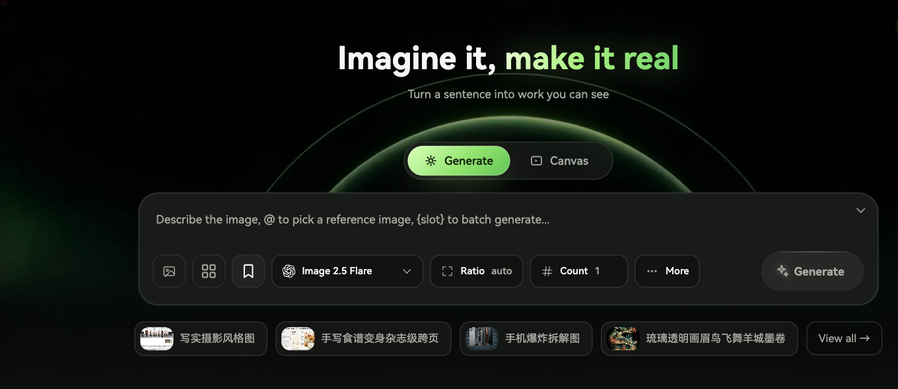

# Muvloom

**Imagine it, make it real.**

English | [简体中文](./README.zh.md) · [Open Muvloom](https://muvloom.online/)

## From an idea to an image

Describe what you want to see and generate it from the homepage. Choose a model, aspect ratio, and image count; add reference images or mention a specific reference in your prompt. Reusable `{slots}` can expand one idea into a batch of variations.

## Keep creating on the canvas

Bring images onto an infinite canvas, select one or several as references, and create new versions without losing the originals. Draw on an image, add arrows or text, and describe the change you want. Organize your work into canvases and continue editing while generation runs.

## Create with an AI assistant

Discuss an idea beside the canvas. The assistant can propose prompts for image editing, image generation, or video; review and confirm a draft before its generation job starts. Results return to the conversation and canvas so you can refine them further. Assistant and video tools appear where the site enables them.

## Find and reuse what works

Browse your works, search prompts and parameters, favorite results, compare details, download an image, or send it back to the canvas. Explore example ideas, save frequently used images as assets, and keep prompts with their references and settings as reusable templates.

## Make it yours

Switch between Chinese and English, light and dark appearance, and desktop or mobile layouts. Where account sync is enabled, projects and saved creative assets can follow you across devices.
