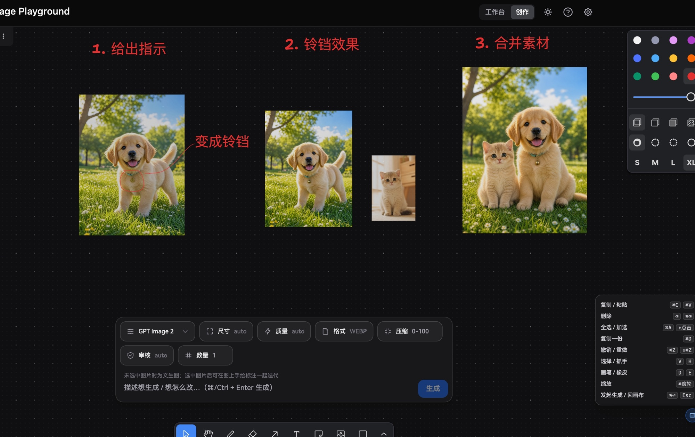
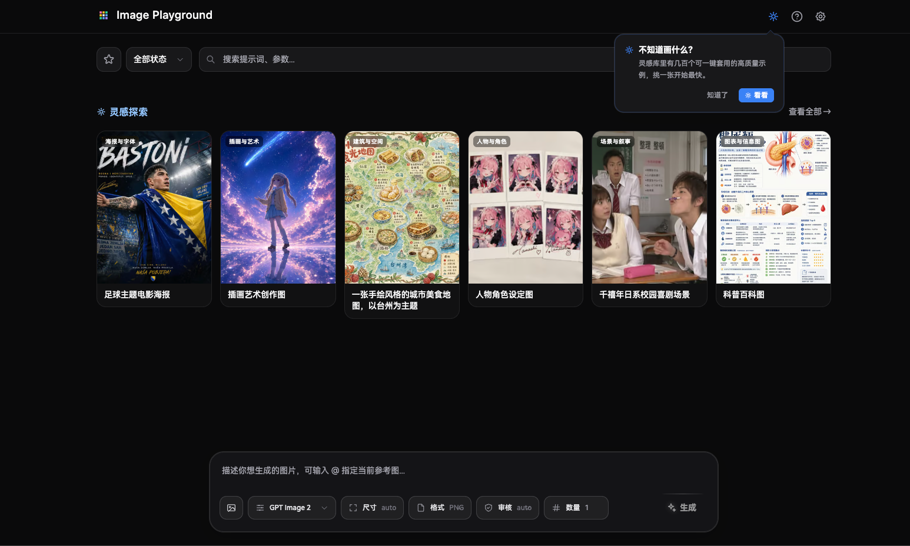

<div align="center">


# AI Image Playground

A browser-based AI image workbench with an infinite creative canvas — bring your own API key, history and config stay fully local.

[](./LICENSE)
[](https://react.dev/)
[](https://www.typescriptlang.org/)
[](https://bun.sh/)

English | [中文](./README.zh.md)

[**Try it live · image.nainma.online**](https://image.nainma.online/)

</div>

<p align="center">
  <a href="https://image.nainma.online/" target="_blank">
    
  </a>
</p>

<p align="center"><i>Create mode: circle what you want changed, type the instruction, and iterate — annotate → generate → merge, all on one canvas.</i></p>

## ✨ Features

Two ways to work, one shared history:

### 🎨 Create mode — infinite canvas

- **Annotate to iterate** — select an image, draw circles / arrows / notes on it, describe the change; the model follows your markup and returns a clean image with annotations removed
- **Merge images** — box-select multiple images and they're sent together as references ("put the kitten next to the puppy")
- **Generate in place** — with nothing selected, your prompt is plain text-to-image; results land right on the canvas next to your material
- **Fire-and-forget concurrency** — every generation gets a live placeholder frame; keep working while multiple tasks run in parallel, with n>1 fan-out for variants
- **Refresh-safe** — the canvas persists locally; in backend mode, in-flight generations resume automatically after a page reload
- **Connected to the workbench** — canvas results land in the shared history (favorite / search / reuse), and any workbench image can be sent onto the canvas to keep iterating
- **Keyboard-first** — full shortcut support with a built-in cheat sheet (⌘⏎ to generate, V/H/D/E tool switching, undo/redo…)

### 🛠 Workbench mode

- **Multiple models** — OpenAI, Gemini, custom HTTP endpoints; bring your own API key
- **Reference images + masks** — up to 16 reference images; the OpenAI path includes a visual mask editor
- **Waterfall history** — every generation saved locally with its effective parameters, favoritable and searchable
- **Inspiration library** — hundreds of high-quality prompts you can apply with one click

### ⚙️ Runs anywhere

- **Fast jobs run inline** — browser calls the upstream directly, images in seconds
- **Long jobs supported too** — optional "backend mode" for 30s–5min jobs (e.g. Gemini 3 Pro). Tasks are persisted; refreshing the page won't lose them
- **No key leakage** — in backend mode, API keys stay in the server's env; the browser never sees them
- **Fully local** — history, config, and BYOK keys live in the browser's IndexedDB

<p align="center">
  <a href="https://image.nainma.online/" target="_blank">
    
  </a>
</p>

## 🚀 Run locally

```bash
git clone https://github.com/Muluk-m/ai-image-playground.git
cd ai-image-playground
pnpm install
pnpm dev:web        # starts the frontend at http://localhost:5173
```

Open the settings panel (top-right), drop in an OpenAI or Gemini API key (leave baseUrl as default), and you're ready to generate.

## 📦 Deploy

### Option 1 · Static-only (simplest)

One-click deploy:

[](https://vercel.com/new/clone?repository-url=https://github.com/Muluk-m/ai-image-playground&project-name=ai-image-playground&repository-name=ai-image-playground)
[](https://app.netlify.com/start/deploy?repository=https://github.com/Muluk-m/ai-image-playground)

The repo ships `vercel.json` and `netlify.toml` preconfigured for the monorepo — both buttons build `apps/web` and serve `apps/web/dist` with no extra setup.

Or any other static host (Cloudflare Pages / GitHub Pages / nginx / S3):

```bash
pnpm install && pnpm build
# upload apps/web/dist/ to your static host
```

Users plug in their own API key in the UI; the browser talks to the upstream directly. **Jobs longer than ~1 minute won't work** (edge timeouts).

### Option 2 · Containerized application

The application release is one local image. The same image runs nginx, BFF, worker, and
Admin, and both deployment projects use [`deploy/compose.app.yaml`](./deploy/compose.app.yaml).
nginx serves the Web build and proxies `/api/*`, `/health`, and the unchanged `/v1/*` API
namespace to BFF. BFF does not serve Web assets in this layout.

Prepare the infrastructure and deployment files outside the repository:

```bash
config_root="${XDG_CONFIG_HOME:-$HOME/.config}/ai-image-playground"
mkdir -p \
  "$config_root/apps/image-playground-personal" \
  "$config_root/apps/image-playground-commercial"

cp deploy/infra.env.example "$config_root/infra.env"
cp deploy/app.personal.env.example \
  "$config_root/apps/image-playground-personal/app.env"
cp deploy/app.commercial.env.example \
  "$config_root/apps/image-playground-commercial/app.env"
chmod 600 \
  "$config_root/infra.env" \
  "$config_root/apps/image-playground-personal/app.env" \
  "$config_root/apps/image-playground-commercial/app.env"

# Replace every replace-* value before starting anything.
```

The two application files must use different buckets, object-store credentials, internal
service tokens, authentication settings, provider credentials, and CORS origins. Compose
also creates a different SQLite volume for each project. Real secrets and operator
configuration remain in these external directories; only safe examples are committed.
`operator-config.json` is optional beside each `app.env`. Missing is valid, while a present
but invalid file prevents BFF startup.

Start the infrastructure, build the release image once, then start each project:

```bash
# One-time host network owned by the existing reverse proxy, not either app project.
docker network create image-playground-edge

scripts/infra-compose.sh up
scripts/app-compose.sh build ai-image-playground:local
scripts/app-compose.sh up image-playground-personal
scripts/app-compose.sh up image-playground-commercial
```

`infra-compose.sh` uses
`$XDG_CONFIG_HOME/ai-image-playground/infra.env` by default. Set `INFRA_ENV_FILE` to
override it. It waits for PostgreSQL and MinIO, creates the buckets in
`MINIO_BUCKET_NAMES`, makes them private, and installs a 45-day expiry rule. Infrastructure
ports bind to `127.0.0.1` by default; application Compose publishes no PostgreSQL or MinIO
port.

`app-compose.sh` defaults to
`$XDG_CONFIG_HOME/ai-image-playground/apps/<project>/app.env`. It starts dependency checks,
BFF, worker, and Admin first and activates nginx only after BFF is healthy. The nginx
container remains available during later backend restarts. Each Web container writes its
own `/usr/share/nginx/html/runtime-config.json` from its external environment, so both
domains share the same Web build without sharing runtime configuration.

The host reverse proxy must be a container on `image-playground-edge`. Route the domains to
the stable network aliases:

| Target | Upstream |
|---|---|
| Personal Web | `http://image-playground-personal-web:8080` |
| Commercial Web | `http://image-playground-commercial-web:8080` |
| Personal Admin | `http://image-playground-personal-admin:37378` |
| Commercial Admin | `http://image-playground-commercial-admin:37378` |

Protect Admin with Cloudflare Access, a VPN, or an IP allowlist. The committed Compose file
does not publish host ports because the domain proxy owns ingress. If the existing host
proxy is not containerized, an operator-supplied Compose override must bind loopback-only
Web/Admin ports.

Inspect or stop projects independently:

```bash
scripts/app-compose.sh status image-playground-personal
scripts/app-compose.sh stop image-playground-personal
scripts/app-compose.sh stop image-playground-commercial
scripts/infra-compose.sh down
```

Stopping an application project does not remove its data volume, the external
infrastructure network, or the external edge network. Stop infrastructure only after both
application projects are down.

Rollback uses an already retained image tag. It preserves backend-first activation:

```bash
scripts/app-compose.sh rollback image-playground-personal ai-image-playground:previous
scripts/app-compose.sh rollback image-playground-commercial ai-image-playground:previous
```

If the previous tag was not retained, build that tag from the previous source checkout
first. One rollback image can then be reused by both projects.

### Fleet deployment contract

`.fleet/deploy.json` now contains three Compose services: the committed infrastructure
project and two independent application projects. Fleet builds
`ai-image-playground:local` once, waits for Compose health, and deploys infrastructure before
either application through service dependencies.

The current fleet Compose schema has no per-service `--env-file` field. The macmini fleet
agent must therefore export
`COMPOSE_ENV_FILES=/Users/qiqian/.config/ai-image-playground/infra.env`. Application
containers load their project-specific files directly from:

```text
/Users/qiqian/.config/ai-image-playground/apps/image-playground-personal/app.env
/Users/qiqian/.config/ai-image-playground/apps/image-playground-commercial/app.env
```

The following host facts remain operator prerequisites and are not changed automatically:

- `/Users/qiqian` is the deployment account home used by fleet.
- `image-playground-edge` exists and the domain proxy has joined it.
- `INFRA_NETWORK_NAME` is identical in infra and application configuration.
- MinIO has distinct application credentials for the two private buckets; the bootstrap
  profile creates buckets and lifecycle rules but does not provision scoped MinIO users.
- Existing macmini PostgreSQL and MinIO data ownership has been checked before the committed
  infrastructure project is started.

## 🛠 Development

```bash
pnpm install
pnpm dev          # web + bff in parallel
pnpm test         # vitest + bun:test
pnpm typecheck
pnpm lint
```

Stack: React 19 + Vite on the frontend · tldraw for the canvas · Bun + Elysia + SQLite on the backend · pnpm + Turbo monorepo.

## 🙏 Credits

Forked from [CookSleep/gpt_image_playground](https://github.com/CookSleep/gpt_image_playground) (MIT), keeping the original UX (reference images + mask editing, waterfall history, inspiration library, quick model picker, effective-parameter comparison). This fork adds native Gemini protocol support, a long-task queue mode, an optional backend, and the infinite-canvas create mode.

Inspiration library prompt data:
- [freestylefly/awesome-gpt-image-2](https://github.com/freestylefly/awesome-gpt-image-2) (MIT)
- [YouMind-OpenLab/awesome-nano-banana-pro-prompts](https://github.com/YouMind-OpenLab/awesome-nano-banana-pro-prompts) (CC BY 4.0)

## 📄 License

[MIT](./LICENSE)
