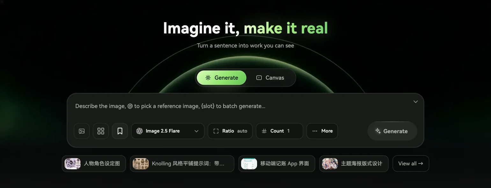

# Muvloom

**Imagine it, make it real.**

English | [简体中文](./README.zh.md) · [Open Muvloom](https://muvloom.online/) · [User guide](https://muvloom.online/guide/en/)

## Generate from an idea

Describe an image and generate it right from the homepage. Choose a model, aspect ratio, and image count; add references, mention an image in the prompt, or use `{slots}` to make several variations at once.

## Refine on an infinite canvas

Arrange images, select one or several as references, and generate new versions beside the originals. Draw, add arrows or text to explain a change, and keep editing while jobs run. Discuss ideas with the AI assistant beside the canvas, then confirm a proposed image or video generation before it runs.

## Explore and reuse

Find examples in the inspiration library, then adapt a prompt or reference for your own work. Your works can be searched, favorited, downloaded, or sent back to the canvas; save useful images as assets and prompts with their references and settings as templates.

