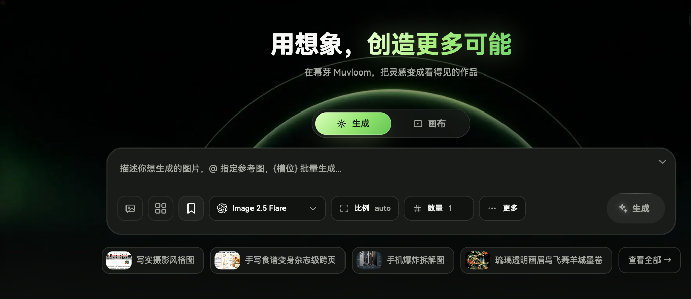

# 幕芽 Muvloom

**用想象，创造更多可能。**

[English](./README.md) | 简体中文 · [打开幕芽](https://muvloom.online/)

## 一句话，开始生图

在首页描述想要的画面，就能直接生成图片。选择模型、画面比例和数量，加入参考图，或在提示词里指向其中一张。还可以用 `{槽位}` 把一个想法展开成多组变化。

## 在画布上继续创作

把图片放进无限画布，选中一张或多张作为参考，在原图旁生成新版本。直接在图上画圈、添加箭头或文字，再说出要修改的地方。用不同画布整理创作；生成任务运行时也能继续编辑。

## 和 AI 智能体一起做

在画布旁讨论创意，让智能体为生图、改图或视频拟好提示词；确认草稿后再开始生成。产物回到对话和画布，方便接着修改。智能体和视频功能以站点实际开放的能力为准。

## 找到并复用好作品

在作品页搜索提示词与参数、收藏结果、查看详情、下载图片，或送回画布继续改。探索示例灵感，把常用图片存成素材，把提示词连同参考图和参数存成可复用的模板。

## 按自己的方式使用

支持中英文界面、亮色与暗色外观，也适配桌面和移动设备。站点开启账号同步后，项目和保存的创作素材还能在不同设备间继续使用。
