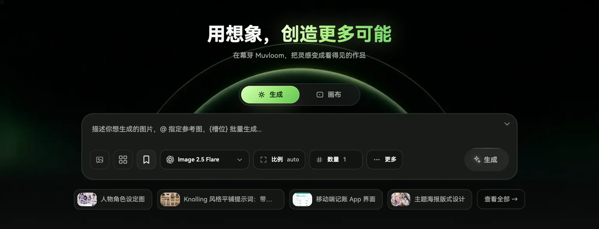
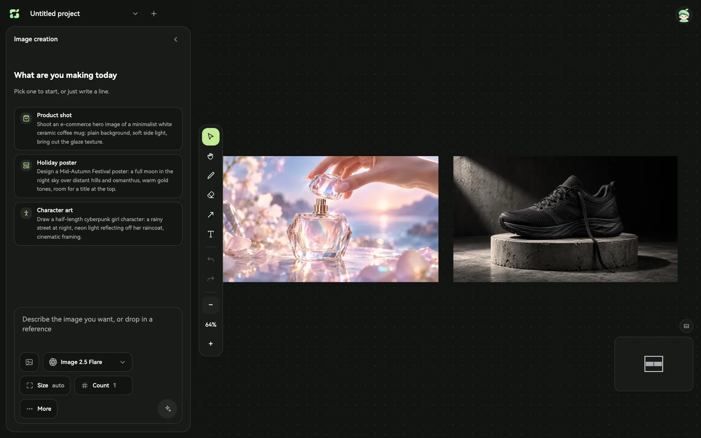
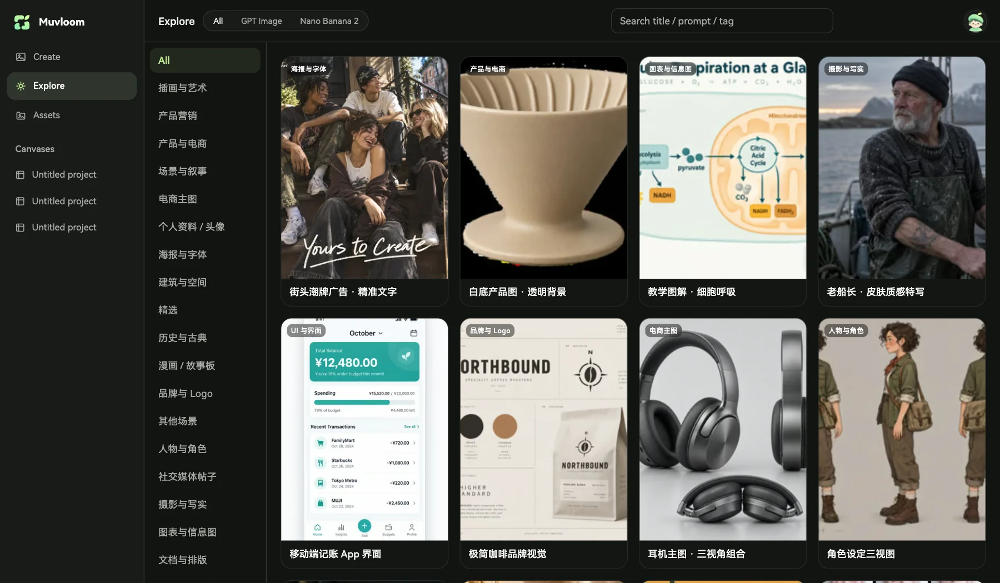

# 幕芽 Muvloom

**用想象，创造更多可能。**

[English](./README.md) | 简体中文 · [打开幕芽](https://muvloom.online/) · [使用指南](https://muvloom.online/guide/)

## 一句话，开始生图

在首页描述想要的画面，就能直接生成图片。选择模型、画面比例和数量，加入参考图、在提示词里引用图片，或用 `{槽位}` 一次展开多组变化。

## 在无限画布上继续创作

摆放图片，选中一张或多张作为参考，在原图旁生成新版本。画圈、添加箭头或文字说明要改的地方；生成任务运行时仍可编辑画布。还可以在画布旁与 AI 智能体讨论创意，确认拟好的生图、改图或视频任务后再执行。

## 探索灵感，复用作品

在灵感库里找到示例，再借鉴提示词或参考图开始自己的创作。作品可以搜索、收藏、下载或送回画布；常用图片可以存为素材，提示词连同参考图和参数可以存为模板。

