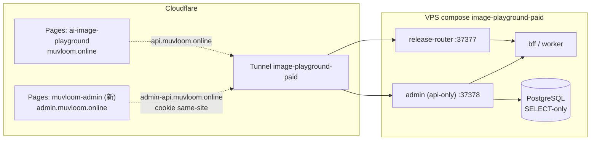

# 后台 v2 — 拆到 Pages、重做布局、新增灵感库

状态：**已实现**（2026-09-23）。A「运营台」定稿后按下述已接受行为重写；三版交互稿（A/B/C）与假数据保留在提交 `9744ba9b`，紧接着的提交把它们从树里删掉。回看稿子：`git show 9744ba9b:apps/admin/src/prototype/admin-v2/VariantA.tsx`。

三件事一起做，但分三张 ticket 落地，顺序见末尾：

1. **拆部署**：前端上 Cloudflare Pages，服务端留 VPS，新 API 域名 `admin-api.muvloom.online`，流水线并入 `deploy.yml`。
2. **重做后台**：布局、导航、模块打翻重来；先看三版交互稿再定。
3. **灵感库**：运营在后台维护效果图 / 模板 / 技能条目，主站「探索」直接读，用户一键玩同款。

## 1. 现状（改之前的事实）

- `apps/admin` 一个 Bun/Elysia 进程（:37378）同源托管 `/api/*` 与 Vite 产物（`server/app.ts:41-64`、`server/static.ts`）。鉴权是 HMAC cookie `admin_session`（7 天、HttpOnly、Secure、`SameSite=Lax`、不带 Domain，`server/lib/session.ts:28-33`）。DB 角色 SELECT-only，所有写操作代理到 BFF `/internal/admin/*`（`Authorization: Bearer INTERNAL_API_TOKEN`）。
- 前端 TanStack Router 文件路由 + TanStack Query + shadcn；`api-client.ts` 只发相对路径 `/api/...`，`` 同样同源（`components/TaskDetailView.tsx:155,216`）。Google 登录回调与登录后跳转都是相对路径（`server/routes/google-auth.ts`）。
- 生产入口只有 cloudflared tunnel：`admin.muvloom.online → http://admin:37378`（`deploy/cloudflared/config.yml.example:17-22`）。没有 nginx 挡在 admin 前面，compose 不发布宿主端口。
- 私有 overlay `private/apps/admin` 通过 `import.meta.glob` 接缝提供 OverviewPanel / UserDetailPanel / SettingsPanel 与 `/billing/settings` 路由；写操作走 `/api/private/*` → BFF `/internal/admin/private/*`。
- 主站灵感库已存在但是静态文件：`apps/web/public/inspiration-manifest.json`（872 KB，22 个分类，图在 `cms-r2.deepclick.com`）随 Pages 发布；`VITE_INSPIRATION_MANIFEST_URL` 可换源；`gen:hero-seed` 在构建期从 manifest 抽 6 条写进 bundle。玩同款 = `applyInspiration`（提示词 + size/quality/n + provider/model 匹配 profile），**不带参考图、不带技能**。
- 技能是随 BFF 镜像发布的 `SKILL.md` + `meta.json`（ADR 0007），`GET /api/agent/skills` 只读；没有任何内容型数据表。

## 2. 拆部署



决策：

- **前端** = `apps/admin` 的 Vite 产物，新 Pages 项目 `muvloom-admin`（付费 CF 账号，同 `ai-image-playground` / `muvloom-test`），生产分支 `main`，自定义域名 `admin.muvloom.online`。这是一次 **DNS 切换**（tunnel CNAME → Pages CNAME，并删 ingress 那一行），不是新增；切之前 API 域名先上线并验证。
- **服务端** = 现有 `admin` compose 服务；`app.env` 把 `ADMIN_DIST_DIR` 设为空后只出 API，tunnel ingress 加 `admin-api.muvloom.online → http://admin:37378`。切换期镜像仍保留 `admin-build` 与 `dist`，仅作 DNS 回滚；验证完成后的后续改动再移除。
- **Cookie 不改**：`admin.muvloom.online` 与 `admin-api.muvloom.online` 同站（eTLD+1 相同），`SameSite=Lax` 的 cookie 在 `fetch(credentials:'include')` 与 `` 子资源上都会带。`*.pages.dev` 预览域登不上，与主站一致。
- **CORS**：admin 服务端新增 `ADMIN_CORS_ALLOWED_ORIGINS`（默认取 `ADMIN_FRONTEND_ORIGIN`），不再共用 BFF 的 `CORS_ALLOWED_ORIGINS`——共用会把后台域名也放进 BFF 白名单，且首项还决定 `AUTH_FRONTEND_ORIGIN`。
- **Google 登录**：`ADMIN_PUBLIC_ORIGIN` 保持「API 自己的 origin」语义（回调 `https://admin-api.muvloom.online/api/auth/google/callback`，Google 控制台要加）；新增 `ADMIN_FRONTEND_ORIGIN`，登录成功 / 失败的 302 一律拼到前端 origin，`sanitizeRedirect` 只接受路径。
- **前端 API 基址**：沿用主站做法，构建时写 `dist/runtime-config.json`（复用 `packages/shared/src/runtime-config.ts` schema：`bff.baseUrl` 语义上就是「这套前端要连的 API」），前端启动读一次；`api-client.ts` 与所有 `` 加基址。开发环境仍走 Vite proxy。
- **流水线**：
  - `scripts/pages-release.sh` / `pages-deploy.sh` 加 app 维度（`web|admin`），前缀 `ADMIN_`；`pages.env` 加 `ADMIN_PAGES_PROJECT` / `ADMIN_BFF_BASE_URL=https://admin-api.muvloom.online` / `ADMIN_PUBLIC_ORIGIN=https://admin.muvloom.online` / `ADMIN_CLOUDFLARE_ACCOUNT_ID` / `ADMIN_CLOUDFLARE_TOKEN_FILE`（同 PAID 账号与令牌）。
  - `apps/admin` 加 `wrangler.jsonc`、`public/_headers`、`public/_redirects`、`build:static-host`（含 `version.json`）；admin `/health` 加 `version`，让 `pages-release.sh` 的域名版本校验和 `deploy.yml` 的 health 等待能覆盖它。
  - `deploy.yml` 的 `pages` job 在 `pages-release.sh paid` 之后跑 `pages-release.sh admin`（此时 `private/` 已就位，`PRIVATE_ADMIN_OVERLAY_ENTRY` 由 `pages-deploy.sh` 设置）。`web.yml` 与 `deploy-test.yml` 的 checks 加 `apps/admin build`。
  - 测试环境（`test` 分支）本轮不发后台。
- **VPS 手工步骤**（一次性，按顺序）：`cloudflared tunnel route dns image-playground-paid admin-api.muvloom.online` → ingress 加行 → `docker restart image-playground-paid-cloudflared-1` → `app.env` 加 `ADMIN_FRONTEND_ORIGIN` / `ADMIN_CORS_ALLOWED_ORIGINS`，改 `ADMIN_PUBLIC_ORIGIN`，清空 `ADMIN_DIST_DIR` → `app-compose.sh compose image-playground-paid up --detach --no-deps admin` → 验证 `https://admin-api.muvloom.online/health` → Pages 项目建好并首发 → DNS 把 `admin.muvloom.online` 切到 Pages，删 ingress 旧行 → 浏览器验证登录、任务图片、私有计费面板。Cloudflare Access 两个域名都要覆盖。
- **回滚**：DNS 切回 tunnel + 恢复 ingress 行，并删除 `app.env` 里的 `ADMIN_DIST_DIR`（不能留空，让镜像内 `/app/apps/admin/dist` 默认值生效）；镜像保留一版带 dist 的 admin 到切换验证完成。

内部版（`image-playground-internal`）的后台域名不在仓库里，本轮只拆付费版；脚本按 edition 参数化，内部版随时可加。

## 3. 后台 v2 信息架构

模块（词汇按 CONTEXT.md「运维」一节）：

| 模块 | 回答的问题 | 现状 | v2 |
| --- | --- | --- | --- |
| 概览 | 业务跑得怎么样 | 有 | 重做：KPI + 24h 量 + 模型用量 + 失败分布，私有树插 OverviewPanel |
| 运维看板 | 这套部署有没有出事 | 有 | 重做：心跳 / 宿主机 / 队列 / 备份 / 接口统计 / 部署记录 / 告警 |
| 用户 | 谁在用、卡在哪 | 有 | 重做：列表 + 详情 + 运营操作；私有树插 UserDetailPanel |
| 任务与设备 | 某条任务 / 某台设备发生了什么 | 有（设备为主） | 合并成一个模块：任务列表可按设备 / 用户切视角 |
| 灵感库 | 主站探索页给用户看什么 | 无（静态 JSON） | **新增**：条目、分类、技能目录（只读）、主站预览、发布 |
| 收款与计费 | 私有树 | 有（SettingsPanel） | 保留接缝，换壳 |
| 审计 | 运营者做过什么 | 表有（`operator_audits`），页面无 | 新增只读列表 |

### 已选方案：A「运营台」

2026-09-22 用户确认 A 定稿：左侧分组导航 + 右侧检视抽屉 + `⌘K` 全局搜索。B、C 仅保留为决策对照，不再进入实现。

已接受行为：

- 左侧按「经营 / 运营内容 / 运维 / 设置」分组；可折叠成图标栏，当前模块使用芽绿选中态。
- 概览与运维看板保持两个模块：概览只回答业务表现；运维看板只回答部署是否出事。
- 用户、任务、告警和灵感条目均从列表在右侧抽屉打开；关闭后保留原列表的筛选、滚动位置和上下文。
- 灵感库主视图采用媒体网格；抽屉内分「内容 / 参数与参考图 / 主站预览 / 发布历史」，发布动作固定在底部。
- `⌘K` / `Ctrl+K` 搜索模块、用户、任务和灵感；选中对象后切到对应模块并打开抽屉。
- 严重告警在内容区顶部显示窄横幅；点击进入告警详情，不把概览与运维数据混成一页。
- 私有树的收款与计费保留独立模块和明确标记；免费部署不显示。

未采用：

- B 的无侧栏顶栏导航、灵感看板拖动和整页编辑。
- C 的三栏收件箱作为全局信息架构。告警、待收款、待发布内容仍可在各模块内提供待办筛选，但不建立统一收件箱。

原型已从树里删除（提交号见文首）。跑真实后台：

```sh
pnpm --dir apps/admin dev            # 前端 :5174，/api 代理到 :37378
pnpm --dir apps/admin dev:server     # API :37378，要 DATABASE_URL 与 BFF_INTERNAL_URL
```

不随变体变的约束：

- 私有 overlay 接缝（`PrivateAdminOverlay` 形状、`/api/extensions`、`/api/private/*` 透传、`*.route.tsx` 路由 staging）保留；overlay 面板要跟着新样式改一次 `shared.tsx`。
- 全站 shadcn 语义 token，跟随系统深浅色；芽绿只做主要操作与选中态。
- 后台不做 i18n，中文。

## 4. 灵感库

### 词汇（提议进 CONTEXT.md）

- **灵感条目（inspiration item）**：运营发布给所有用户看的一条「可以直接玩」的内容；有封面、提示词、推荐模型与参数，可选参考图与挂载技能。三种 `kind`：
  - **效果图（showcase）**：一张成品 + 做出它的提示词。
  - **模板（template）**：提示词里带 `{槽位}`，用户填槽位再生成；复用现有槽位语义，不是用户的「模板」（那是个人资产）。
  - **技能示例（skill）**：挂一条部署技能，玩同款进画布并以 `/技能标识` 起手。**技能正文仍是随 BFF 镜像发布的文件，后台只读目录**（ADR 0007 不变）。
- **发布（publish）**：条目从草稿变成主站可见；主站读到的清单只含已发布条目。下架（archive）不删记录，用户的置顶 id 允许指向已下架条目（前端已容忍缺失）。
- **推荐位（featured）**：上创作页冷启动的 `InspirationEmptyHero` 与首页 chips 的候选集。
- _Avoid_：案例库、素材（用户自己的图）、模板市场（付费模板抽成是另一条路线图项）。

### 数据

新表（公开树 `packages/db`，迁移一份）：

```text
inspiration_items
  id text pk            -- 稳定 key，沿用 manifest 的 id 语义（旧 awesome-N 导入保留）
  kind text             -- showcase | template | skill
  status text           -- draft | published | archived
  featured boolean
  title text, description text
  category_id text fk
  prompt text           -- 模板存带 {槽位} 的原文
  recommended_provider text, recommended_model text
  params jsonb          -- { size, quality?, n? }（只覆盖用户可控字段，同 InspirationItem.params）
  tags jsonb
  cover_key text        -- 公开桶对象 key；URL 由 PUBLIC_ASSET_BASE_URL 拼
  image_key text        -- 原图（可空）
  reference_images jsonb  -- [{ key, name }]
  skill_name text       -- kind=skill 必填，须存在于当前部署技能目录
  sort integer
  created_at, updated_at, updated_by, published_at

inspiration_categories
  id text pk, name text, sort integer

inspiration_publications
  version integer pk, published_at, item_count, manifest_hash
```

审计沿用 `operator_audits`。

### 接口

- 写（BFF，`requireInternalService`，admin 服务端代理）：`/internal/admin/inspirations` CRUD、`/…/:id/publish|archive|draft`、`/internal/admin/inspiration-categories` CRUD、`POST /internal/admin/inspirations/uploads`（返回公开桶的预签名 PUT + 最终 key）。发布时服务端校验：`recommended_model` 在 `channels.json` 可服务（把现在 `apps/web/src/__tests__/features/inspiration/manifest.test.ts` 的不变量搬到服务端）；`skill_name` 在技能目录里；模板必须至少一个 `{槽位}`。
- 读（BFF 公开）：`GET /api/inspirations/manifest` → 现有 `InspirationManifest` 形状（`version` 取 `inspiration_publications.version`），`Cache-Control: public, max-age=300, stale-while-revalidate=86400`，同现在静态文件的头。主站把 `VITE_INSPIRATION_MANIFEST_URL` 指到 `${bffBaseUrl}/api/inspirations/manifest`——**不经 admin-api**，后台域名不对普通用户开放。
- 后台读技能目录：admin 服务端透传 BFF `GET /api/agent/skills?mode=`。

### 存储

- 公开桶单独一个（`docs/design/creation-studio.md` 已定：用户产物私有，公开素材另一桶），现在视频样片已在 `aip-public-assets`。BFF 加 `PUBLIC_ASSET_BUCKET` / `PUBLIC_ASSET_BASE_URL` 配置与一个只会写 `inspirations/` 前缀的 store；`deploy/r2-media-cors.json` 的 admin origin 由预签名 PUT 决定要不要加。
- 现有 872 KB manifest 一次性导入为 `published` 条目；图片先保留 `cms-r2.deepclick.com` 外链（`cover_key` 允许存绝对 URL，导入期过渡），后台提供「重新托管封面」动作逐条搬到公开桶。

### 主站接入

- `InspirationItem` 加可选字段：`kind`、`referenceImages?: {url,name}[]`、`skill?: string`、`slots?: string[]`（服务端从 prompt 解析）。`validateManifest` 与 `build-hero-seed.mjs` 的必填校验同步。
- 玩同款：
  - showcase / template → 现有 `applyInspiration`，参考图按 `writeTemplateIntoComposer` 的路子（下载 → IndexedDB 得 `id` → `addInputImage`，受 `API_MAX_IMAGES`）；模板的槽位由现有 composer 槽位 chip 接管。
  - skill → `fillAgentComposer('/skill ' + prompt)` + `startCanvasFromComposer`（已把 `inputImages` 当 references 转发）。
- hero seed：`gen:hero-seed` 继续读仓库里的快照文件（构建不依赖线上）；改成读 `featured` 的时机放到条目全部迁走之后，单独一张 ticket。
- 清单体积：先维持整份下发（现状也是），条目 > 1000 时再分页 / 按分类分片。

## 5. 拍板结果

1. `admin.muvloom.online` 直接切到 Pages，API 走新域名 `admin-api.muvloom.online`。切换与回滚步骤写进[部署手册](../deploy/image-release.md)「后台」一节。
2. Cloudflare Access 保持开，两个域名都要覆盖——拆开后 API 只剩 cookie 一道。**这是上线前的人工步骤，代码里做不到。**
3. 三档一次做齐：showcase / template / skill 的写入、发布校验与主站落地都在这一轮。存量 563 条按 showcase 导入。
4. 上传走预签名直传公开桶（`POST /api/inspirations/uploads` 返回 PUT 地址）；后台存的是上传后的绝对地址，不是裸 key——`InspirationAdminItem` 不带桶基址，存 key 的话后台刷新就没图可渲染。桶要放开后台域名的 PUT CORS。
5. ROADMAP 记一项「灵感库运营」在 Lane C（内容，不是模型能力，不占 Lane A）。

## 6. 交付状态

| | 状态 |
| --- | --- |
| T1 拆部署 | 代码与脚本已就绪；VPS / Cloudflare 侧的一次性切换仍待人工执行 |
| T2 灵感库后端 | 已完成：迁移 0037、BFF 读写接口、导入脚本（563 条 / 22 分类，幂等）、主站改读 `${bffBaseUrl}/api/inspirations/manifest` |
| T3 后台 v2 前端 | 已完成：分组导航 + ⌘K + 检视抽屉，概览 / 用户 / 任务与设备 / 灵感库 / 技能目录 / 分类 / 运维看板 / 审计 |
| T4 主站玩同款升级 | 已完成：参考图随条目下发并进 composer，模板槽位走现有 chip，技能示例进画布以 `/技能` 起手 |

仍未做（各自独立，不阻塞上线）：封面「重新托管」把 `cms-r2` 外链搬进公开桶；`gen:hero-seed` 改读 `featured`；条目级的玩同款统计。
