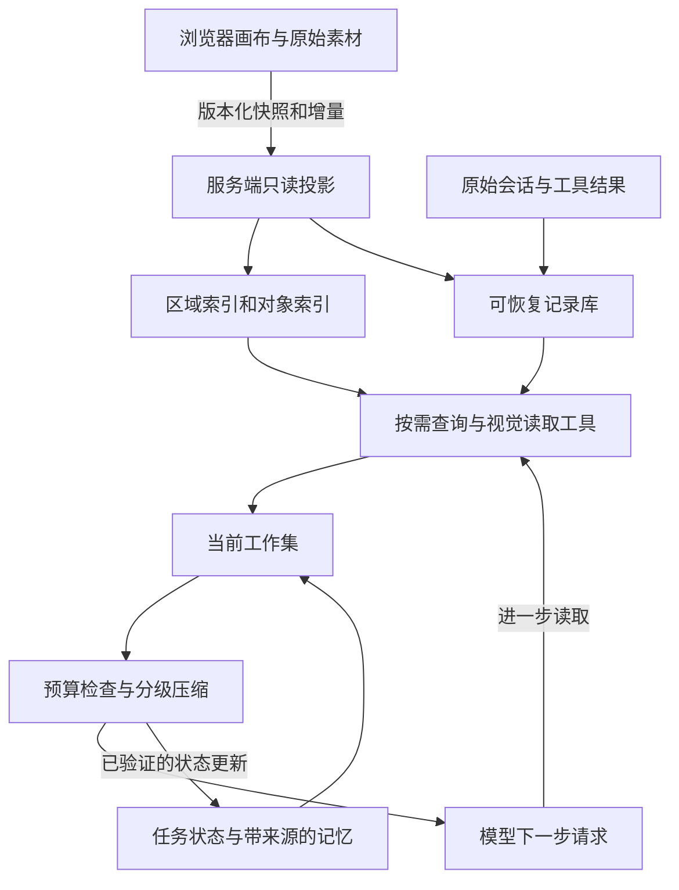

# 智能体画布：渐进读取与可恢复上下文

调研日期：2026-09-16。状态：**研究建议，尚未实施**。代码基线：`d71117bba3cc0f04b7621db1e9f6658321b915aa`。

本文核对了当前实现与一手资料。外部资料支持机制选择；具体协议、版本设计与分期是针对本项目的建议，尚未通过真实画布实验验证。

## 结论

建议建设一个可查询、可回读、能校验版本的画布上下文系统：**渐进读取决定看什么，工作集管理决定暂时保留什么，压缩负责腾出空间，持久化与版本管理保证需要时还能恢复正确细节。**

现有 `pi-agent-core + transformContext` 已经具备会话压缩基础，应沿用。优先补上画布读取投影、分层查询、历史回读和结构化任务状态；暂不更换运行时，不把向量库、多智能体或供应商原生压缩作为前置条件。

成功标准不是“每轮 token 越少越好”，而是：相同任务质量下控制总成本；经过多次压缩仍守住用户要求；对象发生变化后不会继续相信旧观察。

## 一、现状：已经有什么，真正缺什么

以下链接固定到本次调研基线，避免后续代码变化造成证据漂移。

| 链路 | 当前实现 | 对方案的影响 |
| --- | --- | --- |
| 会话压缩 | [compaction.ts](https://github.com/Muluk-m/ai-image-playground/blob/d71117bba3cc0f04b7621db1e9f6658321b915aa/apps/bff/src/lib/agent/compaction.ts)：复用摘要、增量合并、定期从原始历史重建、失败回退与熔断；摘要包含已完成、进行中、决定、产物 | 无需再做一套基础聊天摘要；需要把画布证据、任务约束与恢复能力接进去 |
| 原始记录 | [conversations.ts](https://github.com/Muluk-m/ai-image-playground/blob/d71117bba3cc0f04b7621db1e9f6658321b915aa/apps/bff/src/lib/agent/conversations.ts)：压缩状态独立存储，原始消息保留 | 可以增加检索与回读；“数据库里有”不等于“模型能取回” |
| 输入与图片 | [turn.ts](https://github.com/Muluk-m/ai-image-playground/blob/d71117bba3cc0f04b7621db1e9f6658321b915aa/apps/bff/src/lib/agent/turn.ts)、[images.ts](https://github.com/Muluk-m/ai-image-playground/blob/d71117bba3cc0f04b7621db1e9f6658321b915aa/apps/bff/src/lib/agent/images.ts)：历史主要回放文本，本轮或最近一批引用图片另行装入；内部可按 ID 解析历史图片 | 当前不是每次重发整块画布。但内部编辑工具能解析图片，不代表模型能主动查看任意旧图 |
| 工具集 | [tools/index.ts](https://github.com/Muluk-m/ai-image-playground/blob/d71117bba3cc0f04b7621db1e9f6658321b915aa/apps/bff/src/lib/agent/tools/index.ts)：生图、编辑、素材库、视频，另有澄清工具 | 缺少画布区域查询、对象详情、视觉检查、历史回读工具 |
| 画布事实源 | [persistence.ts](https://github.com/Muluk-m/ai-image-playground/blob/d71117bba3cc0f04b7621db1e9f6658321b915aa/apps/web/src/features/canvas/lib/persistence.ts)、[workspaces.ts](https://github.com/Muluk-m/ai-image-playground/blob/d71117bba3cc0f04b7621db1e9f6658321b915aa/apps/web/src/features/canvas/lib/workspaces.ts)：按会话隔离的浏览器 IndexedDB | 服务端不能直接读取浏览器画布，必须设计传输与快照协议 |
| 结构与标注 | [canvasDoc.ts](https://github.com/Muluk-m/ai-image-playground/blob/d71117bba3cc0f04b7621db1e9f6658321b915aa/apps/web/src/features/canvas/lib/canvasDoc.ts)、[markedReferences.ts](https://github.com/Muluk-m/ai-image-playground/blob/d71117bba3cc0f04b7621db1e9f6658321b915aa/apps/web/src/features/agent/lib/markedReferences.ts)：扁平对象列表；选中的相交标注合成到图片中 | 尚无可供模型查询的语义层级与显式标注关系；应同时保留原图、标注结构和合成预览 |
| 模型协议 | [model.ts](https://github.com/Muluk-m/ai-image-playground/blob/d71117bba3cc0f04b7621db1e9f6658321b915aa/apps/bff/src/lib/agent/model.ts)：网关使用 OpenAI Chat Completions 兼容协议 | 原生 Responses / Anthropic 压缩不可直接假定可用，需要单独验证网关能力 |

现有默认策略保留近期约 10 条消息，有独立用户原话预算，连续增量折叠达到上限后重建。数值来自 [capabilities.ts](https://github.com/Muluk-m/ai-image-playground/blob/d71117bba3cc0f04b7621db1e9f6658321b915aa/packages/shared/src/capabilities.ts)，属于配置默认值，不代表线上实际生效配置或最佳参数。

还需补两道可靠性边界：当前摘要生成后没有完整请求的最终硬预算检查；[compaction-transform.ts](https://github.com/Muluk-m/ai-image-playground/blob/d71117bba3cc0f04b7621db1e9f6658321b915aa/apps/bff/src/lib/agent/compaction-transform.ts) 捕获异常后返回原消息。大画布工具接入后，巨大单次结果或压缩故障仍可能导致请求超限。这里是静态代码发现的风险，未声称已经在线复现。

## 二、推荐架构：事实源、读取层、工作记忆分别负责什么



### 2.1 先解决服务端读不到本地画布的问题

| 方案 | 优点 | 代价与限制 | 建议 |
| --- | --- | --- | --- |
| 每次工具调用转发浏览器 | 接入快，看到实时本地状态 | 依赖页面在线；长任务、刷新、断线恢复复杂；多次读取可能跨版本 | 可做验证原型，不作为持久运行的唯一通道 |
| 全量云端画布同步 | 服务端随时可读，天然支持跨端 | 要承担完整同步、冲突、资产生命周期，超出本次上下文改造范围 | 留给独立同步能力 |
| 会话范围的版本化只读投影 | 能固定本轮观察，继续复用本地编辑器；逐步上传所需素材 | 需要快照、缺失素材状态、增量同步协议 | **推荐** |

推荐流程：发送消息时提交画布对象元数据快照及当前选区；复用已有服务端资产 ID；优先准备选区图片，其他本地图片在需要读取时上传。服务端保存读取副本，编辑事实仍以浏览器为准。初始元数据传输可能是 O(N)，后续按变化量传输；这与“模型提示词只装有预算的结果”是两个不同问题。

不能承诺浏览器关闭后还能读取尚未上传的图片。读取结果应明确区分 `ready / pending_upload / unavailable / deleted / stale`；任务可继续处理已有快照，依赖缺失内容时进入等待或给出范围受限的结果。完整离线执行需要提前上传整个任务依赖集合。

每次读取必须由服务端校验账号、会话、画布及资产访问关系。客户端提交的 `canvasId` 或对象 ID 不能直接成为权限证明。快照和外置记录保留到依赖它们的任务、记忆过期之后再回收；删除会话时联动清理或撤销访问。

### 2.2 渐进读取的五层视图

| 层级 | 内容 | 何时读取 |
| --- | --- | --- |
| L0 定位信息 | 当前任务、选区 ID、快照版本、对象类型统计、少量区域入口 | 每轮默认，大小受控 |
| L1 区域与对象目录 | 分页的空间分区、对象名称/类型/边界、连接或重叠关系 | 找目标、理解局部或制定全局扫描计划 |
| L2 精确结构 | 指定对象的文本、尺寸、层级顺序、资产引用、相关标注与邻居 | 判断“这里”“旁边”“红圈内”以及布局关系 |
| L3 视觉预览 | 指定区域截图或带稳定标签的联系表缩略图 | 比较风格、定位图像内容、缩小候选 |
| L4 原始细节 | 指定图片、局部高清裁剪、准确文字/路径/掩膜 | 编辑、辨别细节、核对最终判断 |

层级不是强制逐级调用。用户已明确选中图片时可以直接进入 L2/L4，减少往返；跨画布找相似图时才从区域与预览逐步缩小范围。视觉摘要只用于导航，涉及小字、标志、颜色或细微差别时必须回到图像证据。

目前画布没有现成语义分组：先用确定性的空间分区和对象关系索引，再结合用户显式分组；“距离近”只代表空间邻近，不能自动认作同一方案。语义检索可后续补充，首版不依赖向量库。大型区域继续分页/细分，避免“概览”本身列出一万条对象。

**视觉与结构双通道的依据**：tldraw 使用截图、视野内简化对象、重点对象和视野外聚类；Figma 官方规则在节点结果过大时建议读取元数据地图，再读取所需节点，并配合截图。我们借鉴读取层级，不替换现有画布引擎。[tldraw Agent starter kit](https://tldraw.dev/starter-kits/agent)、[Figma 官方规则](https://developers.figma.com/docs/figma-mcp-server/add-custom-rules/)

### 2.3 工具协议草案

建议先维持少量职责清晰的工具；以下是概念签名，不是已实现 API：

```text
queryCanvas(snapshotId, scope, filters, cursor, limit, fields)
readCanvas(snapshotId, objectIds, includeRelations, detail)
inspectCanvas(snapshotId, objectIds | region, resolution)
readContext(ref | query, cursor, limit)
getCanvasChanges(canvasId, sinceSnapshotId, cursor)
```

- `queryCanvas` 支持空间过滤、类型、文字检索与分页；没有语义索引时明确能力范围。
- `readCanvas` 返回准确结构和标注；结构读取不能自动塞入所有图片。
- `inspectCanvas` 返回真正进入模型视觉输入的图片，而非仅返回模型无法访问的 URL。裁剪图带原图版本、坐标变换、裁剪边界和对象标签，避免改错区域。
- `readContext` 同时承担历史消息搜索、外置工具结果回读；命中摘要先给出处，再允许取原文。历史查询默认限制本会话，项目级复用须另有明确范围。
- 所有结果包含 `snapshotId / sourceVersions / coverage / truncated / nextCursor / ref`。`coverage` 描述已检查范围；`ref` 可回读；调用参数和输出大小均有服务端上限。

工具返回“本页 20 个，共 300 个候选”和“全部已检查”必须有不同状态。全局分析任务维护已访问分区集合；到达成本上限仍未扫完时，结果要说明覆盖范围，不能把局部检索结果说成全画布结论。

### 2.4 工作集：短期上下文里保留什么

工作集是当前一步模型实际能看到的内容。建议按优先级装配：

1. **必须保留**：当前指令、仍生效的用户限制、任务/画布身份、目标对象与版本、进行中的工具调用及结果配对。
2. **当前相关**：选区、直接依赖的对象和标注、刚读到的视觉证据、近期必要对话。
3. **可恢复摘要**：已完成步骤、被否决方案、待办、已验证事实的来源索引。
4. **可移出内容**：旧截图、长工具输出、重复目录、已结束过程的详细记录。

模型可请求额外资料；确定性的上下文管理器负责预算与必要项保护，不能仅依赖模型“觉得快满了”。近期程度只是信号之一，不能用纯 LRU 把早期的“保留 Logo，不改文案”逐出。

任务状态独立于叙述性摘要，至少区分：

```text
task: goal, scope, currentStep, pendingActions
constraints: exactText, sourceMessageId, status, supersededBy
facts: statement, evidenceRefs, dependencyVersions, status
decisions: choice, reason, sourceRefs, status
artifacts: objectId, assetId, contentHash, role
coverage: inspectedRegions, unresolvedCandidates
```

摘要器不能任意把观察升级为用户要求。约束应引用用户原文；事实绑定可回读来源；推测单独标记。画布文字、OCR 和检索结果始终保留资料身份，不能经摘要变成系统或用户指令。用户改口保留替代关系，避免旧要求反复复活。项目级长期记忆只保存明确稳定的偏好/规范，带来源和修改入口，不自动把一次画布的临时要求扩散到其他会话。

### 2.5 压缩流水线：从可逆处理开始

| 顺序 | 机制 | 保留与恢复方式 |
| --- | --- | --- |
| 1 | 确定性去重、精简重复状态和字段 | 原消息不变，仅改变模型输入表示 |
| 2 | 外置长结果和旧图片，保留短预览与稳定引用 | 原文/原图可按版本回读；先落存储成功再移出上下文 |
| 3 | 将已结束过程合并为带来源的任务摘要 | 原始消息范围可恢复，未完成操作与生效约束单独保留 |
| 4 | 创建新上下文检查点 | 固定约束、任务状态、必要证据、近期完整工具交互重新装配 |
| 5 | 可选供应商原生压缩 | 仅在网关支持并通过回归后使用，不能替代我们的事实源与版本校验 |

现有 `ToolResultOffload` 只是预留类型，当前没有实际外置逻辑。画布读取工具加入后，应把它实现为第 2 层，并复用现有增量摘要与定期重建机制。重建必须从原始证据重新生成，不能无止境地摘要旧摘要；超长原始记录可按有出处的片段处理，再核对受保护状态。

压缩提交前检查：目标对象仍有版本引用、未完成工具交互完整、有效约束都有来源、外置引用确实可读、摘要覆盖边界连续。结构验证能发现漏字段与丢引用，不能证明语义完全正确，因此还需要任务级评测。

摘要服务失败时走去重与外置的确定性路径；关键内容仍装不下则报告本轮无法继续、保存检查点。不要为了继续发请求静默删掉用户限制，也不要把已知超限的原始上下文重新发给模型。

### 2.6 版本与失效：动态画布比静态文档多的一层

需要新增可持久化的画布版本身份，例如 `canvasEpoch + snapshotId`；每个对象区分内容、几何位置、标注关系版本。当前 `CanvasDoc.editRevision` 是内存中的用户操作计数，既不跨会话持久化，也不覆盖全部运行时修改，不能直接充当这些身份。

- 图片内容变了：图片描述、OCR、相关视觉判断失效。
- 只移动图片：内容描述可复用，区域截图、位置关系与布局摘要失效。
- 修改/删除标注：依赖它的编辑意图解释失效；原图描述未必需要重算。
- 删除、撤销、恢复对象：记录明确状态与新版本，不能用同名新对象替代旧引用。

每条摘要记录依赖的对象/区域版本。上下文装配时过滤或明确标记失效事实，按需重读；后台重算只处理受影响部分，避免每次拖动都生成整画布摘要。

一轮默认读取同一快照；用户插话或主动刷新时，在安全边界切换版本并显式更新相关任务状态。生成输入锁定所读素材版本，已提交任务不因画布变化偷偷换图。结果应用前再校验目标是否仍存在、版本是否符合预期；冲突时保留产物供用户查看或采用既有冲突处理，避免覆盖后来编辑。

### 2.7 预算、缓存与延迟一起管理

每次模型调用前检查完整输入包，而不只统计聊天消息：

```text
系统说明 + 工具定义 + 任务状态 + 近期交互 + 检索文本 + 图片输入
  <= 模型上下文窗口 - 输出预留 - 估算误差余量
```

同时给下一次工具结果预留接纳空间。图片不能仅按 base64 文本长度或固定常数精确计费：先按所用模型的规则保守估计，用实际 usage 校准；网关不提供细分时记录估算误差而非伪造精度。

达到高水位触发整理，降到较低水位后才停止，避免每一步都摘要；水位通过任务实验决定。工具返回超大结果时先分页/外置，最后再做预算检查；切换上下文窗口更小的模型时重新装配。

另设每任务读取次数、视觉解析次数、总成本和执行时长上限，缓存相同版本的读取结果，检测反复读取相同内容却无进展的循环。渐进读取降低单次输入，却可能增加模型往返与总费用；局部任务应允许直接批量读取已知目标，全局任务按分区批次处理。

稳定系统说明、固定工具定义、确定性序列化有利于提示缓存；对象变化用必要增量表达，阶段结束再合并。但缓存不减少逻辑上下文占用，不值得为命中率保留过期证据。

原生能力可作为后续适配器。OpenAI 的压缩接口属于 Responses，产物含不可读的加密压缩项；当前 Chat Completions 网关是否透传这些语义未知，不能以一个配置开关视为已经支持。[OpenAI Compaction](https://developers.openai.com/api/docs/guides/compaction)

## 三、一轮任务怎样运行

场景：画布有 1,000 张图，用户说“把左边海报的背景换成右上角参考图的颜色，Logo 和文案都别动”。

1. 固定本轮快照，写入用户原始约束。若已有选区，直接定位；没有选区时先读空间目录，名称不明确再看对应区域预览。
2. 返回候选海报和参考图的准确对象 ID，读取二者结构、相关标注和视觉细节。其他 998 张图不因存在于画布而进入模型输入。
3. 记录目标版本、原图、参考图和受保护内容；若工具能力无法保证要求，执行策略需要体现这一限制，不能把上下文正确等同于生成结果必然正确。
4. 执行编辑。其他历史图像移出当前工作集，保留可恢复引用；生成输入仍是锁定版本的实际图片。
5. 工具返回后，读取结果与目标必要细节进行核对。用户中途换图时检测版本冲突，产物不覆盖新图。
6. 阶段结束保存任务状态与证据引用。下一轮“恢复上一版，但保留这次背景”可取回准确历史素材，而非凭摘要重新猜测。

如果任务换成“找出整个画布所有文案不一致的海报”，读取量仍可能随画布规模增长。机制只能把工作分批、减少主上下文累积，不能让全面检查变成恒定成本；覆盖记录保证最终知道检查了哪些对象。

## 四、方案取舍

| 选项 | 判断 |
| --- | --- |
| 全量结构/截图直接进入提示词 | 小画布可作为质量基线；无法解决大画布与长任务 |
| 只有选区 + token 上限 | 可作为第一步预载；跨区域查找、全局分析和历史恢复不足 |
| 只做会话摘要 | 复用当前能力，但补不齐画布读取与可变事实管理 |
| 渐进读取 + 可回读外置 + 任务状态 + 压缩 | **推荐主线**，能分别控制读取范围、记忆质量和上下文体积 |
| 直接迁移 Deep Agents / LangGraph | 可以借鉴模式；没有证据表明本次需求必须更换已有运行时，迁移另行论证 |
| 原生供应商压缩 | 可选优化，受协议/模型支持限制；不能替代画布检索与可靠引用 |
| 向量检索 + 多智能体递归 | 可用于后期复杂检索/全局扫描；先验证简单索引与单智能体是否成为瓶颈 |

## 五、如何验证有效，而不只是架构更复杂

### 5.1 对照组

同模型、同任务、同素材版本与可重复预算，多次运行比较：

- A：当前选区引用 + 现有会话压缩。
- B：分层读取 + 可恢复外置，仅隐藏旧结果，不新增语义摘要策略。
- C：B + 结构化任务状态 + 带来源的摘要与失效机制。
- D：小画布全量输入基线，用于发现检索漏读造成的质量损失。

预算管理和访问隔离作为各新方案共同基础。先验证 C 比 B 多出的复杂度是否值得，再考虑语义索引或递归智能体。

### 5.2 必须覆盖的任务集

| 场景 | 主要观察 |
| --- | --- |
| 100 / 1,000 / 10,000 对象；局部修改与跨区比较 | 定位准确率、检索往返、单轮上下文随规模的变化 |
| 全画布重复项/文案核查 | 是否分页完整、漏检率、覆盖声明是否真实 |
| 多轮对话并经历至少三次压缩 | 早期负面约束、未完成步骤与被否决方案能否保留 |
| “拿回很早前的第三版图/原话” | 历史检索命中率、回读版本与原始内容一致性 |
| 小字、相近颜色、交叉箭头、图外文字说明 | 缩略图是否不足、能否主动读细节、标注归属正确性 |
| 中途移动/换图/删除/撤销，同名对象 | 旧摘要失效与目标冲突检测 |
| 刷新、离线、缺失本地图片、过期素材 | 能否明确区分缺资料与查无对象，恢复后能否继续 |
| 两个会话或账号，以及项目切换 | 数据与记忆不串用 |
| 摘要超时、存储失败、巨大单工具结果、较小窗口模型 | 不发送已知超限请求、不丢受保护状态、不形成重试循环 |

### 5.3 度量与验收

- 质量：任务成功率、对象定位正确率、用户约束违背率、视觉核对一致性、错误版本使用率、全局任务漏检率。
- 恢复：外置引用可读率、指定历史细节恢复率、压缩后任务续做成功率、失效事实被继续引用的次数。
- 成本：全部模型输入/输出（含视觉、摘要和额外检索推理）、实际缓存用量、每个成功任务费用。
- 时延：首个有效结果与完整任务的 P50/P95、工具往返数；分开测冷缓存和重复任务。
- 性能：快照上传字节数、索引更新时间、浏览器交互延迟与内存，而非只看 LLM token。

当前摘要请求由平台承担，未计入用户单轮 usage；成本评测应另行汇总这些调用，防止把成本转移到后台误判为节省。不因此自动改变现有用户计费规则。

确定性边界在故障测试中应做到：跨范围读取全部拒绝、预算违规请求不发出、过期版本不被悄悄替换、需要完整扫描的结果明确覆盖范围。模型质量与费用目标先测基线后设门槛，不能现在承诺节省某个百分比。生成结果质量可由规则核验与盲评结合衡量，避免只让同一个模型自评。

## 六、落地顺序与代码接缝

| 阶段 | 交付物 | 进入下一阶段的条件 |
| --- | --- | --- |
| 0 测量与协议验证 | 当前任务基线、完整请求预算观测、网关多模态工具结果适配验证、快照协议草案 | 知道实际成本在哪；证实工具返回图片能被模型读取 |
| 1 完整读取闭环 | 版本化只读投影、区域/对象查询、视觉读取、历史回读、结果外置、最终预算检查 | 大画布局部任务可定位、读细节、移出、再取回；缺失资源可恢复 |
| 2 可靠任务记忆 | 有出处的约束与事实、依赖失效、增量摘要/重建、压缩故障处理 | 多次压缩和中途编辑仍保持约束与版本正确 |
| 3 全局与性能优化 | 覆盖跟踪、批处理、预取、分区摘要；按评测决定是否引入语义索引/并行分析 | 全局任务质量达标，额外机制有可测收益 |

主要接缝：`turn.ts` 建立本轮快照与上下文装配；`tools/` 增加查询、视觉和回读工具；`images.ts` 复用素材解析并补视觉读取输出；`compaction.ts` 实现外置并扩展任务记忆；`compaction-transform.ts` 保留现有挂钩但区分存储故障与预算失败；前端画布层输出版本化投影，持久化版本身份。原始消息、画布快照、素材和摘要分开存储，避免摘要反向修改事实源。

首个纵向切片建议是：**在大画布中找到未选中的一个对象 → 查看细节 → 压缩后按同一版本再次读取 → 检测用户中途修改**。这个切片验证整条链路，比先做复杂摘要器更能暴露真正风险。

实施前仍需验证的技术问题：实际网关图片成本和多模态工具结果支持、快照增量上传对大画布的性能、只读投影与素材保留策略、用户缺失资料时的等待体验。它们都应通过小范围原型与基线实验定案。

## 附录：一手来源与可迁移机制

### 1. 渐进读取需要导航能力

Anthropic 提出先保留轻量标识与元数据，通过工具逐步发现、读取相关内容；每次观察应帮助决定下一步读什么。代价是多次往返和探索走偏，可预载少量高价值信息，再允许自主深入。[Anthropic 工程文，2025-09-29](https://www.anthropic.com/engineering/effective-context-engineering-for-ai-agents)

LangChain 的 Skills 将元数据、完整说明、附属资源分层加载，证明这是一种可实现的协议模式。**迁移推论**：画布需要区域/对象目录、关系检索、缩略预览、精细读取；“把所有对象说明都放进去”仍随画布线性膨胀，不能算完整的渐进机制。[Deep Agents Skills，动态文档，调研日读取](https://docs.langchain.com/oss/python/deepagents/skills)

### 2. 外置与摘要应分开

Deep Agents 先将巨大工具输出外置，保留路径与预览；窗口紧张时移除旧写入参数，空间仍不足才摘要，同时保存完整原始会话供搜索恢复。文中 20k token、85% 等是其当时实现参数，不能照搬为画布阈值；它还专门测试摘要后的任务延续与被遗忘细节回读。[LangChain 工程文，2026-01-28](https://www.langchain.com/blog/context-management-for-deepagents)

因此应区分：**原文外置并可回读是存储层面的无损；摘要是工作记忆中的有损表达**。系统保存原文不保证模型一定找得到，必须同时提供稳定引用、搜索工具和恢复验证。压缩目标应包含用户约束、未完成事项、失败尝试与来源，不能只记录“做过什么”。

### 3. 清理、摘要与记忆是不同部件

Anthropic context editing 可清除旧工具结果，并保留近期结果、排除特定工具；客户端仍保有完整历史。Compaction 则生成摘要块，后续调用从摘要继续。两者都有供应商协议约束，不宜成为多模型项目唯一实现。[Context editing](https://platform.claude.com/docs/en/build-with-claude/context-editing)、[Compaction](https://platform.claude.com/docs/en/build-with-claude/compaction)（动态文档，调研日读取）。

Memory 工具由应用执行持久化与读取，模型只提出操作。它支持跨会话记忆，却不自动提供当前画布事实的真实性或版本管理。[Memory tool，动态文档，调研日读取](https://platform.claude.com/docs/en/agents-and-tools/tool-use/memory-tool)

### 4. 可恢复引用必须带版本；缓存不是压缩

Manus 用文件系统外置状态，保留路径/URL 以回读；建议稳定前缀、确定性序列化提高 KV 缓存命中。这是生产经验，非受控画布实验。[Manus 工程文，2025-07-18](https://manus.im/blog/Context-Engineering-for-AI-Agents-Lessons-from-Building-Manus)

**画布适配推论**：仅留对象 ID 不够，对象可能被编辑、移动或删除；引用应含 `canvasId/objectId/revision`，图片衍生描述绑定内容哈希，区域摘要绑定布局版本。旧版本不可得时明确返回过期，不能悄悄用最新图替代。生成输入应锁定所读版本。缓存只减少重复计算/费用，不消除上下文占用；清理旧结果可能使缓存前缀失效，因此应批量压缩并测量总费用，而非只优化命中率。[清理与缓存的官方说明](https://platform.claude.com/docs/en/build-with-claude/context-editing#context-editing-and-prompt-caching)

### 5. 实验证据提醒我们保留简单基线

《The Complexity Trap》在 SWE-agent / SWE-bench Verified 的五种模型配置上发现，简单隐藏旧观察可以将成本约减半，同时达到与 LLM 摘要相近的解题率。结论限于其软件工程实验，不能直接声称视觉任务也如此；但它足以说明，复杂摘要必须通过对照证明收益。[作者论文，2025-08-29](https://arxiv.org/abs/2508.21433)、[代码与数据](https://github.com/JetBrains-Research/the-complexity-trap)

RLM 将长输入作为外部环境，允许程序化检查、拆分及递归模型调用，支持“数据无需全部进主上下文”的方向。其四类长文本任务结果不是视觉画布验证，递归也有成本和延迟；本项目可先借鉴可查询环境，不急于引入递归智能体。[作者论文，v1 2025-12-31；核对 v3 2026-05-11](https://arxiv.org/abs/2512.24601v3)

## 研究边界

以上来源支持机制选择，尚不能给出本项目的最佳分层粒度、压缩阈值、视觉读取成本或质量提升。正文提出的设计与代码接缝属于待验证建议；本次只做来源调研、静态代码核对和文档检查，未运行画布性能实验，未修改产品实现。
