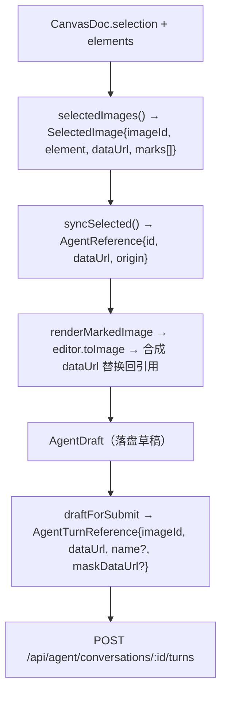

# 智能体画布：有界读路径与矢量标注结构化

调研日期：2026-09-21。代码基线：`main` @ `e35ff319`。状态：**方案建议，尚未实施**。对应 [#394](https://github.com/Muluk-m/ai-image-playground/issues/394)。

上游依据：[渐进读取与可恢复上下文](agent-canvas-context.md)（2026-09-16，建议未实施）、[遮罩编辑意图](masked-edit-intent.md)（2026-09-17，部分已实现）。本文只做静态代码核对，未跑画布实验，不给 token 阈值。

---

## 零、先更正 #394 正文里的两处错误

重写 #394 时我引用的文件是错的，本次调研当场证伪：

1. **智能体链路不经过 `rasterizeSelection.ts`。** 该文件的全部调用方是 `CanvasGenerateBar.tsx:20,64,121-125`、`submitFromCanvas.ts:27,142-144`、`submitVideoFromCanvas.ts:33,106,117,189,276`、`canvasVideoActions.ts:24,252`——全是**创作模式**。`apps/web/src/features/agent/` 下零命中。智能体走的是 `features/agent/lib/markedReferences.ts` + `selectionReferences.ts`，同样只产出合成位图，但代码是另一套。
2. **「文字标注已单独抽成 `annotationText`」只对创作模式成立。** 智能体侧 `MARK_TYPES` 含 `text`（`markedReferences.ts:5`），文字和图形一起烧进位图。

由此暴露一条本来没打算查的现状：**同一块画布上跑着两套「什么算标注」的规则。**

| | 创作模式 | 智能体模式 |
| --- | --- | --- |
| 代码 | `rasterizeSelection.ts:37-99` | `markedReferences.ts:8-16` |
| 归属判据 | **传递闭包**：选中或与 cluster 相交，反复扩散到不再增长（`:57-72`） | 单跳：**必须被显式选中** 且与该图 AABB 相交（`:13`） |
| 文字标注 | 抽成 `annotationText` 拼进 prompt，不画进图（`:74-86`） | 烧进位图 |
| 裁剪基准 | 有图形时用 entry 的 `box`，否则干净直出（`:106-116`） | 一律裁到图片边界，溢出笔画丢掉（`:26-33`） |

于是「在图上圈一下、从圈引一条箭头到旁边写一行字」这个动作，在创作模式里三样都跟着走，在智能体模式里**只有被显式选中的那些才算**。这不在 #394 范围内，但方案落地时会撞上，单独记在这里。

---

## 一、第 1 件事：智能体侧对 `canvas_projects.document` 的有界读路径

### 1.1 数据是齐的，缺的只是读

`canvas_projects` 已带 `revision`、`user_id`（notNull）、`conversation_id`（唯一索引）、`document`（`packages/db/src/schema.ts:229-253`）。`ProjectDocument = { version: 1, elements: ProjectElement[] }`（`project-protocol.ts:138-142`），六种元素，**`arrow` / `freedraw` 的 `points` / `stroke` / `strokeWidth` 在服务端是完整结构化的**（`project-protocol.ts:97-103`）。

文档自带上限：元素数 ≤ `PROJECT_ELEMENT_MAX_COUNT = 1000`、字节 ≤ `PROJECT_DOCUMENT_MAX_BYTES = 512 KiB`、id 全局唯一（`project-protocol.ts:7,317-326`）。

`apps/bff/src/lib/agent/` 对这张表**零命中**。今天智能体与画布只有单向写（`projectArchive.ts` 预留生成位与归档产物）。

### 1.2 归属：一句 `and` 闭合，不需要新身份概念

照抄服务端唯一的会话→项目通道 `projectArchive.ts:28-37`：

```ts
// context.userId / context.conversationId 均来自 AgentToolContext（tools/types.ts:20-26）
db.select({ id, revision, document, deleted_at })
  .from(canvas_projects)
  .where(and(eq(canvas_projects.user_id, context.userId),
             eq(canvas_projects.conversation_id, context.conversationId)))
```

`user_id` 是项目的唯一归属，`conversation_id` 的唯一索引保证最多一行。删除态判 `deleted_at != null`（`projectArchive.ts:38`、`routes/projects.ts:107`）。

起轮请求体里**没有 projectId**（`routes/agent.ts:545-552`），所以反查是唯一的定位方式——不是偷懒，是没有第二条路。

### 1.3 两个退化面，必须显式降级而不是补分支

**退化面 A：匿名设备在服务端根本没有画布行。** 四条独立证据：

1. `canvas_projects.user_id` 是 `notNull().references(users.id)`（`schema.ts:231-233`）。
2. `writeProject` 只接受 `user_id: userId`（`projects.ts:170`），调用方在 `!authUser` 时 401（`routes/projects.ts:127-146`）。整组项目端点无一例外。
3. 整组端点挂在 `accounts:sync` 能力下（`routes/projects.ts:53-57`），而它在 `accounts:login` 关闭时被强制判 false。
4. 术语层原话：「本地项目只在当前设备存在」（`CONTEXT.md:506`）。

所以 `context.userId` 为 null 是这个工具的**终点**，不是可补救的分支。做法与 `readLibrary` 完全一致：`if (!userId) return []`，回文说清「当前会话没有云端画布可读」。`readLibrary.ts:20-23` 的注释已经把这条教训写死：**不要为「设备也能查」加分支**——`canvas_projects` 里没有任何可用于设备的归属列，任何尝试都只会查出别人的画布。

影响面比看上去小：开了 `billing:credits` 的部署里设备**根本起不了轮**（`routes/agent.ts:490-491` 直接 401），所以计费部署每一轮都有 `userId`。只有免费/无计费部署会遇到这个退化面。

**退化面 B：登录了但项目没绑会话。** `conversation_id` 为 null 时同一句反查也返回空。回文措辞要能同时覆盖「没有云端画布」与「这张画布没绑到本会话」。

### 1.4 新鲜度：读到的文档会比用户屏幕上的旧

起轮之前**没有任何一步把画布冲到云端**：`features/agent/store.ts:1277-1400` 的 `send()` 全程未调 `workspace.flush()` 或 `cloud.sync()`（对照 `projectLifecycle.ts:172-180`，切会话时才 flush + sync）。本机落盘 500ms 防抖（`persistence.ts:17`），云端刷新 5s 节流（`cloudProjects.ts:239-242`）。

**所以「带 `revision`」不是装饰，它是模型与用户判断新鲜度的唯一凭据。**

这里有一个真正的产品裁决，不该由实现顺手决定：

> **起轮前要不要强制 flush + cloud.sync？** 做了，模型读到的就是屏幕上那张；不做，模型可能对着 5 秒前的画布下判断，而它看不出差别。代价是每轮起手多一次同步往返，且只在 `cloudProjectsEnabled()` 时有意义。
>
> 倾向：**做，但只在读画布工具真的被调用时按需触发**——起轮一律 flush 会给「只是聊两句」的轮次也加上往返。按需触发意味着工具执行期要能反向要求前端上传，仓库今天没有这条通道（`agent-canvas-context.md` §2.1 把「每次工具调用转发浏览器」降级为「可做验证原型，不作为持久运行的唯一通道」）。**折中：首版不加通道，读到什么算什么，但回文必须带 `revision` 并明说可能滞后。**

### 1.5 有界返回：仓库里没有游标，这会是第一例

现存三种「一刀切」，没有任何游标、续读或「还有 N 条」：

| 模式 | 出处 | 语义 |
| --- | --- | --- |
| 入参封顶 | `viewImage` 的 `maxItems: 4`（`tools/viewImage.ts:11-20`） | 注释写明是**意图护栏不是性能护栏**：「不封顶时模型会把整块画布一口气拽进上下文」 |
| 结果条数封顶 | `readLibrary` 的 `RESULT_LIMIT = 20`（`readLibrary.ts:9,33`） | 超出部分**静默丢弃**，回文只说「找到 N 条」 |
| 体积超限即拒读 | `loadSkill` 的 64 KiB（`skills.ts:114-115,331-332`） | **唯一的「显式超限告知 + 指路」模式** |

HTTP 侧倒是有 id 游标分页（`projects.ts:25-46`，`limit(pageSize + 1)` 多取一条判有无下一页），上限 `PROJECT_PAGE_MAX_SIZE = 100` / 默认 30（`project-protocol.ts:5-6`）。

**建议**：抄 `viewImage` 的 schema 封顶 + `readLibrary` 的表→文本骨架 + `loadSkill` 的超限措辞，游标形状照 `listProjects` 自定为**工具入参里的显式 `after`**（元素 id）。工具调用天然无状态，仓库也没有工具级会话缓存可挂，所以游标必须在入参里，不能藏在服务端。

`readLibrary` 的静默丢弃**不要抄**——#394 明确要求「超限时分页或显式截断，不默默宣称完整」，而 `arrangeTimeline` 已有「做不到的那部分要点名」的措辞惯例（`arrangeTimeline.ts:100-103`）。

### 1.6 工具形状建议

```ts
// apps/bff/src/lib/agent/tools/readCanvas.ts，骨架照 readLibrary.ts
const parameters = Type.Object({
  kinds: Type.Optional(Type.Array(Type.Union([...]), { maxItems: 6, description: '只看这些类型的对象；不填看全部' })),
  after: Type.Optional(Type.String({ description: '上一页回文末尾给出的对象 id，从它之后继续读' })),
  limit: Type.Optional(Type.Integer({ minimum: 1, maximum: 100, description: '本次最多读多少个对象，默认 30' })),
})
```

回文形状（文本，`content: [{ type: 'text' }]`，不带图片——看图走既有的 `viewImage`）：

```
画布 <projectId> 版本 <revision>，共 <total> 个对象，本页 <n> 个（第 <from>–<to> 个）。
这份文档可能比用户屏幕上的旧：它在用户停笔约 5 秒后才同步。
<每行一个对象：id、类型、位置尺寸、该类型的关键字段>
还有 <rest> 个没读，继续读请用 after=<末尾 id>。
```

「本页 30 个，共 300 个」与「全部已读完」必须是**不同的两句话**——这是 `agent-canvas-context.md` 明确要求的（`coverage` / `truncated` 语义）。

**注册三处，缺一不可**（`tools/index.ts:47-55` 的 `TOOLS` 数组是唯一注册表）：

1. `packages/shared/src/agent.ts:39-46` 的 `AgentToolName` 联合加名字——不加，`isAgentToolName` 认不出它，结果卡在历史里会掉。
2. 新建 `apps/bff/src/lib/agent/tools/readCanvas.ts`。
3. `tools/index.ts` 加 import 与数组项。

**不需要改的**：前端 `AgentToolCard` 自动渲染（`AgentPanel.tsx:59-63` 只特判 `loadSkill`）；不进 `RETRYABLE_TOOLS`（`agent.ts:333` 明说读类工具没有可重出的东西）；不写 `target?()` / `snapshot`（只给提交生成任务的工具）。

`onError: 'continue'`：读不到画布不该中止整轮。

---

## 二、第 2 件事：让矢量标注可区分

### 2.1 结构在哪一跳丢的

智能体链路逐跳（证据见附录）：



`marks` 在第 2 跳就被丢了，只剩下当同步键用（`selectionKey = imageId:marks.join(',')`，`selectionReferences.ts:169-171`）。合成位图替换回来时只改 `dataUrl`（`withDataUrl`，`:88-93`），**引用上没有任何字段记录这张图带了哪些批注**。草稿落盘后彻底消失。

`editor.toImage` 是矢量→像素的收敛点（`editor.ts:378-408`），两条链路都在这里终止结构。

### 2.2 两条可选路线

**路线甲：前端把结构随引用一起发上来。**

八个改动点，按数据流顺序（缺任何一个字段都到不了模型）：

| # | 位置 | 改什么 |
| --- | --- | --- |
| 1 | `packages/shared/src/agent.ts:75-83` | `AgentTurnReference` 加 `annotations?`，同文件新增该 interface 与条数上限 |
| 2 | `apps/bff/src/routes/agent.ts:134-144` | `referencesSchema` 放行新字段——**这是前端形状的唯一服务端闸门** |
| 3 | `markedReferences.ts:8-16` 旁 | 新增 `describeMarks(doc, image, markIds)` |
| 4 | `selectionReferences.ts:10-14,17-26` | `SelectedImage` 加 `annotations`，与 `marks` 同一次遍历算出 |
| 5 | `selectionReferences.ts:79-82` | 引用构造带上它 |
| 6 | `selectionReferences.ts:88-93` | 合成位图替换回来时一并刷新，否则「取消批注回原图」会残留旧结构 |
| 7 | `references.ts:11-22` | `AgentReference` 加同名可选字段（随草稿落盘） |
| 8 | `references.ts:129-141` | `draftForSubmit` 显式转发——**白名单式映射，最容易漏的一跳** |

**路线乙：服务端从 `canvas_projects.document` 自己读出来。**

零协议改动：文档里 `arrow` / `freedraw` 本来就是结构化的，第 1 件事的读路径顺手就能拿到。

**取舍**：

| | 甲（前端携带） | 乙（服务端读文档） |
| --- | --- | --- |
| 匿名设备 | 可用 | **不可用**（§1.3） |
| 文档滞后 | 无此问题，与位图同一时刻 | 有（§1.4） |
| 协议改动 | 8 处，含一个 shared 字段 | 0 |
| 与合成位图对齐 | 逐点对应 | 需按元素 id 反查并自行判断归属 |

**建议：甲用于选中图的标注（热路径，必须永远可用），乙服务于「读画布上其余对象」这个通用需求。两者天然对得上号**——`AgentReferenceAnnotation.id` 就是 `canvas_projects.document` 里的元素 id（`project-protocol.ts:181-183` 保证文档内唯一），不需要另造标识体系。这与 `masked-edit-intent.md` 已落地的「选区 ID 绑定原图与 mask 的 SHA-256」是同一种做法。

### 2.3 协议形状与坐标系

```ts
// packages/shared/src/agent.ts，紧邻 AgentTurnReference
/** 落在某张参考图上的一条矢量标注。坐标已归一化到该图本地坐标系：
 *  (0,0) 是图片左上角，(1,1) 是右下角；越界值合法（标注可以画到图外）。 */
export interface AgentReferenceAnnotation {
  /** 画布对象 id，与 canvas_projects.document 里的元素 id 同一个，可回查。 */
  readonly id: string
  readonly kind: 'arrow' | 'freedraw' | 'text'
  readonly color: string
  /** arrow：归一化起点与终点，箭头指向 to。 */
  readonly from?: readonly [number, number]
  readonly to?: readonly [number, number]
  /** freedraw：抽稀后的归一化路径点。 */
  readonly path?: readonly (readonly [number, number])[]
  /** 归一化包围盒 [x, y, w, h]，三种 kind 都有。 */
  readonly box: readonly [number, number, number, number]
  /** text 才有；与烧进位图的文字同源。 */
  readonly text?: string
}
```

`kind` 用独立字面量而不复用 `CanvasEl['type']`：协议包不该跟着画布内部类型走，`project-protocol.ts` 另建 `ProjectElement` 就是这个态度。

**箭头方向有依据**：`points[0..1]` 是尾、`points[2..3]` 是头——`arrowProps` 用 Konva.Arrow 默认的 `pointerAtEnding`（`konvaShapes.ts:63-72`），创建时 `[p.x,p.y,p.x,p.y]`、拖动只改末端（`KonvaCanvas.tsx:329-330,410`）。**箭头没有「绑定到某个对象」的概念，只有两个端点坐标**，所以「这条箭头指向哪个对象」只能由坐标推断，不能声称是用户的声明。

**坐标换算要新写一个函数。** 现有 `elementBounds`（`editor.ts:96-133`）只做正向（旋转四角取 AABB），`toImage` 的平移缩放是渲染变换不能当数据换算用。建议在 `editor.ts` 紧邻 `elementBounds` 新增逆变换，理由是「绕左上角旋转」这个约定只在 `editor.ts:100-104` 写过一次，第二份实现就是第二套约定。

**归一化到显示框 `width/height`，不是 `naturalWidth/naturalHeight`**：合成位图的裁剪基准就是 `elementBounds(image)`（`markedReferences.ts:32`），归一化坐标要与模型看到的那张图逐点对应。图片被缩放时用原始像素尺寸会错位。旋转过的图片另有一层不一致（`toImage` 的 bounds 是 AABB、比图片本身大），实现时按 `rotation === 0` 与否分别对齐。

**路径必须抽稀**：`freedraw.points` 上限 20000 个分量（`project-protocol.ts:315`），原样发会撑爆引用体积。等距抽样到 ~32 点，上限写进协议常量，与 `AGENT_TURN_MAX_REFERENCES = 8` 并列。

### 2.4 为什么「只发合成位图 + 一句提示词」不够

已有实测证据，不是推断。`masked-edit-intent.md` §7 第一行：「原始圈线 + 早期提示词修复 → 仍改了圈外同名对象，**失败**」。创作模式今天正是这一档——合成位图 + `CANVAS_ANNOTATION_INSTRUCTION`（`submitFromCanvas.ts:32-36`）。

同一份文档 §4.1 要求「保留未染色原图，另附编号定位图」，直接支持「结构 + 合成图并存」而非二选一。`agent-canvas-context.md` 的现状表也写死了：「应同时保留原图、标注结构和合成预览」——**三者并存，不是用结构替换合成图**。

---

## 三、交付切分

两件事耦合度低，建议分两次落地：

**第一刀：读路径（纯服务端）。** 改 `packages/shared/src/agent.ts` 的工具名联合 + 新建 `tools/readCanvas.ts` + `tools/index.ts` 注册。验收靠 HTTP 行为测试：有界读取、分页与截断措辞、伪造对象归属读不到、匿名设备读到空、`revision` 出现在回文里。**它单独就解锁 #398**（外置长结果需要一个会产生长结果的读路径）。

**第二刀：矢量标注结构化（shared + web + 一处 BFF 闸门）。** 八个改动点加坐标逆变换加抽稀。验收要断言 outbound 请求里确实带着结构，而不只是对象 id。

第二刀有一个前置选择没定：**要不要顺带统一两套标注归属规则**（§零）。不统一，用户会看到「同一个圈，在生成栏跟着走、在智能体里不跟着走」；统一，改动溢出到创作模式。倾向不在本票统一，但要在票里写明这个不一致是已知的。

## 四、本文没有给出的东西

- 任何 token 预算、节省比例或分页大小的「最佳值」。`agent-canvas-context.md` 明确拒绝虚构这些，正确做法是查 `agent_model_calls` 的 `usage` 与 `input_image_count` 实测。上文建议的 `limit` 默认 30 / 上限 100 是照抄 `listProjects`（`project-protocol.ts:5-6`）的既有取值，不是测出来的。
- 起轮前 flush 的性能数据。§1.4 的倾向是静态推理，未测同步往返耗时。
- 旋转图片上标注归一化的实测验证。§2.3 指出了不一致，未验证误差量级。

---

## 附录：关键证据索引

**服务端**：工具注册表 `tools/index.ts:47-55,65-67,84-107,188-199`；工具契约 `tools/types.ts:20-26,62-90,100-104,127-144`；`defineAgentTool` `tools/adapter.ts:68-107,110-113,118-171`；范本 `tools/readLibrary.ts:9,11-15,20-23,33,38-41,45-64`、`tools/viewImage.ts:8-20,36-70`、`tools/loadSkill.ts:26-47,104-106`；错误分类 `tools/errors.ts:11-18,63-90`；项目读写 `lib/projects.ts:25-53,170`、`lib/projectArchive.ts:28-38,146-156`、`lib/projectConversations.ts:6-58`；起轮 `routes/agent.ts:103-106,133-144,469-552,697-706`；选区精读 `lib/agent/selection-preview.ts:28-105,110-114,127-169`；输入组装 `lib/agent/turn-input.ts:223-250,262-303`、`lib/agent/images.ts:47-60,146-166,214-280`。

**前端**：元素模型 `canvasDoc.ts:14-32,42-58,60-71,73-82,96-106,141-145`；创作模式选区 `rasterizeSelection.ts:37-99,106-116,119-133`；智能体标注 `markedReferences.ts:5,8-16,26-33`；引用同步 `selectionReferences.ts:8-26,43-93,144-171`；引用类型与收口 `references.ts:11-29,92-109,129-141`；composer `AgentComposer.tsx:236-244,383-423`；HTTP `agentClient.ts:246-282,568-586`；导出 `editor.ts:96-133,378-408`；箭头绘制 `KonvaCanvas.tsx:311-312,329-332,410,557-558`、`konvaShapes.ts:63-72`。

**协议**：`packages/shared/src/agent.ts:39-46,70-90,144,333`；`packages/shared/src/project-protocol.ts:5-7,16-33,54-72,83-142,181-183,186-332`；`packages/db/src/schema.ts:229-253,275-303`。
