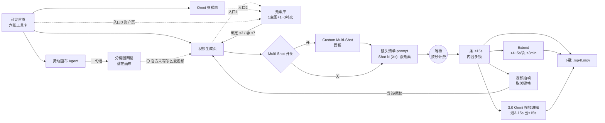
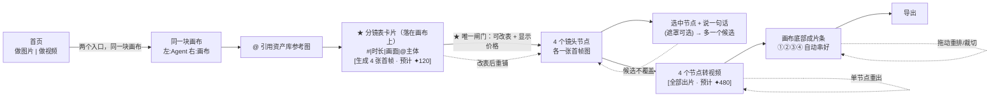

# 视频产品端到端工作流走查（第二轮）

调研日期 **2026-09-17**。统一走查任务：**「用 2 张产品/人物参考图，做一条约 15–30 秒、3–5 个镜头、同一主体贯穿的短视频，并导出」**。

本轮只回答一件事：**一个用户从零到拿到一条成片，一步一步点了什么、每一步屏幕长什么样、在哪里等、在哪里改、在哪里拼。** 不按"维度"盘点功能。

**证据分级**：🟢 实测 / 🔵 官方文档 / 🟡 官方素材 / ⚪ 未能核实

**登录态说明（影响本轮覆盖面，务必先读）**：
- Ego 浏览器只有一个 profile，**即梦未登录**（🟢 `shots/00-jimeng-home.png`，左侧「对话」「画布」均显示"请先登录"，cookie 无 sessionid）。
- **Google Flow 已登录**（🟢）。
- 可灵、Runway 未登录。
- 线索 1 的电商产品：既不在 Ego 的标签页里，也不在 Ego 的浏览历史里。

> **本轮的一个方法学突破**：即梦的配置接口 `/mweb/v1/creation_agent/v2/get_agent_config`、
> `/mweb/v1/video_generate/get_common_config` **不需要登录**即可同源调用，返回的是产品自己的
> 参数空间与 Agent 技能图谱原文。这一部分事实按 🟢 实测计（接口响应已存盘：
> `api-agent_config.json` / `api-video_common.json`），它把第一轮标 ⚪ 的一批问题直接补上了。

---


## 〇、即梦登录态实测（owner 的 Chrome，2026-09-17）——优先级高于下文所有关于即梦的推断

本节是主会话用 owner 已登录的 Chrome 实测得到的（含花 30 积分让 Agent 跑完一条成片）。**下文与本节冲突之处，以本节为准**，已知冲突三处：

1. §十一/§十二 依据官方手册写「画布内 Agent 面板将于后续开放、两者还没合流」——**实测已上线**：画布右下「与 AI 对话」打开右侧会话面板，Agent 能搜索画布节点、建节点、连线、运行节点、建时间线节点。手册滞后于产品。
2. §十 把「导演台 (Beta) 是不是 3D 导演台」列为最高优先级待验证——**实测确认是**：全屏 3D 预演工具（人偶预设 + 机位 + 静态/动态预演）。这条路幕芽不用抄。
3. 手册写「发起生成前系统会展示预计积分」——对手动点节点 `↑` 成立（按钮旁有 `✦10`）；**对 Agent 不成立**：Agent 列出「Estimated 10 credits ×3」的同时已经在运行节点，没有确认环节。

- 首页：「生成 | 画布」切换；画布态下：新建画布 / 最近画布 / 模板「视频创作」「图像创作」；下面仍是 Agent 输入框（/ 技能 @ 主体）。左栏：创作/探索/资产/主体；「对话」列表（默认创作）与「画布」列表并列。余额 60 积分。
- 点模板「视频创作」→ 新标签页打开一份模板副本画布（12 节点 6 连线）。两个编组：
  - 视频编辑：文本说明节点 + 「上传参考视频+编写文本指令」视频节点 → 连线 → 「生成视频结果」
  - 视频创作：文本说明节点；图片节点 ×5（生成场景俯视图 / 生成场景 / 生成物品三视图×2 / 生成人物三视图）→ 全部连线到 1 个「生成视频结果」视频节点
  - 模板说明原文：上传素材 → 生成一致性参考图（人物三视图/物品三视图/场景俯视图）→ 结合题材产出主体稳定的视频。
- 左工具栏：文本/图片/视频/音频/时间线/主体/导演台(Beta)/资产库/上传；左下：选择工具/小地图/显示连线/缩放；右下「与 AI 对话」；右上 搜索/历史/积分。
- 选中已完成的视频节点：
  - 节点上方浮动工具条：局部重拍✦ / 智能超清✦ / 视频编辑✦ / 截取帧▾ / 补帧✦ / 视频修剪 / 提示词反推 / 全屏 / 下载
  - 节点左右各一个 + 连接点
  - 底部「视频生成器」：顶部一排参考缩略图 = 连入该节点的 5 个上游节点（每个可 Remove，末尾「添加参考」）；中间长 prompt（模板里是一段 10 秒一镜到底广告的分时段脚本：0-5s/5s/9-10s + 摄影风格）；底栏：`即梦 Seedance 2.5 | 16:9 1080P 1 | 全能参考 | 15s | 引用参考 | 生成`；右上「展开视频生成器」
  - 结论：连线 = 参考输入；多镜头在模板里不是多节点，而是一条 prompt 里写时间段脚本、单次 15s。
- 视频节点右侧 + →「添加节点」菜单：视频 / 时间线 / 主体 可用；文本/图片/音频/导演台 置灰（按上游类型限制下游）。
- 选「时间线」→ 画布上出现「时间线 1」节点（小预览 + 迷你轨道，已含上游那段 15s；+ 追加；下载；「全屏编辑」）。
- 全屏时间线编辑器：左素材箱（已导入资产 | 画布资产；全部/图片/视频/音频；+导入；已用的标「已添加」）；中预览播放器 00:00:00/00:15:04；下单条视频轨 + 音量；工具：撤销/重做/分割/向左裁/向右裁/删除/吸附/缩放；右上「导出」。= 轻量剪辑器，单轨。
- 导演台(Beta) = 「在 3D 空间中设计角色、机位与镜头」：全屏 3D 预演工具（静态预演|动态预演；左资产：人偶预设 男/女·标准/少年/儿童/纤瘦、道具、图片、机位；右对象树+属性；WASD/QE 移动 IJKL 旋转；右上截图输出回画布）。与我们的「导演台」同名但完全不同，是构图/机位参考图生成器。
- 画布内「与 AI 对话」（右下）→ 右侧滑出会话面板（新会话；「探索更多专业创作模式」技能 chip：/视频反解 /创作分镜 /全流程广告片导演 /剧本开发 /剧情短片；输入框 + 「使用技能」 @；选中的画布节点自动成为输入框上下文 chip）。
- 实测一轮（2026-09-17，花 30 积分）：`/创作分镜 用画布里的女主和网球拍，做一条 15 秒、3 个镜头的网球拍广告短片，9:16。`
  - 步骤行依次出现：使用技能：创作分镜 → 搜索画布节点 → 编辑画布中（可展开）→ 创建视频节点 ×7 → (1/3)运行节点
  - **没有任何澄清提问，也没有生成前确认**，直接扣费。消息里列「将生成以下 3 个视频」：每条 = 完整 prompt（画面+光影+音效+禁止项）+「已引用的图片: 生成人物三视图」+「Estimated 10 credits」。
  - 总结：拆成 3 段 5 秒；「注：当前模型生成比例自动适配为16:9，生成完成后你可以导出时裁剪为9:16」（= 没满足用户的 9:16 要求，事后告知）；「等全部视频生成好了，请告诉我继续，我来帮你把三段视频拼接成完整的15秒广告成片」（= 拼接要用户回来再说一句）。
  - 底部 3 个节点 chip（网球拍广告…持拍准备/挥拍击球/得分定格）可点击定位；「本次消耗 30 积分」。会话自动命名。
  - 约 70 秒完成规划+提交。画布节点数 13→16，新节点连线自上游参考图。
  - 点消息里的节点 chip → 画布自动缩放定位到该节点并选中（chip 带状态「生成完成」）。
  - Agent 建的节点参数（节点输入框可见可改）：`即梦 Seedance 1.0 Fast | 自动匹配·720P·1 | 首尾帧 | 5s | ✦10`；参考 = 人物三视图被当作**首帧**（结果视频的封面就是三视图拼图 → 质量坑：Agent 把「一致性参考图」误当首帧；用户说的 9:16 也没满足）。节点名由 Agent 起：「网球拍广告分镜1：持拍准备」。
  - 三段约 1–2 分钟内全部「生成完成」。
  - 用户回「继续」→ 约 40 秒 → Agent 新建时间线节点「15秒网球拍广告成片」，三个视频节点连线进去，消息里给时间线 chip；「本次消耗 0 积分」。成片导出要进时间线全屏编辑器点「导出」。
- **即梦 Agent 路径步数**：输入一句（1）→ 等 → 回「继续」（2）→ 点时间线 chip → 全屏编辑 → 导出（3–5）。用户决策点：0 个确认；钱在第 1 步就花了。
- **即梦手动路径步数**（画布）：上传/生成参考图节点 → 加视频节点 → 连线 → 写 prompt → 选模型/比例/分辨率/参考模式（全能参考|首尾帧…）/时长 → 生成 → 重复 N 镜 → 节点右 + → 时间线 → 全屏编辑 → 导出。概念负担：节点、连线=参考、参考模式、主体、时间线节点、导演台(3D)。
- 首页「生成」tab：同一个输入框，左下「创作类型」下拉：Agent 模式 / 图片生成 / 视频生成 / 音乐生成 / 音频生成 / 数字人 / 动作模仿。选「视频生成」后底栏变为 `视频生成▾ | 即梦 Seedance 2.0 mini | 全能参考▾ | 16:9·720P·1 | 5s | @ | ✦30(原45) | ↑`，placeholder「上传最多12个参考素材、输入文字或 @ 参考内容…例如：@图片1 模仿 @视频1 的动作，音色参考 @音频1」。
- 参考模式下拉：全能参考 / 首尾帧 / 智能多帧 / 智能编辑(Beta) / 超长视频(Beta)。
- **结构性观察**：即梦只有一个输入框组件，出现在三处——首页（生成）、画布节点下方、画布右侧 Agent 会话。Agent 模式隐藏参数（只剩「自动」「技能」「@」），非 Agent 模式显式参数。图片/视频/音频不是不同页面，而是同一输入框的「创作类型」。


---

## 目录与覆盖度

| 章节 | 覆盖度 |
| --- | --- |
| 一、即梦（A） | 🟢 免登录 API + 公开只读画布实测；**🔵 官方《画布使用手册》全文（见 §十一，本轮最大收获）**；⚪ 仅剩 `导演台(Beta)` 与生成中进度态 |
| 二、线索 1 电商产品（B） | ⚪ **未能确认是哪个产品**；给出排除过程与一条强线索 |
| 三、可灵（C） | 🔵 官方文档完整；⚪ 画布 Agent 内部（官方也无文档） |
| 四、Google Flow（D） | 🟢 **本轮唯一一条真正端到端实测** |
| 五、Runway（E） | 🔵 官方帮助中心 |
| 六、跨产品流程对照表 | — |
| 七、三种流程原型 | — |
| 八、对幕芽的建议流程 | — |
| 九、第一轮结论的推翻与修正 | **11 条** |
| 十、未能核实 + 花积分能补什么 + 清理情况 + 截图清单 | — |
| **十一、即梦官方《画布使用手册》** | 🔵 **本轮最大的一手收获**，补掉即梦一整章的 ⚪ |
| **十二、官方手册带来的结论更新** | 对 §六/§七/§八/§九 的修订，追加 8 条推翻/修正 |

> **§十 的"未能核实"清单写于 §十一 之前，已被 §十一 大幅覆盖。以 §十一 / §十二 为准。**

### 三个数字先放这里

| 产品 | 从零到第一段视频 | 从零到成片 | 生成前确认 / 费用 |
| --- | --- | --- | --- |
| **即梦（画布节点）** | 约 **7 步**（新建画布→上传→放节点→选中→写 prompt→调 6 个参数→↑） | ⚪（时间线未实测） | 有价格（`✦56` 贴在按钮上），**无确认卡** |
| **即梦（Agent 模式）** | **1 步** | ⚪ | ⚪ |
| **可灵（视频生成页）** | **7 步**（跳过建元素）/ **13 步**（含建元素） | **不存在**——单次 ≤15s，**无时间线** | 有公开秒单价，**无确认卡记载** |
| **可灵（灵动画布）** | **1 步**（官方只承诺到分镜图） | 同上 | 只有顶栏积分余额 |
| **Google Flow** | **5 步** | **8 步** | 设置里有，**实测对图片不触发**；会话里不显示单次费用 |
| **Runway** | **3 步**（官方自编号） | **5 步** | 有，**但默认关**；确认卡 = model + prompt + est. credits |
| **幕芽（建议流程）** | **3 步** | **4 步**，必填决策 **0 个** | 分镜表卡按钮上带预计积分 |

---

## 一、即梦 Jimeng

### 1.1 已确证的参数空间（🟢 实测 API）

owner 截图里视频节点底栏是：
`即梦 Seedance 2.0 VIP ▾ | 16:9 · 720P · 1 ▾ | 全能参考 ▾ | 4s ▾ | @ | ✦56 | ↑`

这一排控件的语义，用 `video_generate/get_common_config` 的模型定义可以逐个坐实：

| 控件 | 对应字段 | 取值 |
| --- | --- | --- |
| `即梦 Seedance 2.0 VIP ▾` | `model_list[].model_name` | 全列表见下 |
| `16:9` | `video_aspect_ratio` | `21:9 / 16:9 / 4:3 / 1:1 / 3:4 / 9:16`，默认 `16:9` |
| `720P` | `resolution` | 2.0 VIP：`720p / 1080p / 4k`；2.5：`480p / 720p / 1080p` |
| `1` | 出片张数 | — |
| **`全能参考 ▾`** | **`input_media_type`** | **`unified_edit / prompt / first_frame / end_frame`（2.5 另有 `long_video` / `edit`），默认 `unified_edit`** |
| `4s ▾` | `frames` @ `fps=24` | 2.0 VIP：96–360 帧 = **4–15s**；2.5：96–720 帧 = **4–30s** |
| `✦56` | 本次生成消耗积分 | 生成前显示在按钮左侧 |

**这条解开了 owner 问的「全能参考 vs 首尾帧 vs 主体」的关系**：

- 「**全能参考**」和「**首帧**」「**尾帧**」**不是三个功能，是同一个下拉 `input_media_type` 的三个互斥取值**。选「全能参考」就是把图/视频/音频一股脑丢进去让模型自己理解；选「首帧/尾帧」就是传统的图生视频/首尾帧插值。默认是「全能参考」。
- 「**主体**」是**另一个维度**：它是一个具名可复用实体，通过输入框里的 `@` 插入，不占 `input_media_type`。也就是说「@主体 + 全能参考」可以同时用。

各模型能力（🟢 `api-video_common.json`）：

| 模型 | 官方一句话 | 分辨率 | 特有能力 |
| --- | --- | --- | --- |
| 即梦 Seedance 2.5 | 最强模型，支持 50个参考，新增视频编辑、超长生成 | 480p/720p/1080p | 首帧、尾帧、**长视频 30–180s**、**视频编辑 4–30s**、全能参考 |
| 即梦 Seedance 2.0 mini | 极致性价比，相近的体验，比 Fast 更快的推理速度 | 720p | 延长、编辑、全能参考 |
| 即梦 Seedance 2.0 Fast VIP | 极速推理，会员专属通道，音视文图均可参考（暂不支持真人人脸） | 720p | 同上 |
| 即梦 Seedance 2.0 VIP | 全模态能力，会员专属通道，音视文图均可参考（暂不支持真人人脸） | 720p/1080p/4k | 同上 |
| 即梦 Seedance 1.5 Pro | 音画同出，全新体验 | 720p/1080p | 延长、编辑 |
| 即梦 Seedance 1.0 / 1.0 Fast | 效果最佳，画质超清 / Pro级表现，加量不加价 | 1080p | 1.0 Fast 有 `multi_frames`（多帧） |
| MiniMax H3 / HappyHorse 1.1 / Wan 3.0 | 第三方模型 | — | **即梦画布里可以直接调第三方模型** |

「全能参考」的物理上限（🟢 `reference_resource_config`）：
**最多 50 个素材**，其中图片 ≤30、视频 ≤10、音频 ≤10；单视频 ≤200MB、1.8–30.2s，视频总时长 ≤30.2s；单音频 ≤15MB、1.8–30.2s。

### 1.2 即梦 Agent 的内部技能图谱（🟢 实测 API，第一轮完全没看到）

`get_agent_config.starling_mapping.skill` 列出了 **32 个内部技能 id**，这不是技能市场里用户发布的那些，
而是 **Agent 自己在一条生产线上依次调用的工具**。把它们按名字归类，即梦的视频流水线就明牌了：

**故事片线**
`story-idea 故事创意` → `story-script 故事脚本` → `script-chunk 分镜设计` → `story-ref-gen 素材生成`
→ `scene-reflection 分镜校验` → `shots-timing 镜头节奏` → `video-shot-design 创作分镜`
→ `trans-prompt-seedance2.5 / seedance25-prompt-engineering 提示词生成` → `shots-assembly 镜头组装`
→ `bgm-search BGM搜索` → `video-sop 长视频创作`

**电商 / 广告线**
`ecom-idea 电商创意` → `ecom-script 电商脚本` → `ecom-ref-gen 电商参考生成`
→ `image-ecommerce 电商素材设计` / `image-main 创意设计` / `image-poster 海报设计` / `image-logo Logo设计`
→ `video-main 视频创作` → `tvc-creation 全流程广告片导演`

**支撑**
`project-memory 项目记忆`、`ref-extract 素材抽取`、`video-reverse-skill 视频反解`、
`skill-creator 技能编辑工具`、`dreamina-cli-generate / dreamina-cli-resource CLI 生成/资源`、
`image-pe 图片Prompt Skill`、`video-prompt 视频提示词`

三点值得注意：

1. **`scene-reflection 分镜校验` 是一个独立技能**——即梦在"出图之前"插了一道自动校验。
2. **`shots-assembly 镜头组装` 和 `video-sop 长视频创作` 是技能不是界面**。这坐实了第一轮的推测：
   **拼接在即梦是一次 Agent 工具调用，不是一个用户要操作的时间线。**
3. **`dreamina-cli-*` 的存在说明即梦有一套 CLI/Agent 外部调用面**，和可灵的 MCP & CLI 是同一步棋。

官方内置 Agent 技能只有 **7 个**（🟢 `skill_data`），每个都带 market 分类：

| id | 名称 | 官方描述原文 | 分类 |
| --- | --- | --- | --- |
| `web_agent_skill_story` | 故事短片 | 帮你自动生成故事大纲、分镜脚本并产出短片 | film_short |
| `web_agent_skill_tvc_director` | 全流程广告片导演 | 输入你的广告需求或一份 Brief，即可从创意、脚本、分镜到镜头、配乐分阶段生成，串成一支结构完整的商业广告片，不限品类与风格 | commercial_ads |
| `web_agent_skill_seedance_shot_design` | 创作分镜 | 面向 Seedance 视频模型的专业级虚拟导演与提示词工程师。将模糊创意转化为电影级美学视频分镜 Prompt，内置运镜词典与导演风格库，**超 15 秒长叙事自动分段** | general_creation |
| `web_agent_skill_video_reverse` | 视频反解 | 拆解参考视频的镜头语言、光影色调与声音节奏，一键生成可用于拉片复刻、元素替换和再创作的视频 Prompt | general_creation |
| `web_agent_skill_ecommerce` | 电商套图 | 生成风格统一的商品全套视觉素材，适用于各大电商平台 | ecommerce_updated |
| `web_agent_skill_poster` | 海报设计 | 生成更有创意的海报内容，擅长营销场景和节日热点 | graphic_design |
| `web_agent_skill_brand` | 品牌设计 | 根据公司名称、业务与客群，生成品牌 Logo 与视觉方案 | graphic_design |

**「超 15 秒长叙事自动分段」是一句关键原文**：即梦把「一条 30s 片子要切成几镜」这件事
交给技能自动决定，用户不填镜数。

### 1.3 只读画布实测（🟢）

公开作品《香水–Elle fait naître le soleil》（作者「机关枪怪人」，成片 00:50 / 1080P，494 收藏）
→ 作品页 `查看创作过程` → 只读画布 `/ai-tool/ai-canvas/<uuid>`。

- 顶栏：`项目名 ⋯ 当前为只读模式，如需创作请点击 [复制项目] ×` 🟢 `shots/A02-jimeng-process-canvas.png`
- 适配画布后整图 **8% 缩放**才装得下，节点数以百计 🟢 `shots/A03-jimeng-canvas-fit.png`
- **新发现（第一轮没看到）**：画布上有名为 **`视频 2–Generation history`** 的 frame，
  里面平铺着同一个节点的多条候选，每条都带 `AI生成` 徽标。也就是说
  **「一个节点的 N 个候选」在即梦画布上是被摊开成一个可框选的分组，而不是只藏在节点角标的 `8 ⌄` 下拉里**——
  两种形态同时存在：折叠时是角标计数（实测见到 `8 ⌄` / `10 ⌄` / `12 ⌄`），展开时是一个 history frame。
- 左下角画布工具条：`▷（指针）| ▥（缩略图）| ⤴（分享）| 100%`

> ⚪ 只读画布的工程 JSON（`octo_api/v1/project/get`）需要登录，同源 replay 返回 `login is required`，
> 未能取到节点/连线的结构化数据。


### 1.4 即梦：分步走查（🟢 已确证部分 + ⚪ 登录墙）

因为未登录，**画布内部的逐步操作无法实测**。下表把 owner 截图（🟡 owner 提供）、
公开只读画布（🟢）与免登录 API（🟢）能坐实的部分拼起来，登录墙后的步骤明确标 ⚪。

| 步骤 | 用户动作 | 屏幕变化 | 系统替他决定了什么 | 他能改什么 | 证据 |
| --- | --- | --- | --- | --- | --- |
| 1 | 首页中间选 `画布`（另一个选项是 `生成`） | 出现 `新建画布` + 两张模板卡 `视频创作` / `图像创作` | 「一次创作」是对话还是画布，在**进门第一步**就分叉 | 选哪条 | 🟢 `00-jimeng-home.png` |
| 2 | 点 `新建画布`（或从模板起步） | 进入无限画布，左侧竖工具栏 `文本/图片/视频/音频/时间线/主体/导演台(Beta)/资产库/上传` | 画布默认空，工具栏就是"能往画布上放什么" | — | 🟡 owner 截图 |
| 3 | 点工具栏 `上传` 放 2 张参考图 | 画布上出现 2 个图片节点 | — | 节点位置 | ⚪ |
| 4 | 点工具栏 `主体` 建一个具名主体 | ⚪ 主体创建面板 | ⚪ | ⚪ | ⚪ |
| 5 | 点工具栏 `视频` 放一个视频节点 | 画布出现 `视频 1` 节点，**左右各一个 `+` 连接点** | 节点是"一镜"的容器 | 节点命名（公开作品里用户自己命名为 `part 02-9`…） | 🟡 owner 截图 / 🟢 只读画布 |
| 6 | 选中视频节点 | **节点下方长出该节点专属的输入框**：`+ 参考`、「上传参考图、输入文字或 @ 主体，描述你想生成的视频」 | 输入框是**挂在节点上**的，不是全局的 | prompt、参考、@主体 | 🟡 owner 截图 |
| 7 | 调底栏参数 | `即梦 Seedance 2.0 VIP ▾ \| 16:9 · 720P · 1 ▾ \| 全能参考 ▾ \| 4s ▾ \| @ \| ✦56 \| ↑` | 默认：`input_media_type=unified_edit`（全能参考）、`16:9`、`4s`（96帧@24fps） | 模型 / 比例+分辨率+张数 / **输入模式（全能参考↔首帧↔尾帧↔纯文本）** / 时长 4–15s | 🟢 API + 🟡 截图 |
| 8 | 点 `↑` | ⚪ 生成中形态 | 按钮左侧 `✦56` = 本次消耗积分，**生成前就显示** | — | 🟡 截图（价格）/ ⚪（进度态） |
| 9 | 出片 | 节点变成内联播放器，带 `AI生成` 徽标；多次生成堆成 `8 ⌄` 角标，展开是一个 `视频 N–Generation history` frame | 候选自动成组 | 选用哪一条 | 🟢 `A02` |
| 10 | 连下一镜 | 从节点右侧 `+` 拉一条边到新节点 | **画布记录"谁生成自谁"**，不是自由摆放 | 连谁 | 🟢 只读画布可见连线 |
| 11 | 串成片 | 工具栏 `时间线` | ⚪ 时间线形态未实测 | ⚪ | ⚪ / 🟢 内部技能 `shots-assembly 镜头组装`、`video-sop 长视频创作` 说明**Agent 也能代劳拼接** |
| 12 | 导出 | ⚪ | ⚪ | ⚪ | ⚪ |

### 1.5 即梦的四条路各是什么、怎么衔接（owner 问题的直接回答）

即梦不是"一个产品四个功能"，而是**四个粒度的同一件事**，从粗到细：

| 路 | 入口 | 谁在决定分镜 | 用户看到的中间产物 | 适合谁 |
| --- | --- | --- | --- | --- |
| **Agent 对话** | 首页 `生成` tab → `Agent 模式`（默认创作类型） | Agent。技能 `story-idea → story-script → script-chunk → shots-timing` 全自动 | 方案 / 分镜表（技能描述里叫「九列分镜表」「4–15s Clip 表」） | 只有一个想法的人 |
| **导演台 (Beta)** | 画布左侧工具栏 | **介于两者之间**——⚪ 具体形态未实测。从命名（导演台）与内置技能 `tvc-creation 全流程广告片导演`「从创意、脚本、分镜到镜头、配乐**分阶段生成**」推断，它是**把 Agent 的分阶段产物摊成一个可逐阶段确认的面板** | ⚪ | 要控分镜但不想连线的人 |
| **画布节点** | 画布左侧 `视频` / `图片` / `音频` / `文本` | **用户**。一个节点 = 一镜，参数全明牌 | 每个节点的参数条 + 候选 history | 要逐镜控参数的人 |
| **时间线** | 画布左侧 `时间线` | 用户排序 | ⚪ | 要精剪的人 |

**衔接方式是"同一块画布"**：Agent 对话的产物、导演台的产物、手搓的节点、时间线，全部是同一块画布上的对象。
这是即梦跟 Flow / Runway 最不一样的地方——**它没有"会话"和"工作面"的分离，画布本身就是会话的落点。**

> **与第一轮的关系**：第一轮说「四家都没有在 Agent 模式下暴露镜数和时长」。这条**仍然成立，但要补一句**：
> 即梦在**画布节点模式下是完全显式的**（模型/比例/分辨率/张数/输入模式/时长六个控件一字排开）。
> 所以即梦的真实形态是 **「Agent 模式隐藏参数 + 节点模式暴露参数」双轨并存**，不是"参数消失了"。
> 这正是 owner 说「好复杂」的来源：**用户要先知道自己该走哪条轨。**

### 1.6 即梦的摩擦点（以第一次使用者视角）

1. **进门就要做一个没有依据的选择**（步骤 1）：`生成` 还是 `画布`？两者都能做视频，首页没有任何提示告诉你差别。
2. **画布左侧 9 个工具**（步骤 2）里，`主体`、`导演台(Beta)`、`时间线`、`资产库` 四个是概念，不是动作。第一次用的人不知道 `主体` 和 `上传` 的区别。
3. **`全能参考` 是默认值但最难理解**（步骤 7）。它和 `首帧`/`尾帧` 是同一个下拉的互斥选项，但下拉标题不叫「输入方式」而是直接显示当前值「全能参考」，**看起来像一个功能开关而不是一个模式选择器**。
4. **三个都叫"参考"的东西**：`+ 参考`（节点输入框左边）、`全能参考`（底栏下拉）、`@主体`。第一次用的人无法判断该用哪个。
   - 实际关系：`+ 参考` 是**动作**（加素材），`全能参考` 是**模式**（这些素材怎么被用），`@主体` 是**具名引用**（跨镜复用的实体）。
5. **一条 30s 的片子要不要拆成多个节点，没有任何界面提示**。2.0 VIP 上限 15s、2.5 上限 30s（`long_video` 模式 30–180s），
   但这个上限藏在「4s ▾」下拉里，且随选中的模型变化。
6. **同一件事有多个入口**：做一条视频可以走 Agent 对话、导演台、画布节点三条路；即梦自己不给任何导航建议。


### 1.7 即梦流程图

```mermaid
flowchart LR
  home["首页<br/>生成 | 画布"]
  agent["Agent 对话<br/>(消息流)"]
  canvas["无限画布<br/>(空)"]
  subj["主体面板<br/>具名实体"]
  node["视频节点<br/>+ 节点输入框"]
  param["底栏参数<br/>模型/比例/输入模式/时长"]
  wait(("等待<br/>✦N 积分已扣"))
  hist["Generation history frame<br/>N 个候选"]
  edge["从 + 拉边<br/>接下一镜"]
  tl["时间线"]
  out["成片"]
  dir["导演台 Beta<br/>分阶段"]

  home -->|点 生成| agent
  home -->|点 画布| canvas
  canvas -->|工具栏 上传| canvas
  canvas -->|工具栏 主体| subj
  canvas -->|工具栏 视频| node
  canvas -->|工具栏 导演台| dir
  subj -.->|@主体| node
  node --> param --> wait --> hist
  hist --> edge --> node
  hist --> tl --> out
  agent -->|产物落画布| hist
  dir -->|产物落画布| hist
  hist -.->|不满意，改 prompt 重生成| param
```

- **分叉**：`首页` 一次（生成/画布）；`画布` 里三次（Agent 对话 / 导演台 / 手搓节点）——**三条路都能到同一个 `Generation history`**。
- **等待点**：只有一个，`↑` 之后。积分在点之前就显示（`✦56`），点下去即扣。
- **可回头改**：`hist → param` 这条虚线是唯一的"改一镜"路径：选中节点 → 改输入框/参数 → 再点 `↑` → 多出一个候选。**原候选不被覆盖**，这是即梦画布最好的一点。

### 1.8 即梦关键屏幕线框

**① 首页（🟢 实测）**
```
┌──────────────────────────────────────────────────────────────────────┐
│ [限时促销条 ────────────────────────────────────────────────────  ×] │
├────────────┬─────────────────────────────────────────────────────────┤
│ 即梦AI  ⊡  │                                      ○  [ 登录 ][领积分]│
│            │                                                         │
│ ◆ 创作     │              你好，今天想要创作什么?                     │
│ ◎ 探索     │                                                         │
│ ▤ 资产     │            ┌──────────┬──────────┐                      │
│ ▣ 主体     │            │   生成   │  画布 ●  │  ← 第一个分叉        │
│            │            └──────────┴──────────┘                      │
│ 对话       │  ┌───────────┬──────────┬──────────┐                    │
│  请先登录  │  │     +     │ 模板     │ 模板     │                    │
│            │  │ 新建画布  │ 视频创作 │ 图像创作 │                    │
│ 画布       │  └───────────┴──────────┴──────────┘                    │
│  请先登录  │  ┌───────────────────────────────────────────────────┐  │
│            │  │ 输入想法、剧本或上传参考，支持 / 使用技能，        │  │
│            │  │ @ 添加主体，和 Agent 一起创作            [ ↑ ]   │  │
│            │  └───────────────────────────────────────────────────┘  │
└────────────┴─────────────────────────────────────────────────────────┘
```

**② 画布 + 选中视频节点（🟡 owner 截图 + 🟢 API 坐实参数）**
```
┌──┬───────────────────────────────────────────────────────────────────┐
│文│                                                                   │
│本│      ┌──────────────┐          ┌──────────────┐                   │
│图│   ●──│   视频 1     │──●    ●──│   视频 2  ◉  │──●   ← 左右各一 + │
│片│      │  ▶ 00:04     │          │  ▶ 00:04     │                   │
│视│      └──────────────┘          └──────────────┘                   │
│频│                                 ╭─────────────────────────────╮   │
│音│                                 │ [+] 参考                    │   │
│频│                                 │ 上传参考图、输入文字或 @ 主体│   │
│时│                                 │ ，描述你想生成的视频         │   │
│间│                                 ├─────────────────────────────┤   │
│线│                                 │ [即梦 Seedance 2.0 VIP ▾]   │   │
│主│                                 │ [16:9·720P·1 ▾][全能参考 ▾] │   │
│体│                                 │ [4s ▾] [@]      ✦56  [ ↑ ]  │   │
│导│                                 ╰─────────────────────────────╯   │
│演│                                   ↑ 输入框挂在节点上，不是全局的  │
│台│                                                                   │
│ᴮᵉᵗᵃ                                                                  │
│资│                                                                   │
│产│                                                                   │
│库│                                                                   │
│上│  [▷][▥][⤴]  100%                                                  │
│传│                                                                   │
└──┴───────────────────────────────────────────────────────────────────┘
      「全能参考 ▾」展开 = input_media_type：
      ┌─────────────────┐
      │ ● 全能参考       │ unified_edit（默认，图/视频/音频混合参考）
      │ ○ 文生视频       │ prompt
      │ ○ 首帧           │ first_frame
      │ ○ 尾帧           │ end_frame
      │ ○ 超长生成 (2.5) │ long_video 30–180s
      │ ○ 视频编辑 (2.5) │ edit 4–30s
      └─────────────────┘
```

**③ 只读画布 / Generation history（🟢 实测）**
```
┌──────────────────────────────────────────────────────────────────────┐
│ 香水–Elle fait naître le soleil   当前为只读模式，如需创作请点击     │
│                                              [ 复制项目 ]        [×] │
├──────────────────────────────────────────────────────────────────────┤
│  ▣ 视频 2–Generation history ┄┄┄┄┄┄┄┄┄┄┄┄┄┄┄┄┄┄┄┄┄┄┄┄┄┄┄┄┄┄┄┄┄┄┄┄  │
│  ┌──────────────────────┐        ┌──────────────────────┐            │
│  │ ▶ 视频 2   [AI生成]  │        │ ▶ 视频 2   [AI生成]  │            │
│  │      (候选 1)        │        │      (候选 2)        │            │
│  └──────────────────────┘        └──────────────────────┘            │
│  ┌──────────────────────┐        ┌──────────────────────┐            │
│  │ ▶ 视频 2   [AI生成]  │        │ ▶ 视频 2   [AI生成]  │            │
│  └──────────────────────┘        └──────────────────────┘            │
│   ↑ 同一个节点的 N 次生成被摊开成一个可框选的分组                    │
│                                                                      │
│  折叠时的形态： ┌──────────┐                                         │
│                 │ (缩略图) │ [ 8 ⌄ ]  ← 角标计数                     │
│                 └──────────┘                                         │
│  [▷][▥ 缩略图][⤴ 分享]  [ 8% ]                                       │
└──────────────────────────────────────────────────────────────────────┘
```

---

## 二、线索 1 的电商产品（B）—— ⚪ **未能确认是哪个产品**

**结论：没认出来，不猜名字。** 下面是我做过的排除和一条强线索。

### 2.1 排除过程（🟢 实测）

| 候选 | 为什么排除 | 证据 |
| --- | --- | --- |
| **稿定AI** `gaoding.art` | 形态极像（首页顶部就是 `Agent模式 \| 图片生成 \| 视频生成` 三段控件，下面 `AI画布 / AI电商 / 视频创作 / 图片创作 / AI改图 / AI改字 / SKILL HUB`，还有「AI电商工具：电商主图套图 / 商品精修 / 爆款主图复刻」和「电商工作流」）。但**左侧导航是 `创作 / 发现 / 我的 / 创建`，货币叫「豆」**（"新用户登录即可领豆，最高可获得 70 豆"），不是「算力」，也没有「电商图文 \| 电商视频」双入口 | 🟢 `shots/B01-gaoding-home.png` |
| **绘蛙** `ihuiwa.com`（阿里，服饰电商，货币**确实叫「算力」**） | 顶部横向导航 `首页/AI生图/AI修图/AI视频/AI创作/WaClaw/模特广场/作品与素材/购买套餐`，**没有左侧竖导航，没有「电商图文 \| 电商视频」双入口** | 🟢 `shots/B02-huiwa-home.png` |

另外：**Ego 浏览器里既没有这个产品的标签页，也没有它的浏览历史**（历史里 14:35–16:48 全是第一轮调研的足迹：即梦/可灵/Runway/Flow/海螺/Lovart，没有任何电商向产品）。Bing 上按
「电商图文+电商视频+主图视频+品牌TVC+算力」「人脸资产+算力」「种草视频+品牌TVC+自由创作」「主图视频+种草视频+品牌TVC」四组特征词检索，全部只命中行业盘点文，没有命中具体产品。

### 2.2 一条很强的线索：它的四个子模式和即梦 Agent 的内部技能 id 一一对应（🟢）

owner 描述的四个视频子模式，与我从**即梦免登录 API** 拉到的内部技能 id 精确对应：

| owner 看到的子模式 | 即梦内部技能 id | 即梦给它的中文名 |
| --- | --- | --- |
| **主图视频** | `video-main` | 视频创作 |
| **种草视频** | `ecom-idea` / `ecom-script` / `ecom-ref-gen` | 电商创意 / 电商脚本 / 电商参考生成 |
| **品牌TVC** | `tvc-creation` | **全流程广告片导演** |
| 自由创作 | （无技能，直通 Agent） | — |
| （图文侧）电商图文 | `image-ecommerce` / `image-main` | 电商素材设计 / 创意设计 |

再加上 owner 描述的输入框文案「上传 **1–6 个参考素材**、输入文字或 **@主体**，自由组合图、文、音、视频多元素」——
**「图/文/音/视频多元素混合参考」正是 Seedance 2.0 的 `unified_edit`（全能参考）模式的产品化说法**，
即梦自己的 `reference_resource_config` 上限也是同一套（图 ≤30、视频 ≤10、音频 ≤10）。

**因此可以有把握地说的是**：这个电商产品**不是一个独立做模型的公司**，它把 Seedance 2.0 / 即梦那套
「全模态参考 + @主体 + 分类技能」包成了电商垂直入口，并且把技能集裁成了四个面向电商的模板
（主图视频 / 种草视频 / 品牌TVC / 自由创作）。**名字我不猜。**

### 2.3 它的形态告诉我们什么（对幕芽最有用的一条）

owner 的原话是关键：**「视频与图片是不同的入口，但是进入后图片与视频模式的画布（是同一个）」**。

把这条和它的信息架构放在一起看，这是一个**明确的产品裁决**，而且正好是即梦没做的：

```
首页：  ┌────────────────┬────────────────┐
        │   电商图文  →  │   电商视频  →  │   ← 入口按「你要什么产物」分
        └────────────────┴────────────────┘
              │                  │
              │            ┌─────┴──────┬────────┬──────────┐
              │            主图视频  种草视频  品牌TVC  自由创作   ← 模板分流
              │                  │
              └────────┬─────────┘
                       ▼
              ┌────────────────────┐
              │   同一块画布/项目   │   ← 产物落点是同一个
              │   (项目卡左上角用   │
              │    「视频」/「图片」│
              │    角标区分类型)    │
              └────────────────────┘
```

**入口分流 + 工作面统一**。项目卡上的「视频 / 图片」角标说明：**类型只是项目的一个标签，不是两套系统。**

⚪ **未能核实**：四个子模式各自把用户带到什么中间步骤（有没有脚本/分镜确认页）、生成按钮上的「310 算力」怎么算出来的、
「人脸资产」和「@主体」是不是同一个东西。**这一段必须等 owner 给截图或 URL 才能补。**

---

## 三、可灵 Kling

未登录，本节全部为 🔵 官方文档 / 🟡 官方配图。**一个必须先说的发现：可灵官方对「灵动画布 Agent」根本没有操作指南**——
`klingai.com/quickstart` 的 26 篇指南全是模型/功能指南，没有画布或 Agent 条目。Agent 的唯一一手资料是
2026-01-29 的一条更新公告。所以可灵有**两条流程**，文档覆盖度天差地别。

### 3.1 路线 A：视频生成页（文档完整，🔵）

这是可灵**真正被写清楚**的那条路，也是走查任务真正能走完的那条。

| 步骤 | 用户动作 | 屏幕变化 | 系统替他决定了什么 | 他能改什么 |
| --- | --- | --- | --- | --- |
| 1 | 建元素：Omni 输入框点 `Create Element` / Video 3.0 点 `Bind elements…` / Assets 页点 `Elements`（**三个入口**） | 元素创建流 | 三个入口通向同一个流 | 从哪进 |
| 2 | 点 `Add Images` 传主参考图 | 主图占位 | **自动识别 subject type** | 可改为 Characters/Animals/Items/Costumes/Scenes/Others |
| 3 | （角色）选音色 | 出现音色项 | 绑了音色后 **prompt 里不要再写音色** | 传音频提取 / 从 Voice Library 选 / No Voice |
| 4 | 传 1–3 张补充图 | 缩略图排开 | **上限锁死：1 主图 + 最多 3 补充 = 4 张** | 张数、角度；也可只给 1 张让 AI 自动补多视角 |
| 5 | 填名字 + 描述 | 名称/描述框 | 名字库内唯一 | 手填，或点 `AI Auto-Description` |
| 6 | 点 `Generate` 存库 | 元素入库，图片/视频生成都能用 | **建元素免费**；AI 补多视角会员每天 3 次免费、之后 5 credits/次 | — |
| 7 | 回 Video 3.0，传首帧（或首尾帧） | 输入区出现首帧 | — | 首帧 / 首尾帧 |
| 8 | 点 `Bind Subject to Enhance Consistency` | 元素挂上本次生成 | **最多绑 3 个**，且元素必须出现在参考帧里 | 绑哪几个 |
| 9 | 打开 `Multi-Shot` 开关 | 开关亮 | 关着 = 单镜头；**开着是 `Custom Multi-Shot` 的前提** | 开/关 |
| 10 | 点 `Custom Multi-Shot` | 弹出分镜配置面板 | 只开 Multi-Shot → 模型自动规划转场；点了 Custom → 「模型严格按提示词执行」 | 官方原文「flexibly configure the **number of shots and their durations**」 |
| 11 | 写镜头清单 prompt | 文本框 | 总时长 3–15s 内分配 | 逐镜 `Shot N (Xs): …`，句中 `@元素名` |
| 12 | 选 1080p/720p、Native Audio、Voice Control | 参数条 | **按秒计费**：12 / 9 credits/s（带原生音频 1080p/720p）、8 / 6（不带）、Voice Control +2 | 三项都能改 |
| 13 | 点生成 | 队列 → **一条片子里就含多镜**（最长 15s） | **无生成前确认卡的官方记载** | — |
| 14 | 下载 | — | — | 2026-01-30 起支持 **.mov 无损导出** |

### 3.2 路线 B：灵动画布 Agent（🔵 公告口径，无分步文档）

公告没有编号步骤，它给的是 **5 个场景块 × 每块 2–3 栏对照图**。这 3 栏就是官方给出的全部"步骤"：

```
场景 1 故事分镜（官方三栏）
  [栏1 输入]           →  [栏2 生成主体和场景]        →  [栏3 生成分镜图]
  一张角色参考图            角色三视图（正/侧/背）           24 格分镜图网格
  + 一句话 prompt          + 道具图 + 4 张空场景图          落在画布上
```

**正文承诺 4 步（主体&场景图 → 分镜图 → 分镜视频），但配图只到分镜图，「分镜视频」这一栏缺失。**🔵
在画布里怎么把分镜图变成分镜视频、要不要逐个点、能不能批量，公告没写（⚪）。

画布内部的布局（从官方「输出（对话+画布）」配图辨认，🟡）：
```
┌────────────────────────────────────────────────┬─────────────────────┐
│ ← 城市漫步插画系列                             │  会话名              │
│                                                │  ┌───┐ 晨曦探路.png │
│ ┌──┐   画布（自由摆放的素材网格）              │  └───┘               │
│ │工│   ┌────┐ ┌────┐ ┌────┐                    │  ┌───┐ 极速飞驰_v2  │
│ │具│   └────┘ └────┘ └────┘                    │  └───┘               │
│ │条│   ┌────┐ ┌────┐ ┌────┐                    │  ┌───┐ 雪地欢呼_v2  │
│ └──┘   └────┘ └────┘ └────┘                    │  └───┘               │
│                                                │  ┌─────────────────┐ │
│  58%                                           │  │输入你的创意，例如│ │
│                          [ 积分余额 8331.60 ]  │  │生成一个1分钟的赛│ │
│                              ↑ 顶栏右上         │  │博朋克风格故事分 │ │
│                                                │  │镜...            │ │
│                                                │  └─────────────────┘ │
└────────────────────────────────────────────────┴─────────────────────┘
```
🟡 官方公告配图。**画布在左、对话停靠在右**，与即梦「画布即会话落点」是同一个思路，但可灵把对话做成了**文件列表**（按文件名 + 缩略图列结果），不是消息流。

**批量是卖点**：「Agent 可以处理您一次性输入的多个提示词，**并行同步生成所有结果并展示在画布上**，您还可以**批量框选**素材**批量下载**」🔵

### 3.3 关键数字

| 问题 | 可灵 |
| --- | --- |
| 从零到第一段视频 | 路线 A 约 13 步（含建元素 6 步）；跳过建元素、只用首帧 + Custom Multi-Shot 约 **7 步**。路线 B **1 步**（输入一句话），但官方只承诺到分镜图 |
| 从零到成片 | **官方口径里不存在「成片」这一步**。单次上限 15s，走查任务的 15–30s 里超出的部分必须分多次生成，而**可灵没有时间线、没有剪辑台**，所有官方文档里都没有 |
| 生成前确认 / 费用 | 无确认卡记载。费用是**公开秒单价**（12/9/8/6 credits/s），画布顶栏显示积分余额 |
| 多镜头靠什么串 | **靠单次生成内部**的 Multi-Shot / Custom Multi-Shot，不靠拼接 |
| 主体一致性在哪一步介入 | **生成之前**：先建元素（步 1–6），生成时绑定（≤3，须出现在参考帧）或 Omni 里 `@`（无视频输入 ≤7、有视频输入 ≤4；图片生成 ≤10） |
| 改一镜几步 | **没有「改第 N 镜」的官方流程。** 替代：① 整条重生成；② Extend（生成后左下角 Tab，Auto/Customized，每次 +4–5s，可多次，总长 ≤3 分钟）；③ 3.0 Omni 视频编辑（进 3–15s，出 ≤15s，支持 4K）；④ 视频抽帧取关键帧当首/尾帧重做 |

### 3.4 官方原文（🔵）

**它为什么不做时间线——官方公开表态**
> "5. 15-Second Long-Shot Generation — Video 3.0 generates up to 15 seconds of continuous video… **Say goodbye to fragmented assembly and embrace a story with real progression and flow.**"
> 页首摘要：「No more tedious cutting and editing — just one generation for a cinematic video」
> — https://klingai.com/quickstart/klingai-video-3-model-user-guide

**Multi-Shot 的开关依赖**
> "When 'Multi-Shot' is enabled, the model automatically plans the shot transitions, and **this switch is a prerequisite for enabling 'Custom Multi-Shot'**."
> "If you wish to set specific details for each shot, click 'Custom Multi-Shot' to **flexibly configure the number of shots and their durations**." "**The model will strictly follow the prompts.**"
> — 同上

**镜头清单 prompt 的官方写法**
> "Shot 1 (3s): Close-up on the comedy open-mic stage… Shot 2 (4s): Mid-close shot of **[@Little Scholar]**, who says, '…' Shot 3 (4s): **[@Little Scholar]** with a restrained, slight smile… Shot 4 (2s): Switch to the audience laughing loudly."
> — https://klingai.com/quickstart/klingai-element-library-3-user-guide

**元素上限（三处互相打架，全在官方页面上）**
> "Each element must contain at least 2 reference images (1 main + 1 additional) and can include up to 4 (1 main + 3 supplementary)."
> "In Video 3.0 Omni or Video O1, if there is a video in the input area, you can upload a total of **4** images/elements. If no video exists, you can upload up to **7**."
> "In Video 3.0, after uploading a frame or start and end frames, you can bind up to **3** additional elements."
> "In Image 3.0 Omni or Image O1, you can upload up to **10**."
> — https://klingai.com/quickstart/klingai-element-library-3-user-guide

**Extend**
> "The AI-generated video can be further extended by **4-5 seconds** and allows for multiple continuations, reaching a total length of **up to 3 minutes**." "located at the **bottom left Tab after video generation**, with two modes: 'Auto-Extend' and 'Customized Extend'." 公式：`Prompt = Subject + Movement`
> — https://klingai.com/quickstart/ai-video-extension

### 3.5 可灵的摩擦点

1. **「一次生成 15 秒」和 15–30 秒的任务正面撞车。** 可灵把"不用拼"当卖点，但超过 15s 就**无处可拼**——官方文档里没有任何时间线、轨道、拼接工具。用户会在第一次做 25 秒片子时发现自己得出站找剪辑软件。
2. **元素数量上限有三套互相矛盾的说法**（7 / 4 / 3 / 10），都在官方页面上，首次使用者无法从任一页推断"我这次能带几个"。
3. **`Multi-Shot` 是 `Custom Multi-Shot` 的前置开关**，这个依赖只写在一句话里；关掉会**静默退回单镜头**。
4. **`Custom Multi-Shot` 面板长什么样，官方只给截图不给控件说明**。「配置镜数和逐镜时长」到底是表单字段还是就是在 prompt 里写 `Shot N (Xs)`，两处文档的示例全是后者。
5. **同一件事多个入口**：建元素 3 个入口；多镜头 2 条路（视频生成页的 Multi-Shot ↔ 灵动画布 Agent 的智能分镜），**两者互不引用，公告与模型指南之间没有任何交叉链接**。
6. **要学的概念多**：元素（Element）≠ 参考图、主图 vs 补充图、绑了音色后不要在 prompt 里重复写、`@` 指代、智能分镜 vs 自定义分镜、抽帧、Extend 的两种模式。
7. **画布 Agent 与视频生成页是两套心智**：画布上是自由摆放的素材网格 + 右侧文件列表，**没有顺序概念**，不是镜头序列。

### 3.6 可灵流程图



**注意这张图里没有"拼接"节点**——这不是我漏画，是可灵确实没有。
---

## 四、Google Flow（🟢 本轮唯一一条真正端到端实测）

owner 账号已登录（免费档）。我新建了一个测试项目走完全程，**走查结束已删除**（🟢 `D25`，删除确认框原文：
「确定要删除此项目吗？您的所有片段、素材和提示都将被永久删除。」）。

> ⚠️ **一个必须先说的意外**：Flow 的「生成前先确认 = 始终」**没有拦住图片生成**。
> 详见 §4.3。这条直接推翻第一轮的一个结论。

### 4.1 分步走查

| 步骤 | 用户动作 | 屏幕变化 | 系统替他决定了什么 | 他能改什么 | 截图 |
| --- | --- | --- | --- | --- | --- |
| 1 | Flow 首页点 `+ 新建项目` | 跳 `/project/<uuid>`，进入项目工作台 | **项目自动命名为「9月 17 - 17:33」**（日期时间），不问你叫什么 | 事后 ⋮ → 重命名 | `D01`/`D02` |
| 2 | — | 三栏：左 `所有媒体/角色/场景/工具`（底部 `回收站`/`收起`）+ 中 空资产网格「开始创建或拖放媒体」+ 右 Agent 会话「<名字>，您好！您想创作什么内容?」 | **右侧 Agent 面板默认打开**，三张建议卡 `制作视觉情绪板` / `生成概念图` / **`了解生成费用`** | 可 × 关掉 Agent 面板 | `D02` |
| 3 | 点输入框左下 `+` | **不是文件对话框**，是一个资源选择器：项目作用域下拉 + 搜索 + 分类 `全部/图片/视频/语音/角色/虚拟形象/上传的内容` + 排序「最近」+ 底部 `上传媒体内容` | 参考素材**先进库再引用**，不是临时附件 | 选已有资产或上传新的 | `D03` |
| 4 | 点 `上传媒体内容` 选 2 张参考图 | 弹**使用权同意框**：「此图片的使用权 / 请确保您对上传的所有内容或文件（包括涉及未成年人的内容）均拥有必要权利…使用 Flow 时，须遵守 Google 的《使用限制政策》」`[取消] [我同意]` | **上传前有一道法务闸门** | 只能同意或取消 | `D04` |
| 5 | 点输入框右下滑杆图标 | 右侧换成「**智能体设置**」面板 | 见下表 | 见下表 | `D05` |
| 6 | 在输入框写一句任务，点 `→` | 输入框变成「停止」按钮，出现 `● ● ●` 思考指示 | **Agent 独自规划**，不反问 | 中途可点「停止」 | `D09`/`D10` |
| 7 | 等约 60–70 秒 | Agent 先输出 **4 镜脚本概览**（镜头 1–4 各一句），再输出「准备开始生成第 1 个镜头」+ 一个引用块形式的**画面描述**，再说「我将为你生成 2 张不同角度的备选图片」 | **镜数（4）、每镜内容、画面描述、生成张数全部由 Agent 定**；我只说了"约20秒、4个镜头" | 这一步只能看，不能改 | `D12` |
| 8 | **（本该在这里确认，但没有）** | **直接出图**，1 张，内联在会话里 | ⚠️ 没有任何确认卡、没有费用提示 | — | `D13` |
| 9 | Agent 追问 | 「接下来，我们该如何推进？ 1. **将镜头 1 动起来**：使用这张图片作为首帧，生成一段 4-8 秒的动态视频（镜头慢慢推向耳机）。 2. **继续生成镜头 2**：…我们将使用这张图片作为视觉参考以保持一致。」 | **Agent 自己提出了两条一致性路线：首帧续接 vs 图片当参考** | 回一句话选哪条 | `D13` |
| 10 | 点会话里的图 | 全屏图片详情：标题被**自动命名**为 `Man walking toward pedestal`，右上 `ⓘ ♡ 分享 🗑 ↓下载 ↺历史 ✓`，上方两个工具 `裁剪` / `选区(遮罩)`，底部输入框「**您想要更改什么?**」+ 模型 `Nano Banana 2 Lite` | **改图 = 打开它 + 说一句话**（可先框选区域） | prompt、遮罩、裁剪 | `D18` |
| 11 | 回资产网格，hover 卡片 | 卡片右上出现 `♡ ↺ ⋮` | — | — | `D19` |
| 12 | 点 ⋮ | 菜单：**`生成动画`** / `添加到提示` / `下载` / `复制` / `重命名` / `分享` / `设置项目封面` / `举报输出内容` / `移至回收站` | — | — | `D20` |
| 13 | 点 `生成动画` | **不打开任何视频表单**——这张图变成一个附件 chip 塞进右侧 Agent 输入框，光标停在「您希望创作什么?」 | **图→视频在 Flow 里没有独立界面，全部回到那一个输入框** | 写运镜/时长的自然语言 | `D21` |
| 14 | 顶栏 `+` | 菜单：`上传` / `新建集合` / `创建角色` / **`新建场景`** | — | — | `D23` |
| 15 | 点 `新建场景` | 跳 `/project/<uuid>/scene/<uuid>`，**这就是时间线**：预览器（16:9 角标）+ 播放控件 + **秒级刻度尺 00–12** + 中间一个 `⊕` 加片段 + 底部「**选择要编辑的片段**」输入框（模型 `Omni 1.1 Flash`）；顶栏 `♡ ↓下载 🗑 隐藏历史记录 ⋮ [完成]` | 场景自动命名 `Untitled Scene 09-17 09:47:05` | 加/排/剪片段；选中片段后用自然语言改 | `D24` |
| 16 | 顶栏 `↓下载` | — | — | 导出 | `D24` |

### 4.2 「智能体设置」面板（🟢 `D05`）

```
┌────────────────────────────────────────┐
│ ←  智能体设置                       ×  │
├────────────────────────────────────────┤
│ 生成前先确认                            │
│  ⦿ 始终                                │
│    智能体将在生成媒体内容之前征求确认。 │
│  ○ 永不                                │
│    智能体将自动生成媒体内容并消耗点数。 │
│                                        │
│ 图片生成默认设置                        │
│  [16:9●][4:3][1:1][3:4][9:16]          │
│  [x1][x2●][x3][x4]                     │
│  [ 🍌 Nano Banana 2 Lite          ▾ ]  │
│                                        │
│ 视频生成默认设置                        │
│  [16:9●][9:16]        ← 只有两档       │
│  [x1●][x2][x3][x4]                     │
│  [ Omni 1.1 Flash                 ▾ ]  │
│                                        │
│              [   保存   ]              │
└────────────────────────────────────────┘
```

**注意：视频这一栏没有时长控件，也没有镜数控件。** 这与第一轮结论一致。

### 4.3 ⚠️ 推翻第一轮：「生成前先确认」对图片不生效（🟢）

第一轮写：「Flow：`生成前先确认 [始终 | 永不]`，**默认「始终」**（🟢）……Ask 模式下 Agent 会把方案摆出来等你点头」。

**实测结果**：设置面板确实显示 `⦿ 始终`（`D05`），但我只在对话框发了一句文字任务（没点任何生成按钮），
Agent 规划完 4 镜脚本后**没有弹任何确认卡，直接生成了镜头 1 的图片并扣了点数**（`D12` → `D13`）。

- owner 的 Flow 是免费档：「**50 个 Google Flow 点数 · 点数每天刷新一次**」（🟢 `D15`）。消耗的是当天会自动刷新的免费额度，图已随项目一并删除。
- ⚪ **未能核实**：这个确认是不是**只对视频生成**生效。要验证就必须真生成一条视频，需要 owner 授权。

**对我们的意义**：不要把「生成前确认」当成一个全局开关来抄。Flow 的实际行为更像
**「便宜的（图片）直接做，贵的（视频）才问」**——如果真是这样，这是一个比"全局 Ask/Auto"更好的默认策略。

### 4.4 关键数字

| 问题 | Google Flow |
| --- | --- |
| 从零到第一张图（第一个镜头的画面） | **3 步**：新建项目 → 输入一句话 → 发送。（如果要带参考图，+2 步：`+` → 上传 → 同意使用权） |
| 从零到第一段视频 | **5 步**：上面 3 步 + 资产 ⋮ `生成动画` + 写一句运镜 → 发送 |
| 从零到成片 | **8 步**：+ `+` → `新建场景` → 往时间线加片段 → `↓下载` |
| 必填决策 | **0 个**。全程没有任何必填下拉；比例/张数/模型都有默认值，藏在设置面板里 |
| 生成前确认 / 费用 | 设置里有，**实测对图片不触发**；会话里**不显示单次费用**，只有账号菜单里的总余额 |
| 多镜头靠什么串 | **场景（Scenebuilder）时间线**，手动 `⊕` 加片段。Agent 不自动拼 |
| 主体一致性在哪一步介入 | **两条路，Agent 会主动问你选哪条**（步骤 9）：① 上一镜的图当**首帧**续接；② 上一镜的图当**视觉参考**。另有第三条：`+ → 创建角色` 建具名角色 |
| 改一镜几步 | **2 步**：点开那张图/那段片 → 在底下说一句话。（可选先框选区域）|

### 4.5 Flow 的角色页（🟢 `D06`）

```
┌──────────────────────────────────────────────────────────────────────┐
│ ←  新角色                                                            │
│                                                                      │
│           创建并重复使用角色，制作风格一致的视频。                    │
│           使用下面的示例提示，或从头开始创建。                        │
│                                                                      │
│   ┌──────────────┬──────────────┬──────────────┐                     │
│   │ [头像] 古灵精怪│ [头像] 精英人士│ [头像] 百变角色│                │
│   │ 过目难忘的怪趣 │ 干净利落、谈吐 │ 不局限于人类， │                │
│   │ 人物…         │ 得体、专业干练 │ 万物皆可为角色 │                │
│   ├──────────────┼──────────────┼──────────────┤                     │
│   │ [头像] 邻家面孔│ [头像] 邪恶反派│ [头像] 幻境之灵│                │
│   └──────────────┴──────────────┴──────────────┘                     │
│                                                                      │
│   ┌────────────────────────────────────────────────────┐             │
│   │ 描述您的角色...                                     │             │
│   │ [+] [👤 格式]          [🍌Nano Banana 2 Lite ▾] [→]│             │
│   └────────────────────────────────────────────────────┘             │
│   ┌──────────────────────┬──────────────────────┐                    │
│   │      ⬆ 上传          │   + 从项目中添加      │                    │
│   └──────────────────────┴──────────────────────┘                    │
└──────────────────────────────────────────────────────────────────────┘
```

**三条建角色的路**：文字描述生成 / 上传 / 从项目资产中添加。**6 张原型卡是给"我不知道怎么描述"的人准备的台阶。**

### 4.6 Flow 的场景（时间线）（🟢 `D24`）

```
┌──────────────────────────────────────────────────────────────────────┐
│ ←  Untitled Scene 09-17 09:47:05   ♡  ↓  🗑  [↺ 隐藏历史记录] ⋮ [完成]│
├──────────────────────────────────────────────────────────────────────┤
│ ┌──┐        ┌────────────────────────────────────────┐               │
│ │16│        │                                        │               │
│ │:9│        │             （预览器）                  │               │
│ └──┘        │                                        │               │
│             └────────────────────────────────────────┘               │
│        🔊 00:00:00  ⏮  ▶  ⏭  00:00:00  ⛶  🔁                        │
│                                                          🔍- 🔍+     │
├─00──01──02──03──04──05──06──07──08──09──10──11──12───────────────────┤
│                              ⊕                                       │
│                         ↑ 加片段                                     │
├──────────────────────────────────────────────────────────────────────┤
│            ┌──────────────────────────────────────────┐              │
│            │ 选择要编辑的片段                          │              │
│            │ [+]              [✨ Omni 1.1 Flash] [→] │              │
│            └──────────────────────────────────────────┘              │
└──────────────────────────────────────────────────────────────────────┘
```

**这是四家里唯一一个"时间线底部也挂着一个自然语言输入框"的设计**：先在时间线上选中一段，
再在下面说要改什么。**选中 = 上下文，说话 = 动作。**

### 4.7 Flow 的摩擦点

1. **参考图被一道法务闸门挡住**（步骤 4）。第一次上传必须接受「此图片的使用权」。这在企业/团队场景是对的，但它出现在**第一次上传的瞬间**，打断得很硬。
2. **「生成前先确认」是个谎**（步骤 8）——至少对图片是。设置里写着会问，实际不问。**这是我在五家里唯一遇到的"设置与行为不符"。**
3. **`生成动画` 这个菜单项名字在骗人**（步骤 13）。它听起来像"点了就开始生成"，实际只是把资产塞进输入框。好处是心智统一（只有一个输入口），坏处是**点完之后屏幕上几乎没有变化**，第一次点的人会以为没反应。
4. **「场景」这个词要学**。左侧导航的 `场景` 在没有场景时是空的，跟 `所有媒体` 长得一模一样；只有从顶栏 `+ → 新建场景` 才知道它是时间线。
5. **项目和场景都自动用时间戳命名**（`9月 17 - 17:33`、`Untitled Scene 09-17 09:47:05`），做到第三个项目就分不清了。
6. **没有任何地方显示单次生成的费用**。要知道花了多少只能去账号菜单看总余额，或者点会话里那张 `了解生成费用` 建议卡。

### 4.8 Flow 流程图

```mermaid
flowchart LR
  home["Flow 首页<br/>+ 新建项目"]
  ws["项目工作台<br/>左:分类 中:资产网格 右:Agent"]
  picker["资源选择器<br/>(+ 按钮)"]
  rights{"使用权同意框"}
  lib["项目素材库"]
  set["智能体设置<br/>生成前确认/比例/张数/模型"]
  chat["Agent 输入框"]
  plan["4镜脚本概览<br/>+ 画面描述"]
  wait(("等待 ~60s"))
  img["图片落会话 + 资产网格<br/>自动命名"]
  fork{"Agent 主动问:<br/>首帧续接 还是 图当参考?"}
  detail["图片详情<br/>裁剪/选区 + 说一句话"]
  anim["资产⋮ 生成动画<br/>→ 塞回输入框"]
  vid["视频片段"]
  scene["场景 = 时间线<br/>⊕ 加片段 + 选中片段说话"]
  dl["↓ 下载"]
  char["角色<br/>描述/上传/从项目添加"]

  home --> ws
  ws -->|+ 按钮| picker -->|上传媒体内容| rights -->|我同意| lib
  rights -->|取消| ws
  ws -->|滑杆图标| set
  ws --> chat --> plan --> wait --> img --> fork
  fork -->|首帧| anim
  fork -->|参考| chat
  img --> detail -.->|改一镜: 2步| img
  ws -->|资产⋮| anim --> chat
  chat -.-> vid --> scene --> dl
  ws -->|顶栏 + 创建角色| char -.->|@| chat
  lib -.-> chat
```

- **分叉**：步骤 9 的 `fork` 是 Flow 最聪明的一处——**它不让用户想"一致性怎么办"，而是把两条路做成一个二选一的问句。**
- **等待点**：只有一个，发送之后。**没有确认关卡。**
- **可回头改**：`detail` 那条虚线，2 步。

---

## 五、Runway

未登录，全部 🔵 官方帮助中心。Runway 是五家里**文档写得最像一条流程**的一家——
官方文章自己就把它编成了 Step 1–4。

### 5.1 分步走查

| 步骤 | 用户动作 | 屏幕变化 | 系统替他决定了什么 | 他能改什么 |
| --- | --- | --- | --- | --- |
| 0 | 登录落 Home | 顶部 Agent 输入框 + Presets + New at Runway + Apps | **Presets 按 onboarding 答案个性化**（官方原文：「your Home page may look different from a teammate's」） | 左栏：New Session / Home / Agent / Tool / Apps / Workflows / Recents / Projects / Assets / Favorited |
| 1 | 左栏点 `Agent` | 落到**最近一次会话**（不是新会话）；两张入口卡 `New chat` 和 `New timeline`（"Edit existing footage"） | 老用户默认进旧会话 | 双击 Agent 或点会话名 → Start New Chat |
| 2 | （可选）改生成设置 | prompt 面板**右下角**的设置 chip | **默认 `Automatically generate`——不等确认直接烧 credits**；模型偏好**桌面默认 Quality、移动端默认 Speed** | `Ask before generating media` / `Automatically generate`；`Optimize generations for: Speed / Cost / Quality / Custom`；点 `Set as default for new sessions` 固化 |
| 3 | 拖 2 张参考图进输入区 | 缩略图出现，**自动编号 `Image 1` `Image 2`** | 编号系统给；**默认是临时的，只在本 session 有效** | — |
| 4 | hover 缩略图 → 点右上 `Reference details` → 输入名字 → `ENTER` | 变成 **saved reference**，跨 session 可用 | — | 同一图标里 toggle `Share with Workspace`；删名字 + Delete 撤销保存 |
| 5 | （可选）打 `/` 触发 Skill | skill 内联进消息，发出后聊天给消息**打 skill 标签** | skill 自带分步流程；`Ad Campaign` 会**先出 mood board 让你选方向**再产资产 | 内置：Ad Campaign / Commercial / Mood Board / Motion Graphic / Resize Image / Social Thumbnail / UGC Video / Workflow / New Skill；自建 skill 指令 ≤ **5,000 字符**，Private 或 Share with workspace |
| 6 | 打 `@` 引用参考图，写一句话 | `@` 弹出列表（已上传 + saved） | 官方建议「**A single, simple sentence works well in most cases**, as Agent will ask for more details as needed」 | `@[Image 1]` 直接嵌在句子里 |
| 7 | 发送 → Agent 出 plan | Agent 分析、给计划，**可能反问** | **Agent 自己选模型**（Gen-4.5 / Seedance 2.0 / Kling / Veo…）；「Agent's plan describes its **intent, not a guaranteed outcome**」 | 同意直接跑，或在聊天里给反馈改方案 |
| 8 | （Ask 模式）看确认卡 | 卡上显示 **the model, prompt, and estimated credit cost** 三项 | 不确认不生成 | 放行 / 继续改 |
| 9 | 生成中 → `Generations` tab | 「Everything Agent generates during a session is collected in the Generations tab… as a **grid**」 | — | 按 asset type 或 favorited 筛选 |
| 10 | 多镜头完成 | 「it will **automatically** combine your clips and audio in the **Final Cut** tab」 | **Agent 自动拼**；超过所选模型时长上限的会拆成多 clip 再自动合起来 | 也可手动 trim/split/arrange |
| 11 | 在 Final Cut 里改 | 时间线 + 左侧 Agent 聊天并置 | 「**Images are not currently supported in the timeline.**」 | Split（Cmd+B，最短 ≈0.1s）、拖边 Trim、右键 Split audio、拖动换轨/换序、右键 **Detect Shots** 自动按场景切、轨道音量、`+` 加轨道并上传 |
| 12 | 导出 | 「click **Download** in the top-right corner of the timeline」 | **Agent / Workflows 的产物一律 MP4**（官方原文：「Output format selection is currently available in Tool Mode and Edit Studio only. **Workflows and Agent generations are delivered as MP4**」） | ProRes/PNG Sequence 只能去 Tool Mode / Edit Studio，且**格式在生成时就定死、事后改不了** |
| 13 | （可选）升 4K | Upscale Video app | Agent 出片 480p/720p/1080p | 官方建议「**iterate at 720p to save credits, then upscale your final version**」 |

### 5.2 关键数字

| 问题 | Runway |
| --- | --- |
| 从零到第一段视频 | **3 步**（官方自己就编号成 Step 1 开会话 / Step 2 写 prompt / Step 3 审计划）。Ask 模式多一次确认 |
| 从零到成片 | **4 步**（+ Step 4 Touching up videos，多镜头自动落进 Final Cut）；加一次 Download = **5 步** |
| 生成前确认 / 费用 | **有，但默认关**。确认卡显示 **model / prompt / estimated credit cost** 三项。Workflow 同理，且「Building a workflow doesn't consume credits on its own」 |
| 多镜头靠什么串 | **Final Cut 时间线**（Agent 自动拼 + 手工可调）；Workflow 路线上是 Media utility node 的 "Stitching videos together" |
| 主体一致性在哪一步介入 | **第 3–4 步**：上传即 `Image 1`，命名后成 saved reference，之后每次 `@` 引用。Workflow 里另有官方建议：ask Agent to add a system prompt，原话示例 `Add a system prompt that keeps the style and characters consistent across all clips.` |
| 改一镜几步 | **三条路**：① Final Cut 手工（定位 playhead → Split → 拖/删，3 步内）；② 聊天里让 Agent 改（**1 步**）；③ 资产上 `@Agent` 评论（Team/Enterprise，4 步），结果回帖并另存为新资产——但**「Each tag works from the original asset rather than Agent's earlier results」，没法在同一串里迭代** |

### 5.3 Runway 的摩擦点

1. **默认不问就烧 credits。** `Automatically generate` 是默认值，确认卡要自己去 prompt 面板右下角开。官方在 Workflow 篇特意提醒「consider Ask before generating media for workflows with several generation nodes」——**等于承认默认值对多节点场景不合适**。
2. **三个 tab 不是同时存在的。** Generations 随生成出现、Final Cut 要有视频才出现、Workflows 要 Agent 开始建 workflow 才出现。**首次用户看到的 tab 栏跟文档截图对不上。**
3. **导出档次被静默锁死。** Final Cut 只有一个 Download；想要 ProRes/PNG 必须离开 Agent 去 Tool Mode / Edit Studio，而且格式在生成时就定死，**事后没法补救**。
4. **时间线不接图片。** 用 2 张参考图做片子的人很自然想把图垫进时间线当定版帧，官方明确不支持。
5. **同一件事多个入口**：开 Agent 4 处；触发 skill 3 处（`/` / composer 的 skills 图标 / Home 页 chips）；建 workflow 2 处；改一镜 3 条路。
6. **要学的概念**：Session vs Project；**Skill vs Workflow vs App**（官方专门写 FAQ 区分：「Skills are saved instructions you invoke with a slash command… Workflows are node-based pipelines saved as standalone assets」）；temporary reference vs saved reference。
7. **⚠️ 第一轮的一个用词需要更正**：帮助中心里**不存在名为 `Cuts` 的 tab**，官方名字是 **`Final Cut`**（站内搜 `"Cuts tab"` 只命中两篇文章且正文无该词）。

### 5.4 官方原文（🔵）

**确认卡到底显示什么**
> "**Ask before generating media**: Agent shows you its plan for each step — **including the model, prompt, and estimated credit cost** — and waits for your go-ahead before generating."
> "**Automatically generate (default)**: Agent generates immediately after planning each step, without waiting for confirmation."
> — https://help.runwayml.com/hc/en-us/articles/51601639579667-Creating-with-Runway-Agent

**References 的自动编号与 `@` 语法**
> "Once uploaded, Runway assigns the reference a label automatically: Images → **Image 1, Image 2, Image 3**…"
> "To reference uploaded or saved media in your prompt, **type @ in the prompt input**… For example: **The product in @[Image 1] rotating slowly with the music from @[Audio 1]**"
> "**By default, uploaded references are temporary** — they exist only for the current session."
> — https://help.runwayml.com/hc/en-us/articles/52963720640275-Using-reference-media-to-guide-your-generations

**自动拼接**
> "Agent doesn't have a hard duration limit, but videos longer than the chosen model's duration limit will generate in separate clips. **Agent brings these separate clips together automatically in the video editor.**"
> — 同上 Agent 篇 FAQ

**Workflow 节点图**
> 四类节点：**Input nodes**（手输文本或传素材，不接其他节点输出）/ **Media model nodes**（用 credits）/ **LLM nodes**（Gemini 2.5 Flash / Claude Sonnet 4.5 / Claude Opus 4.5）/ **Media utility nodes**（Stitching videos together / Extracting first, middle, or last frames / Adding or extracting audio）
> 连线：「**Inputs are on the left side of the node / Outputs are on the right side.**」「Content types are color coded: **Orange – Text / Blue – Image / Yellow – Audio / Green – Video**」「Required inputs have an **asterisk**」
> 运行：`Run all` 跑全图；**节点上的 `Run` 只跑那一个节点**——「regenerating one part of your pipeline without rerunning everything」
> — https://help.runwayml.com/hc/en-us/articles/45763528999699-Introduction-to-Workflows

**另有一个非 Agent 路径的 Multi-Shot Video app（🔵，第一轮没提到）**
> "Multi-Shot Video generates a single cohesive video made up of **up to 5 connected shots** from one text prompt." "**Auto mode (default)**… **Custom mode** — Switch to Custom to define each shot manually. Enter a description for each shot… **up to a maximum of 5**." "runs on **Kling Pro 3.0** and outputs **10s videos without audio at 16:9 and 720p by default**."
> — https://help.runwayml.com/hc/en-us/articles/51200254894483-Multi-Shot-Video

> 注意这条的含义：**Runway 自己的 Multi-Shot app 底下跑的是可灵。** 「一次多镜」这件事，
> Runway 没有自研，直接接了可灵 Pro 3.0。

### 5.5 Runway 流程图

```mermaid
flowchart LR
  home["Home<br/>Agent 输入框 + Presets"]
  sess{"New chat<br/>还是 New timeline?"}
  chat["Agent 会话"]
  ref["拖入参考图<br/>→ Image 1 / Image 2"]
  saved["命名 → saved reference<br/>跨 session"]
  skill["/ Skill<br/>9 个内置 + 自建"]
  plan["Agent plan<br/>(intent, not guarantee)"]
  ask{"Ask before generating?<br/>默认 OFF"}
  card["确认卡<br/>model + prompt + est. credits"]
  wait(("生成中"))
  gen["Generations tab<br/>grid"]
  fc["Final Cut tab<br/>Agent 自动拼"]
  wf["Workflows tab<br/>节点图"]
  dl["Download<br/>(一律 MP4)"]
  up["Upscale Video app<br/>→ 4K"]

  home --> sess
  sess -->|New chat| chat
  sess -->|New timeline| fc
  chat --> ref --> saved -.->|@| chat
  chat --> skill --> plan
  chat --> plan --> ask
  ask -->|ON| card --> wait
  ask -->|OFF 默认| wait
  wait --> gen --> fc --> dl --> up
  chat -.->|建 workflow| wf -->|Run all / 单节点 Run| gen
  fc -.->|改一镜: 聊天 1 步 / 手工 3 步| fc
```

---

## 六、跨产品流程对照表

行 = 流程阶段，列 = 产品。单元格写「在哪个界面、用什么控件完成」。没有就写「无」。

| 流程阶段 | 即梦 | 电商产品 B | 可灵 | Google Flow | Runway |
| --- | --- | --- | --- | --- | --- |
| **起手 / 入口** | 首页分段控件 `生成 \| 画布`，**进门就分叉** | 首页两张大卡 `电商图文 \| 电商视频`，视频下再分 `主图视频/种草视频/品牌TVC/自由创作`，**按产物分流** | 首页六张工具卡（Omni/图片/视频/动作控制/灵动画布/数字人），**按工具分流** | 首页一个 `+ 新建项目`，**不分叉** | 左栏 `Agent` → 两张卡 `New chat \| New timeline` |
| **给素材** | 画布工具栏 `上传`；或节点输入框 `+ 参考` | 输入框「上传 1–6 个参考素材」 | 视频生成页传首帧/首尾帧；Omni 输入框传素材 | 输入框 `+` → **资源选择器**（先进库）→ 上传 → **使用权同意框** | 拖进 prompt 输入区，**自动编号 `Image 1`** |
| **定主体** | 左侧一级导航 `主体` + 画布工具栏 `主体`；prompt 里 `@` | 底栏 `人脸素材`；输入框 `@主体` | **元素库**（1 主图 + 1–3 补充，可绑音色，可 AI 补多视角）；prompt 里 `[@元素名]` | `+ → 创建角色`（描述/上传/从项目添加，6 张原型卡）；或 Agent 在流程中直接问"用首帧还是当参考" | hover 缩略图 → `Reference details` → **命名即成 saved reference**；prompt 里 `@[Image 1]` |
| **写脚本 / 分镜** | Agent 模式自动（内部技能 `story-script`→`script-chunk`→`shots-timing`）；或用户在画布上手摆节点；或 `导演台 (Beta)` ⚪ | ⚪ 未能核实四个子模式各带到什么中间页 | **两套并存**：① prompt 里写 `Shot N (Xs)` 清单；② 灵动画布 Agent 自动出分镜图网格 | **Agent 直接在聊天里输出 4 镜脚本概览**（纯文本，不可编辑） | Agent plan（聊天里）；或 `/` Skill 带的分步流程；或 Workflow 节点图 |
| **出首帧 / 关键帧** | 画布上放图片节点；或视频节点选 `首帧` 输入模式 | ⚪ | 视频生成页上传首帧；**视频抽帧**（2026-01-30 起，直接从历史视频取关键帧） | Agent 先出镜头图（本轮实测），落会话 + 资产网格 | Agent 自行决定；Workflow 里有 `Extracting first, middle, or last frames` 工具节点 |
| **出视频** | 节点底栏 `↑`，左侧显示 `✦56` | 生成按钮标 `310 算力` | 视频生成页点生成，**按秒计费 6–12 credits/s** | 资产 ⋮ `生成动画` → 塞回输入框 → 说一句话 → 发送 | Agent 自动选模型并生成 |
| **看结果与重试** | 节点角标 `8 ⌄`；展开成 `视频 N–Generation history` frame，**候选不覆盖** | ⚪ | 生成历史（⚪ 形态未实测） | 图片内联在会话 + 落资产网格；卡片上 `↺` | **`Generations` tab**，grid，可按类型/收藏筛选 |
| **改一镜** | 选中节点 → 改输入框/参数 → 再点 `↑` → **多一个候选**（2–3 步） | ⚪ | **无专门流程**。整条重生成 / Extend / Omni 视频编辑 / 抽帧重做 | **打开那张图 → 底下说一句话**（可先 `裁剪`/`选区`）= **2 步** | ① 聊天里让 Agent 改（1 步）② Final Cut 手工 Split/拖（3 步）③ 资产 `@Agent` 评论（4 步，**每次都从原始资产起算，无法迭代**） |
| **串联 / 拼接** | 节点间 `+` 拉边；画布工具栏 `时间线`；**或让 Agent 调 `shots-assembly` 代劳** | ⚪（owner 明确：图片与视频进入后**是同一块画布**） | **无。** 官方公开表态 "Say goodbye to fragmented assembly"，靠单次 ≤15s 内的 Multi-Shot | `+ → 新建场景` = **时间线**（秒级刻度 + `⊕` 加片段 + 选中片段说话） | **`Final Cut` tab，Agent 自动拼**；手工可 Split/Trim/换轨/`Detect Shots` |
| **配音配乐** | 画布工具栏 `音频`；内部技能 `bgm-search BGM搜索` | 输入框支持「音」元素 | 模型级 **Native Audio**（3.0 音画同出）+ 音色绑定到元素 | 资源选择器有 `语音` 分类；场景时间线有音量控件 | Agent 自动合成音轨；Final Cut 里可 `Split audio` 拆音轨 |
| **导出** | ⚪ 未实测 | ⚪ | 下载，支持 **.mov 无损**（2026-01-30 起） | 场景顶栏 `↓ 下载` | Final Cut 右上 `Download`，**Agent 产物一律 MP4**；ProRes/PNG 要去 Tool Mode/Edit Studio 且**生成时就得选定** |

### 一眼看出来的三件事

1. **只有 Flow 和 Runway 有真正的时间线；可灵公开拒绝做；即梦有一个 `时间线` 工具但同时把拼接做成了 Agent 技能。**
2. **「改一镜」的最短路径是 Flow 和 Runway 的 2 步和 1 步，都是"选中 + 说一句话"。即梦是 2–3 步但结果更好（候选不覆盖）。可灵没有。**
3. **五家里只有 Flow 会主动替用户做"一致性怎么办"的决策**——它在出完第一张图后直接问「用首帧续接，还是把这张图当参考？」。其余四家都要求用户**事先**就懂元素/主体/reference 是什么。

---

## 七、三种流程原型

观察下来，「怎么从一个想法走到多镜成片」实际上只有**三种主干原型**，外加一个正交的**收口层**。
五家产品都是这三种的不同组合。

### 原型 A：对话代办型（Agent 决定分镜）

> **代表**：Google Flow（全部）、即梦 `生成` tab 的 Agent 模式、可灵灵动画布、Runway Agent 默认路径

- **形态**：一个输入框 + 一个工作面。用户说一句话，Agent 自己拆分镜、自己选模型、自己决定生成几张，产物落在工作面上。
- **适合谁**：**没有分镜概念的人**，以及"我要一条能用的片子，不在乎怎么来的"的场景（电商素材量产、社媒）。
- **步骤数**：**3–5 步**到成片（Flow 实测 3 步出第一张图、8 步到导出；Runway 官方编号 4 步 + 1 次下载）。
- **最大优点**：**零学习成本**，且它替用户回答了最难的那个问题——"这条片子该分几镜"。
- **最大坑**：**失控 + 不透明**。Flow 实测：镜数、每镜内容、画面描述、生成张数全由 Agent 定，用户在那一步只能看不能改；而且**设置里写着会确认，实际直接生成扣点数**。Runway 的默认值同样是"不问就生成"。
  → **这个坑是可以修的**：只要把 Agent 产出的分镜变成一个**可编辑的对象**（而不是一段聊天文本），并在它下面放一个带价格的确认按钮，原型 A 的所有优点都保留，坑就没了。**这是我给幕芽的核心建议。**

### 原型 B：节点画布型（用户决定分镜，一个节点一镜）

> **代表**：即梦画布（视频节点 + 左右 `+` 连接点 + 连线）、Runway Workflows 节点图

- **形态**：一个节点 = 一次生成 = 一镜。节点自带输入框和完整参数条，节点之间连线，连线记录"谁生成自谁"。
- **适合谁**：**要逐镜控参数的人**——广告/影视向、需要反复试不同模型与时长的人。
- **步骤数**：**每镜 5+ 步**（放节点 → 填 prompt → 挂参考 → 调 4–6 个参数 → 生成），一条 4 镜片子 20+ 步。
- **最大优点**：**可控 + 可回溯 + 候选不覆盖**。即梦的 `Generation history` frame 是我见过最好的重试模型：同一个节点的 8 次生成全部保留、摊开、可框选。Runway 的单节点 `Run`（"regenerating one part of your pipeline without rerunning everything"）是同一个思路。
- **最大坑**：**概念密度爆炸**。即梦一个节点底栏就要用户理解：模型（10 个）× 输入模式（`全能参考`/`首帧`/`尾帧`/`文生`/`超长`/`编辑`）× 时长（随模型变，4–15s 或 4–30s）× 分辨率（随模型变，480p–4K）。再加上画布左侧 9 个工具里的 `主体`/`资产库`/`上传` 三个都跟"给素材"有关。**owner 说的"好复杂"，复杂度就在这里。**

### 原型 C：单次多镜型（模型在一次生成内部分镜）

> **代表**：可灵 `Multi-Shot` / `Custom Multi-Shot`、Runway `Multi-Shot Video` app（**底层跑的是可灵 Kling Pro 3.0**）

- **形态**：分镜写进 **prompt 文本**（`Shot 1 (3s): …  Shot 2 (4s): …`），一次生成直接出一条含多镜的片子。
- **适合谁**：**要转场连贯的人**。跨次生成的镜头之间光线/色调/人物必然漂移，模型内部分镜没有这个问题。
- **步骤数**：**最少**。可灵路线 B 是 1 步。
- **最大优点**：**连贯**，而且省掉了整个拼接环节。可灵把这个当成产品立场公开写出来："Say goodbye to fragmented assembly"。
- **最大坑**：**硬上限**。可灵单次 ≤15s，而"15–30 秒 3–5 镜"这个再普通不过的需求就已经越界了；一旦越界，**可灵完全没有承接的地方**（无时间线、无剪辑台）。用户被迫出站。即梦 Seedance 2.5 的 `long_video`（30–180s）是同一条路走得更远的版本。

### 收口层 D：时间线（正交于 A/B/C）

> **代表**：Flow `场景`、Runway `Final Cut`、即梦画布工具栏 `时间线`

不是第四种原型，而是 A/B/C 之上的**收口**：把散落的片段变成一条可导出的成片。三种做法：

| 做法 | 谁在做 | 代表 |
| --- | --- | --- |
| **Agent 自动拼**，用户只在需要时微调 | Agent | Runway（"automatically combine your clips and audio in the Final Cut tab"）、即梦技能 `shots-assembly` |
| **用户手动拼**，时间线底部挂一个自然语言输入框 | 用户 + Agent 混合 | Flow 场景（选中片段 → 说一句话） |
| **不拼** | — | 可灵 |

### 五家的组合

| 产品 | A 对话代办 | B 节点画布 | C 单次多镜 | D 时间线 |
| --- | --- | --- | --- | --- |
| **即梦** | ✅ `生成` tab | ✅ 画布节点 | ✅ 2.5 `long_video` | ✅ 工具栏 + Agent 技能 |
| **可灵** | ✅ 灵动画布 | ❌ | ✅ Multi-Shot | ❌ |
| **Flow** | ✅ 唯一路径 | ❌ | ❌ | ✅ 场景 |
| **Runway** | ✅ 默认 | ✅ Workflows | ✅ 独立 app（接可灵） | ✅ Final Cut |
| **产品 B** | ✅ 模板化 | ⚪ | ⚪ | ⚪ |

**这张表就是 owner 说"即梦好复杂"的量化解释：即梦是唯一四格全打勾、且四条路全部暴露在同一块画布左侧工具栏上的产品。**
Runway 也是四格全打勾，但它把 B/D 藏在 **tab** 里、按需出现（没生成就没有 Generations tab，没视频就没有 Final Cut tab）。
Flow 只打两格，所以最简单。

---

## 八、对幕芽的建议流程

**前提**（owner 给定）：已有左侧 Agent 对话面板 + 右侧无限画布 + `@` 引用 + 资产库；图片模式已成熟；
视频与图片入口可以分开，但**必须落到同一块画布**。现有的视频「导演台」是一张死板的表单，要换掉。

### 8.1 推荐流程：**「Agent 写分镜表 → 用户改表 → 一键铺节点 → 逐镜首帧 → 一键出片 → 成片条导出」**

一句话概括：**把现在那张"要用户填"的表单，换成一张"Agent 先填好、用户只改"的分镜卡片，并让它成为整条流程里唯一的闸门。**

| 步骤 | 用户动作 | 屏幕 | 系统替他决定 | 他能改 |
| --- | --- | --- | --- | --- |
| 1 | 首页点 `做视频`（旁边是 `做图片`） | 直接进**画布**，左侧 Agent 面板已打开，输入框 placeholder 换成视频语气 | 入口只是给 Agent 一个目标类型，**不开第二块画布** | 随时在同一块画布上做图 |
| 2 | 一句话 + `@` 引用资产库里的 2 张参考图 | 输入框里参考图变成内联 chip（沿用现有 `@` 能力） | **不问镜数、不问时长、不问模型** | prompt、引哪几张 |
| 3 | 发送 | 画布上落下**一张「分镜表」卡片**（不是聊天气泡）：每行 `# \| 时长 \| 一句话画面 \| @主体`；底部一行 `共 4 镜 · 约 18s` + 按钮 **`生成 4 张首帧 · 预计 ✦120`** | Agent 定了镜数、每镜内容、每镜时长 | **直接在卡上改**：改行文字、改时长、加行、删行、拖排序。这就是"导演台"，但它是流程里的一张卡，不是一个模式 |
| 4 | 点 `生成 4 张首帧 · 预计 ✦120` | 画布上横向铺出 **4 个镜头节点**（带序号 ①②③④），每个先出**首帧图** | 先出图不出视频（便宜、快、可判断） | — |
| 5 | 看首帧，对不满意的节点：选中 + 说一句话（复用现有 interject / 遮罩能力） | 该节点多一个候选，**原候选保留**（抄即梦的 Generation history） | — | prompt、遮罩区域 |
| 6 | 点分镜表卡上的 **`全部出片 · 预计 ✦480`**（或单个节点上的 `出片`） | 4 个节点并行转成视频，节点变内联播放器 | 用哪个模型、首帧怎么用 | 单个节点可单独重出 |
| 7 | 画布底部**常驻的「成片条」**自动按 ①②③④ 串好 | 一条横条：4 个缩略片段首尾相接，可拖动重排、拖边裁切 | 顺序 = 分镜表的顺序 | 顺序、入出点 |
| 8 | 点成片条右端 `导出` | 下载 | — | — |

**从零到第一段视频：3 步**（一句话 → 确认分镜表 → 全部出片）。
**从零到成片：4 步**（+ 导出）。**必填决策：0 个**（分镜表有默认值，用户可以一个字不改直接点）。

### 8.2 它比即梦画布少了哪些概念，以及为什么可以少

| 即梦有、幕芽**不做** | 为什么可以不做 |
| --- | --- |
| **进门分叉 `生成 \| 画布`** | 幕芽的 Agent 面板是画布的侧栏，不是另一个世界。**对话和画布本来就是一个屏幕**，没有可分叉的东西 |
| **`导演台 (Beta)` 作为一个独立模式** | 分镜表卡片就是导演台。把它做成流程里的**一张卡**而不是**一个入口**，用户不需要知道"导演台"这个词 |
| **`全能参考 / 首帧 / 尾帧 / 文生 / 超长 / 编辑` 输入模式下拉** | 流程已经规定了：第 4 步产首帧、第 6 步首帧→视频。**用户不需要选输入模式，因为流程只有一种走法。** 要做"上一镜接下一镜"，就把它做成**节点之间连线的一个属性**（连上 = 用上一镜的尾帧当首帧），而不是一个下拉 |
| **`主体` 作为一个独立实体类型 + 独立创建流程** | 幕芽已有 `@` 引用资产库。**直接把"主体"定义为"资产库里被 `@` 过的那张/那组图"**，不新建对象、不新建创建流程。等到真的需要"多角度三视图 + 音色"时再升级 |
| **三个都叫"参考"的东西**（`+ 参考` / `全能参考` / `@主体`） | 幕芽只保留一个：**`@`**。加素材 = `@` 一个资产；没有第二种加法 |
| **独立的 `时间线` 页面/工具** | 镜头顺序已经被分镜表定义了。成片条只需要做"微调 + 导出"，**做成画布底部常驻的一条，而不是一个要切过去的模式** |
| **镜数 / 总时长下拉**（幕芽现有导演台的病根） | 这两个值现在由 Agent 在分镜表里给出默认，用户**改行**就等于改镜数、**改每行时长**就等于改总时长。**同样的自由度，零个必填下拉。** |

**一句话**：即梦把"四种原型"全部平铺在工具栏上让用户自己选路；幕芽**只给一条路（原型 A），
但把这条路上唯一那个不可逆的决策点（分镜）做成一张可编辑、带价格的卡。**

### 8.3 推荐流程的流程图



**只有一个闸门（`card`），只有两个等待点（出首帧、出片），三处可以回头改（`fix`、单节点重出、成片条）。**

### 8.4 关键屏幕线框

**① 分镜表卡片（这是整条流程的核心，也是替换现有导演台的那个东西）**
```
┌─ 幕芽 ────────────────────────────────────────────────────────────────┐
│ ┌── Agent ────────────┐ ┌── 画布 ─────────────────────────────────┐  │
│ │                     │ │                                         │  │
│ │ 你: 用 @参考图1      │ │  ╔═══════════════════════════════════╗  │  │
│ │ @参考图2 做一条 20   │ │  ║ ▤ 分镜表            共 4 镜 · 18s ║  │  │
│ │ 秒的产品短片，同一   │ │  ╠═══╤══════╤════════════════╤═══════╣  │  │
│ │ 个人贯穿             │ │  ║ # │ 时长 │ 画面           │ 主体  ║  │  │
│ │                     │ │  ╟───┼──────┼────────────────┼───────╢  │  │
│ │ Agent: 我拆了 4 镜， │ │  ║ ① │ 5s ▾ │ 人物走向展示台 │@参考2 ║  │  │
│ │ 分镜表已放到画布上， │ │  ║ ② │ 4s ▾ │ 特写拿起产品   │@参考1 ║  │  │
│ │ 你可以直接改。       │ │  ║ ③ │ 5s ▾ │ 使用中的沉浸感 │@参考2 ║  │  │
│ │                     │ │  ║ ④ │ 4s ▾ │ 窗前远景 + Logo│@参考2 ║  │  │
│ │                     │ │  ╟───┴──────┴────────────────┴───────╢  │  │
│ │                     │ │  ║ [+ 加一镜]                         ║  │  │
│ │                     │ │  ╠════════════════════════════════════╣  │  │
│ │ ┌─────────────────┐ │ │  ║  [ 生成 4 张首帧 · 预计 ✦120 ]     ║  │  │
│ │ │ 继续说...   [↑] │ │ │  ╚════════════════════════════════════╝  │  │
│ │ └─────────────────┘ │ │                                         │  │
│ └─────────────────────┘ └─────────────────────────────────────────┘  │
└──────────────────────────────────────────────────────────────────────┘
      ↑ 每一行都可以直接编辑、拖排序、删除。改完按钮上的价格实时变。
```

**② 铺出镜头节点 + 首帧（步骤 4 之后）**
```
┌─ 画布 ───────────────────────────────────────────────────────────────┐
│  ╔═ 分镜表 ═╗（收起态，可展开）                                       │
│  ╚══════════╝                                                        │
│                                                                      │
│  ┌── ① 5s ──┐   ┌── ② 4s ──┐   ┌── ③ 5s ──┐   ┌── ④ 4s ──┐          │
│  │ [首帧图]  │──▶│ [首帧图]  │──▶│ [首帧图]  │──▶│ [首帧图]  │          │
│  │  2 ⌄     │   │  1 ⌄     │   │  1 ⌄     │   │  1 ⌄     │          │
│  │ [ 出片 ] │   │ [ 出片 ] │   │ [ 出片 ] │   │ [ 出片 ] │          │
│  └──────────┘   └──────────┘   └──────────┘   └──────────┘          │
│       ↑ 选中它，在下面说一句话就能改（遮罩可选）                      │
│  ╭──────────────────────────────────────────╮                        │
│  │ 改这一镜：把人物换成侧身                  │  ← 只在选中时出现      │
│  │                                   ✦30 ↑  │                        │
│  ╰──────────────────────────────────────────╯                        │
│                                                                      │
│                               [ 全部出片 · 预计 ✦480 ]               │
├──────────────────────────────────────────────────────────────────────┤
│ 成片条  [ ① ][ ② ][ ③ ][ ④ ]                        0:18   [ 导出 ]  │
└──────────────────────────────────────────────────────────────────────┘
        ↑ 常驻画布底部，不是一个要切过去的页面
```

**③ 首页入口（回答 owner 的「入口分开、画布统一」）**
```
┌──────────────────────────────────────────────────────────────────────┐
│  幕芽                                                     [ 我的 ]   │
│                                                                      │
│                    今天想做点什么？                                   │
│                                                                      │
│      ┌──────────────────────┐   ┌──────────────────────┐            │
│      │      🖼               │   │      🎬               │            │
│      │    做图片             │   │    做视频             │            │
│      │  海报 / 商品图 / 插画 │   │  短片 / 主图视频      │            │
│      └──────────────────────┘   └──────────────────────┘            │
│                                                                      │
│  我的项目                                                            │
│  ┌────────┬────────┬────────┬────────┐                              │
│  │[视频]  │[图片]  │[视频]  │[图片]  │  ← 类型只是角标，不是两套系统 │
│  │        │        │        │        │                              │
│  └────────┴────────┴────────┴────────┘                              │
└──────────────────────────────────────────────────────────────────────┘
```

### 8.5 备选流程（B 案）：**「不问，先跑完，事后改」**

抄 Flow：用户一句话，Agent **直接把 N 镜的首帧和视频全跑完**铺在画布上，成片条自动串好；
用户唯一要做的动作是"改哪一镜"。

- **步骤数**：**2 步到成片**（一句话 → 导出）。这是理论最短。
- **适合**：便宜模型 / 内部版 / 免费版试用 / 用户明确说"随便给我一条"的场景。
- **坑**：① 费用不可控（一次可能几百积分）；② 用户对结果没有心理预期，第一条几乎肯定不是他要的，
  而改 4 镜的成本高于一开始就改一张表；③ Flow 实测证明，这种流程下用户**连"它要生成了"都不知道**。
- **建议**：B 案作为一个**开关**（「跳过分镜确认，直接出片」），默认关。**不要做成默认流程。**

### 8.6 三条一定要抄的细节

1. **抄 Flow 的那个二选一问句**（Flow 步骤 9）：出完第一镜后，Agent 主动问「下一镜用这张图**续接**，还是把它当**参考**？」——把"一致性怎么做"这个概念题变成一道选择题。**五家里只有 Flow 这么做。**
2. **抄即梦的 Generation history**：同一个节点的 N 次生成全部保留、折叠成角标 `8 ⌄`、展开成一个可框选的分组。**重试不覆盖**，这是即梦画布最好的一点，也是我们现在没有的。
3. **抄 Runway 确认卡的三件套**：`model + prompt + estimated credit cost`。幕芽的分镜表卡按钮上至少要有 **预计积分**；owner 看到的即梦 `✦56` 和产品 B 的 `310 算力` 也都是把价格贴在生成按钮上。

---

## 九、第一轮报告里被推翻或需要修正的结论

| # | 第一轮的说法 | 本轮的实测 | 结论 |
| --- | --- | --- | --- |
| 1 | 「Flow：`生成前先确认 [始终 \| 永不]`，**默认「始终」**（🟢）……Ask 模式下 Agent 会把方案摆出来等你点头」 | 设置面板确实是 `⦿ 始终`，但 Agent 规划完 4 镜脚本后**没有任何确认卡，直接生成图片并扣点数**（🟢 `D05`→`D12`→`D13`） | **推翻**（至少对图片生成）。是否只对视频生效 ⚪ 未验证 |
| 2 | 「Runway：Workflows / Generations / **Cuts** 三个 tab 并列」 | 帮助中心里**不存在名为 `Cuts` 的 tab**，官方名是 **`Final Cut`**；且三个 tab **不同时存在**，按需出现（没生成就没 Generations，没视频就没 Final Cut） | **修正用词 + 补充：不是"并列"，是"按需出现"** |
| 3 | 「四家都没有在 Agent 模式下暴露『镜数』和『总时长』」 | 仍然成立。但**必须补一句**：即梦在**画布节点模式**下参数是完全暴露的六件（模型/比例/分辨率/张数/输入模式/时长 4–15s 或 4–30s）（🟢 API + 🟡 owner 截图） | **成立但不完整**。即梦是「Agent 模式隐参数 + 节点模式显参数」双轨 |
| 4 | 「即梦『生成偏好』popover **只有比例和模型**，没有时长、没有镜数、没有分辨率、没有出图张数」 | 那是 **Agent 模式**的偏好面板。**节点模式**下分辨率（480p–4K，随模型）、张数、时长全都在底栏 | **修正**：第一轮把 Agent 模式的参数面当成了产品的全部参数面 |
| 5 | 「拼接在即梦是一个 **Agent 工具**，不是一个用户界面」（第一轮标为推测） | 内部技能 id `shots-assembly 镜头组装`、`video-sop 长视频创作` 坐实了 Agent 侧（🟢 API）；**但 owner 截图显示画布左侧工具栏确实有 `时间线`** | **修正为：两者都有。** Agent 能代劳，用户也有界面 |
| 6 | 「可灵自己 ⚪ 没有时间线 UI（未找到官方说明）」 | 可以升级证据等级：官方在 Video 3.0 指南里**公开表态** "Say goodbye to fragmented assembly"，且 `quickstart` 的 26 篇指南中**没有任何时间线/剪辑条目**（🔵） | **⚪ → 🔵**（官方立场明确，但仍不能断言产品里绝对没有） |
| 7 | 「即梦技能市场」= 用户可发布的技能生态 | 成立。**但漏了更重要的一层**：即梦 Agent 有 **32 个内部技能**构成一条流水线（`story-idea → story-script → script-chunk → story-ref-gen → scene-reflection → shots-timing → video-shot-design → trans-prompt-seedance2.5 → shots-assembly → bgm-search → video-sop`），市场里那些是**叠在这层之上**的（🟢 API） | **补充**。这是本轮最有价值的新事实 |
| 8 | 「**Runway 是唯一三种都做的**：Workflows 节点图 / Generations 网格 / Final Cut 时间线」 | **即梦也是三种都做**（Agent 对话 / 画布节点 / 时间线），而且**全在同一块画布上**；Runway 是三个 tab | **推翻"唯一"**。真正的区别是：Runway 用 tab 分层、按需出现；即梦全平铺在工具栏上——**这正是 owner 觉得即梦复杂的原因** |
| 9 | （第一轮未提）Runway 的多镜头能力 | Runway 有一个独立的 **Multi-Shot Video app**，「up to 5 connected shots」「Auto mode / Custom mode（最多 5 镜）」，**底层跑的是 Kling Pro 3.0**（🔵） | **新增**。行业里"一次多镜"事实上只有可灵和 Seedance 两家在做，Runway 是买的 |
| 10 | 「即梦首页中央 `[生成 \| 画布]`，`生成` 进 Agent 对话」 | 成立。但本轮实测时**默认选中的是 `画布`**——是 localStorage 记住了上次选择（`DREAMINA_MAIN_FRAME_2026_*` 等 key），不是产品默认值 | **小修正**：这个 tab 有记忆，不能从一次截图推断默认值 |
| 11 | 「即梦 `全能参考` 是一种参考方式」（第一轮未展开） | `全能参考` = `input_media_type` 枚举的默认值 `unified_edit`，与 `prompt` / `first_frame` / `end_frame` / `long_video` / `edit` **互斥**；而 `@主体` 是正交的另一个维度（🟢 API） | **新增关键事实**。owner 问的「全能参考 vs 首尾帧 vs 主体」三者关系至此明确 |

---

## 十、本轮未能看到的东西，以及花积分能补上什么

### 10.1 未能核实清单

| 缺口 | 原因 | 影响 |
| --- | --- | --- |
| **即梦画布内部的全部交互**（导演台 Beta 长什么样、主体怎么建、时间线什么形态、生成中的进度态、资产库、Agent 会话消息卡） | **即梦在 Ego 浏览器里未登录**（🟢 `00-jimeng-home.png`），owner 的登录态在他自己的日常 Chrome 里 | **这是本轮最大的缺口。** A 线只能靠 owner 截图 + 免登录 API + 公开只读画布拼出来 |
| **线索 1 电商产品是哪个** | 不在 Ego 的标签页，也不在 Ego 的浏览历史；四组特征词检索无果；已排除稿定AI 与绘蛙 | B 线只有架构推论（§二），没有分步走查 |
| **Flow 的视频生成是否有确认卡** | 验证一次就要真生成一条视频 | 「生成前确认」这条设计裁决缺一半证据 |
| **可灵灵动画布项目内部** | 未登录，且**官方根本没有画布操作文档** | C 线的 Agent 路只有公告的三栏配图 |
| **可灵 `Custom Multi-Shot` 面板的实际控件** | 官方只给截图不给控件说明 | 「镜数和逐镜时长到底是表单字段还是 prompt 写法」无法确定 |
| **Runway 的实际界面** | 未登录 | E 线全部为文档推断 |
| **即梦只读画布的工程 JSON** | `octo_api/v1/project/get` 需要登录；同源 replay 返回 `login is required`；注入 hook 也没捕到 | 拿不到节点/连线的结构化数据 |

### 10.2 如果允许花一点积分，各家能补上什么、大概多少

| 产品 | 花多少 | 能补上的关键屏幕 |
| --- | --- | --- |
| **Google Flow** | **0**（免费档 50 点/天，自动刷新）。一条 4–8s 视频约占当日额度的一小部分 | ① 视频生成到底有没有确认卡（**本轮最想补的一格**）② 生成中的进度态 ③ 视频落进 `场景` 时间线后的形态 ④ 时间线上"选中片段说一句话"的实际效果 ⑤ 导出对话框 |
| **即梦** | **先要登录，不是钱的问题**。登录后光是打开画布、点开各面板就能补 80%，**一分不花**。真要生成：`Seedance 2.0 mini` 4s / 720p 是最便宜档，owner 截图里 `2.0 VIP 4s 720P` 是 **✦56** | ① 导演台 Beta 全貌 ② 主体创建流程 ③ 时间线 ④ 节点右键菜单与工具箱 ⑤ Agent 会话的消息卡/计划/澄清形态 ⑥ 生成中进度 ⑦ 资产库 ⑧ 技能详情页。**投入产出比最高的一项** |
| **可灵** | 需要登录；`Video 3.0` 720p 无音频 **6 credits/s**，一条 5s ≈ **30 credits**。建一个元素**免费** | ① 灵动画布项目内部（对话+画布如何并置、节点长什么样、进度、有没有确认）② `Multi-Shot` / `Custom Multi-Shot` 面板真身 ③ 元素库管理界面 ④ Omni 工作台。**建元素那一段零成本就能看，值得优先** |
| **Runway** | 需要登录 + 付费套餐；官方建议「iterate at 720p to save credits」 | ① 确认卡真身（model/prompt/est. credits 三件套长什么样）② Final Cut 时间线 ③ Workflow 节点图 ④ Skill 创建弹窗 |
| **产品 B** | 需要 owner 给 URL / 截图 | 整条线 |

**一句话建议**：**只要 owner 在 Ego 里登录即梦（不花一分钱），A 线的缺口能补掉八成**；其余四家的缺口都要么需要付费账号，要么需要 owner 提供入口。

### 10.3 本轮清理情况

- ✅ Google Flow：新建的测试项目 `9月 17 - 17:33`（含 1 张生成图、1 个空场景）**已删除**（🟢 `D25`，删除确认框「您的所有片段、素材和提示都将被永久删除」，删除后首页只剩 `+ 新建项目`）。
- ✅ **未对 owner 已有的任何项目/资产做过修改、删除或重命名。**
- ✅ Flow 上传参考图时弹出的「此图片的使用权」同意框 **点了「取消」**，未接受任何条款。
- ✅ 仓库只读，未写入仓库任何文件。
- ⏳ Ego 浏览器标签页：本次任务空间（spaceId 13）由我自己新建，收尾时关闭；owner 原有标签页本来就不存在（Ego 里没有 user space）。

### 10.4 截图清单

| 文件 | 内容 |
| --- | --- |
| `00-jimeng-home.png` | 即梦首页（**证明未登录**） |
| `A01-jimeng-readonly-canvas.png` | 即梦公开作品全屏播放器 |
| `A02-jimeng-process-canvas.png` | 即梦只读画布 · `视频 2–Generation history` frame |
| `A03-jimeng-canvas-fit.png` | 即梦只读画布 8% 全景（数百节点） |
| `A04-jimeng-canvas-direct.png` | 直接访问画布 URL（需登录） |
| `B01-gaoding-home.png` | 稿定AI 首页（排除） |
| `B02-huiwa-home.png` | 绘蛙首页（排除） |
| `D01-flow-home.png` | Flow 首页 |
| `D02-flow-new-project.png` | Flow 项目工作台（三栏） |
| `D03-flow-composer-plus.png` | Flow 资源选择器 |
| `D04-flow-uploaded.png` | **使用权同意框** |
| `D05-flow-gen-settings.png` | **智能体设置**（生成前先确认 = 始终） |
| `D06-flow-characters.png` / `D06b` | Flow 新角色页 |
| `D07-flow-scenes.png` | Flow 场景（空态） |
| `D08-flow-tools.png` | Flow 探索工具（我的工具/社区/模板） |
| `D09-flow-composer-typed.png` | 输入任务 |
| `D10`/`D11`/`D12` | Agent 思考 → 4 镜脚本 → **无确认直接出图** |
| `D13-flow-confirm-card.png` | 出图后 Agent 的二选一问句 |
| `D15-flow-account.png` | 账号 · **50 个 Google Flow 点数，每天刷新** |
| `D16`–`D19` | 资产网格与卡片 hover |
| `D18-flow-img-open.png` | 图片详情（裁剪/选区 + 说一句话改图） |
| `D20-flow-asset-menu.png` | 资产 ⋮ 菜单（生成动画/添加到提示…） |
| `D21-flow-animate.png` | **点「生成动画」= 塞回输入框** |
| `D22`/`D23` | 项目菜单 / `+` 菜单 |
| `D24-flow-scenebuilder.png` | **Flow 场景 = 时间线** |
| `D25-flow-delete-confirm.png` | 删除测试项目确认 |

附：免登录取得的即梦接口响应
`api-agent_config.json`（79KB，Agent 技能图谱 + 参考素材上限）、
`api-video_common.json`（46KB，10 个视频模型的完整参数空间）、
`api-common_config.json`（36KB）。
---

## 十一、【重要补充】即梦官方《画布使用手册》——本轮最大的一手收获

**来源链路（🔵 全部官方）**：即梦主站 `帮助中心` → 官方客服站
`helpdesk.bytedance.com/sites/standalone/helpcenter_web/home?biz_id=73&app_id=513695`
→ 热门问题 `新画布` → `新画布使用手册` → 官方公开飞书文档
**https://bytedance.larkoffice.com/wiki/X1elw8hpMiqWdLki3Mlc9WWznhd**（作者：张铭艳 / 余雯涛 / 来庆宇，「昨天修改」）。
全文已存 `jimeng-canvas-manual.txt`。

**这份文档把 §1.4 表里几乎所有 ⚪ 都补上了，并且推翻了本轮自己的两处推断。** 下面是逐条。

### 11.1 官方定义与界面五区（🔵 原文）

> 「即梦画布是**面向多素材、多镜头创作的一站式 AI 创作空间**。图片、视频、音频、主体资产和时间线集中在同一张画布中，
> 从灵感梳理、素材准备、内容生成到镜头编排和成片，都可以在这里完成。」

界面**五个区**（🔵 原文逐条）：

| 区域 | 官方定义原文 |
| --- | --- |
| **画布区域** | 放置和组织文本、图片、视频、音频等内容 |
| **工具栏** | 添加内容并使用常用画布工具 |
| **生成器** | **选择模型和参考素材，设置生成参数，并发起图片、视频或音频生成** |
| **素材与生成历史** | 查找、添加和管理创作素材 |
| **Agent 面板** | 通过对话描述任务，并查看 Agent 的执行进度和结果。**（\*将于后续开放）** |

> ⚠️ **这条推翻了我在 §1.5 的一个推断。** 新画布里的 **Agent 面板目前还没上线**。
> 所以即梦当下的真实分工是：**主站 `生成` tab = Agent 对话；新画布 = 纯节点 + 生成器**，
> 两者还没合流。「四条路在同一块画布上并存」是即梦的**目标态**，不是现状。
>
> 对幕芽的含义：**我们已经有 Agent 面板 + 画布并置了，这一点上其实走在即梦前面。**
> 不要把即梦当下的形态当成"成熟方案"去抄。

owner 截图里视频节点下方那个带底栏的输入框，官方名字就是「**生成器**」。

### 11.2 连线的官方语义（🔵 原文）

> 「画布中的文本、图片、视频、音频、**主体和时间线都以节点形式呈现**。节点保存具体内容；
> **连线表示两个节点之间存在引用或生成关系**，方便沿着创作链路追溯输入与结果。」
>
> 「**连线具有方向：上游节点提供内容或参考，下游节点接收这些输入并继续生成或编辑。**
> 连接完成后，**建议在执行任务前再次确认下游节点实际引用的内容**。」
>
> 创建：从上游节点的连接点按住拖到下游节点。删除：选中连线按 Backspace，**只取消关系不删内容**。

**注意「时间线也是一个节点」**——即梦没有独立的时间线页面，时间线是画布上的一种节点。这一点和我在 §8 给幕芽提的
「成片条常驻画布底部」是同一个方向，但即梦做得更彻底。

其余节点操作（🔵）：移动（方向键 / Shift 约束轴）、复制（右键）、**编组 `Cmd/Ctrl+G` / 解组 `Cmd/Ctrl+Shift+G`**、
**组背景色**、**布局：宫格 / 智能布局**、**颜色标签**（一个节点可多个标签，右上角选色；画布右上角按标签筛选定位）。

### 11.3 主体资产的官方规格（🔵，补掉 §1.4 步骤 4 的 ⚪）

> 「**图片主体支持"主图 + 3 张辅助图 + 1 个音色"；视频主体只支持一个最长 15 秒的视频。**
> 图片最大 25 MB，视频最大 500 MB，音色最大 15 MB 且**时长必须为 2～5 秒**。」
>
> 创建方式：「**选中画布中的内容，点击"保存为主体"**，设置名称和主图后完成保存。」
> 两个层级：「**画布主体**：存在于当前项目中的主体节点」vs「**即梦资产库**：跨项目保存人物、商品或道具等主体资产」。

**和可灵一模一样的规格**（1 主图 + 3 辅助 + 音色）。两家在"主体"这件事上已经收敛到同一个形状。
**关键差别**：即梦的主体是**从画布上已有的内容"另存为"出来的**，不是一个独立的创建向导——
这比可灵的"三个入口 + 6 步创建流"轻得多，也是幕芽可以直接抄的做法（`@` 过的资产 →「保存为主体」）。

### 11.4 图片侧的六个「预设」——分镜与一致性的工业化入口（🔵，第一轮和本轮前面都没看到）

图片编辑工具：`消除笔`（移除内容并补全背景）、`提示词反推`、**`宫格切分`（把多宫格分镜图拆成多张独立图片）**、
`扩图`、`多角度`、`智能超清`、`构图`、`抠图`、`智能改图`。

**预设**（六个，🔵 原文）：

| 预设 | 官方描述 | 它在流程里干什么 |
| --- | --- | --- |
| **连续分镜图** | 生成情节连贯的多幅分镜，呈现故事发展 | **一次出一整张分镜网格**，再用 `宫格切分` 拆成 N 张独立首帧 |
| **多机位九宫格** | 生成同一场景的多机位视图，以九宫格呈现 | 同一场戏的 9 个机位（= 可灵的"多视角分镜"） |
| **人物三视图** | 生成人物的正面、侧面和背面视图 | **造主体的辅助图**（正好对应"主图 + 3 张辅助图"） |
| **面部三视图** | 正面、侧面和斜侧面特写 | 同上，人脸专用 |
| **产品三视图** | 产品的标准三视图 | 电商主体 |
| **场景俯视图** | 场景鸟瞰视图，展示整体空间布局 | 场景板 |

> **这是本轮对"分镜怎么来"最重要的一个发现**：即梦的分镜**不是先有一张表、再逐镜出图**，
> 而是 **`连续分镜图` 预设一次出一张多宫格图 → `宫格切分` 拆成 N 张 → 每张接一个视频节点**。
> 三视图预设则是**造主体辅助图的流水线**。
> 这条路比"Agent 写一张表"更便宜（一次图片生成 vs N 次），也更容易保持风格一致（同一张图里出来的）。
> **强烈建议幕芽把它作为分镜表的补充：分镜表定内容，`连续分镜图 + 宫格切分` 定画面。**

### 11.5 视频侧的编辑工具（🔵，补掉"改一镜"的 ⚪）

> `提示词反推`、**`局部重拍`：选定视频片段需要调整的区域，重新生成局部内容**、`视频编辑`、
> **`截取帧`**、**`补帧`**、`修剪视频`。

- **`局部重拍`** = 即梦版的"改一镜的一部分"。**这正是我们宿主已有的遮罩 interject 在视频上的对应物。**
- **`截取帧`** = 可灵的"视频抽帧"，把任一帧取出来当下一镜的首帧。

生成结果的管理（🔵 原文）：
> 「查看视频历史：展开节点历史，查看当前任务生成的全部视频。**同节点多次生成，点击左右切换**，浏览不同轮次的生成结果。」
> 「**设为主视频**：展开节点历史后，点击满意的视频，即可将其设为当前节点的主视频。」
> 「**应用全部历史**：在节点上右键，选择应用全部视频。」

**"设为主视频" + "应用全部历史" 这两个动作值得抄**：一个节点有 N 个候选，用户选一个当主，或者把 N 个全部摊到画布上。

### 11.6 时间线与成片（🔵，完全补掉 §1.4 步骤 11–12 的 ⚪）

> 创建：「**通过工具栏或画布菜单创建时间线**」——三个入口：`双击画布` / `画布左侧工具栏` / `鼠标右键`。
> 添加素材：**两条路**——「**点击时间线添加**」和「**连线添加**」（把视频/音频节点连到时间线节点上）。
> 「**时间线中的排列顺序就是成片的播放顺序。** 调整后建议从头预览一遍，重点检查画面衔接、音画同步和片段边界。」

**导出（七个选项，🔵 原文）**：

| 导出方式 | 官方说明 |
| --- | --- |
| **导出为 MP4** | 导出完整视频，适合下载、分享或发布 |
| **导出为 XML** | 导出时间线配置文件，保留剪辑结构、时间码、片段引用和素材路径，**通常不包含原始素材** |
| **批量导出时间线素材** | 打包下载当前时间线上的全部素材，适合本地备份或项目交接 |
| **导出到剪映** | 导出完成后**跳转到剪映继续编辑** |
| **导出到 Premiere / 达芬奇 / Final Cut Pro** | 导出对应工程文件和原始素材 |

> **这是五家里导出做得最重的一家，而且方向很明确：它不假装自己是最后一站。**
> 「导出为 XML + 导出到剪映/PR/达芬奇/FCP」等于承认：**AI 出片之后还要进专业剪辑软件。**
> 对比 Runway 的「Agent 产物一律 MP4」和可灵的「只能下载单条」，即梦是唯一把自己定位成
> **"前道工序"** 的。字节有剪映，这条路对它是免费的。

### 11.7 积分：即梦**有**生成前预估（🔵 原文）

> 「**发起生成或执行相关任务前，系统会展示预计积分，便于提前确认。**」
> 「适用范围：图片生成、视频生成、音频生成，以及部分 AI 编辑能力会消耗积分；**通过 Agent 发起的相关生成任务，也会计入对应积分消耗**。」
> 「计费规则：不同模型、分辨率、时长及附加设置，对应的积分消耗不同；会员权益、限免次数及活动策略，也会影响实际积分消耗。」
> 「退回规则：**若任务因平台原因未成功完成，已预扣积分通常会退回**；已成功完成并交付结果的任务，对应积分不会退回。」

owner 截图里生成按钮左边的 `✦56` 就是这个"预计积分"。**这是"生成前确认"在中文产品里的实际形态：
不弹确认卡，而是把价格常驻在按钮旁边。** 比 Runway 的确认卡轻，比 Flow 的"什么都不显示"强。

### 11.8 发布画布模板（🔵，解释了第一轮看到的「查看创作过程 + 复制项目」）

> 入口：「画布资产页 → 画布卡片「更多设置」→「发布画布」」
> 「发布后的模板会**与一条 AI 短片绑定**，其他用户可以在**观看短片时查看画布的创作过程，并复制模板继续创作**。」
> 「提交后，**短片和画布模板会分别审核，两者的审核结果相互独立**。」

### 11.9 其他官方规格（🔵）

- 上传上限：**图片 ≤30 MB / 视频 ≤500 MB / 音频 ≤15 MB**
- 音频两种模式：**`音乐`**（描述风格/情绪/场景）与 **`TTS 配音`**（文本 + 音色）；生成后可**一键加入时间线**
- 文本节点：标题层级/加粗/斜体/下划线/删除线、有序无序列表、对齐、节点大小、节点颜色、**全屏编辑**；
  「将文本节点连接到图片、视频或音频节点，**作为后续生成要求**」——**文本节点就是可复用的 prompt 块**
- 水印：默认加「AI生成」明水印，**普通用户可在设置里关掉**；基础会员及以上可去除「即梦AI」品牌水印
- 快捷键面板四类：**通用操作**（撤销/重做/编组）、**视图操作**（缩放/适配/平移）、**时间线操作（分割/裁剪/缩放）**、**文本编辑**
- 搜索：画布右上角搜索入口，按名称/文本内容搜，可按图片/视频/文本/音频/**主体**类型筛选，点结果直接定位节点
- 生成历史：按时间倒序，可按类型筛选；**「原节点已被删除时，支持从生成历史重新添加到画布」**

### 11.10 官方文档评论区里的三条一手情报（🔵）

| 日期 | 内容 | 意义 |
| --- | --- | --- |
| 今天（官方回复） | 用户问「如何延长视频时间？直接连线吗？连线没有延长的时间选择」→ 官方：「**目前暂不支持一键延长视频，该功能在计划开发中**」 | **即梦画布目前没有"延长/续接"** ——可灵有（Extend +4–5s ≤3min）。这是即梦当前的一个明确缺口 |
| 9/15（官方回复） | 「**团队空间正在开发中**」 | 新画布还没有多人协作 |
| 昨天（用户） | 「**需要一份 3D 导演台的使用手册**」 | ⚠️ **`导演台 (Beta)` 的全名很可能是「3D 导演台」**，见下 |

### 11.11 关于 `导演台 (Beta)` 的更正（🟡 + 推断，需要 owner 登录确认）

我在 §1.5 推断「导演台是把 Agent 的分阶段产物摊成一个可逐阶段确认的面板」。**这个推断很可能是错的。**

反证：
- 官方画布手册**全文没有"导演台"三个字**，九章目录里也没有它（🔵）。
- 文档评论区有用户求「**3D 导演台**的使用手册」（🔵）。
- 即梦首页「最近上新」轮播里有两张卡：**「一键 3D 白模转视频」** 和
  **「即梦AI Blender&Maya 插件 · 让白模即刻出片」**（🟢 `00-jimeng-home.png`）。

**新推断**：`导演台 (Beta)` 是一个 **3D 场景 / 机位摆位工具**——在一个 3D 白模场景里摆机位、定运镜，
再让模型按这个机位出片。它解决的是"运镜和空间关系用文字说不清"的问题，而**不是**分镜表。

**如果这个推断成立，它对幕芽的含义是**：导演台这条路我们**不用抄**。它是字节在
"3D 白模 → 视频"这条工业管线（配 Blender/Maya 插件）上的延伸，面向的是有 3D 资产的专业团队，
和我们的用户没有交集。**owner 说"导演台太死板"，可能是在说我们自己那张表单，而不是即梦的这个。**

⚪ **必须由 owner 登录后点开确认。** 这是目前优先级最高的一个待验证项。
---

## 十二、官方手册带来的结论更新（对 §六 / §七 / §八 / §九 的修订）

### 12.1 §六 对照表中「即梦」一列的更新（全部升级为 🔵）

| 流程阶段 | 即梦（更新后） |
| --- | --- |
| 给素材 | 工具栏创建节点 / 双击画布菜单 / **拖文件进画布** / 侧边栏资产库导入 / **添加生成历史**。上限：图 30MB、视频 500MB、音频 15MB |
| 定主体 | **选中画布上任意内容 →「保存为主体」**（不是独立创建向导）。图片主体 = 主图 + 3 张辅助图 + 1 个音色（音色须 2–5s）；视频主体 = 一个 ≤15s 视频。两层：画布主体（本项目）/ 即梦资产库（跨项目） |
| 写脚本 / 分镜 | **图片预设 `连续分镜图` 一次出一张多宫格分镜 → `宫格切分` 拆成 N 张**；另有 `多机位九宫格`。文本节点可当可复用的 prompt 块，连到下游节点「作为后续生成要求」 |
| 出首帧 / 关键帧 | 上述分镜图；或 `人物/面部/产品三视图` 造主体辅助图；或从视频 `截取帧` |
| 看结果与重试 | 节点历史左右切换；**`设为主视频`**；**右键 `应用全部历史`**（把 N 个候选全摊到画布） |
| 改一镜 | **`局部重拍`**（选定区域重生成局部）、`视频编辑`、`修剪视频`、`补帧`；或改生成器参数再生成一轮（候选不覆盖） |
| 串联 / 拼接 | **时间线是画布上的一种节点**。创建 3 个入口（工具栏/双击/右键）；添加素材 2 条路（**点击时间线添加** / **连线添加**）；排列顺序 = 播放顺序 |
| 配音配乐 | 音频节点两种模式 `音乐` / `TTS 配音`；生成后**一键加入时间线** |
| 导出 | **MP4 / XML / 批量导出素材 / 导出到剪映 / Premiere / 达芬奇 / Final Cut Pro** —— 五家里最重的一套 |
| 生成前费用 | **官方明文：「发起生成或执行相关任务前，系统会展示预计积分，便于提前确认」**；平台原因失败会退回预扣积分 |
| ❌ 没有的 | **延长/续接视频**（官方今天回复：「目前暂不支持一键延长视频，该功能在计划开发中」）；**团队空间**（开发中）；**画布内 Agent 面板**（「将于后续开放」） |

### 12.2 §七 原型表的修订

| 产品 | A 对话代办 | B 节点画布 | C 单次多镜 | D 时间线 |
| --- | --- | --- | --- | --- |
| **即梦（修订后）** | ⚠️ **只在主站 `生成` tab；画布内的 Agent 面板「将于后续开放」** | ✅ 画布节点（官方五区之一：生成器） | ✅ 2.5 `long_video` 30–180s | ✅ **时间线是画布上的一种节点**，导出七选项 |

**结论变了**：即梦**当下不是"四格全打勾"，而是"B + C + D 做得很深，A 还没接进画布"。**
owner 感觉"复杂"的真正来源不是四条路并存，而是 **B 这一格本身的概念密度**
（9 个工具 + 6 个输入模式 + 10 个模型 + 6 个图片预设 + 6 个视频编辑工具 + 7 个导出选项）。

### 12.3 §八 建议流程的三处加强（都来自官方手册）

1. **分镜表之外，再给一条"一次出整张分镜网格"的捷径。**
   抄即梦的 `连续分镜图 → 宫格切分`：Agent 写完分镜表后，**默认用一次图片生成出一张 2×2 / 3×3 的分镜网格**
   （风格天然一致、只花一次图片钱），再自动切成 N 张首帧铺到节点上。
   → 把 §8.1 步骤 4 的「生成 4 张首帧 · 预计 ✦120」改成「生成 1 张分镜网格并切分 · 预计 ✦30」，**成本降一个数量级**。
2. **主体 = 「选中任意内容 → 保存为主体」，不做独立创建向导。**
   官方手册坐实了即梦就是这么做的，比可灵的"三入口 + 6 步"轻得多。幕芽已有 `@` 引用资产库，
   只需要在节点右键加一个「保存为主体」。**规格直接抄：主图 + 3 张辅助图 +（可选）1 个音色。**
3. **把价格常驻在生成按钮旁边，不做确认弹窗。**
   即梦官方口径是「发起生成前展示预计积分」，owner 截图里就是 `✦56`；产品 B 是 `310 算力`。
   → §8.1 里分镜表卡底部按钮 `生成 … · 预计 ✦XXX` 的写法是对的，**不要再加一层确认弹窗**。

另外补一条 **要不要做**的判断：
- **`延长/续接`：可以先不做。** 即梦到今天都没有（官方"计划开发中"），可灵有但要 Extend 专门的 Tab。
  在"15–30 秒 3–5 镜"这个目标下，**多节点 + 时间线比延长更直接**。
- **`导出到剪映/PR/达芬奇/FCP`：值得做，但不是第一版。** 即梦这套的含义是"承认自己是前道工序"。
  幕芽第一版做到 **MP4 + 打包导出素材** 就够了；XML 那一档等有专业用户再说。

### 12.4 §九 追加的推翻/修正

| # | 原说法 | 更正 | 来源 |
| --- | --- | --- | --- |
| 12 | 我在 §1.5 推断「导演台 (Beta) 是把 Agent 分阶段产物摊成可逐阶段确认的面板」 | **很可能错了。** 官方画布手册全文无"导演台"；文档评论区有用户求「**3D 导演台**的使用手册」；即梦首页轮播有「一键 3D 白模转视频」「Blender&Maya 插件 让白模即刻出片」。**新推断：导演台 = 3D 场景/机位摆位工具**，面向有 3D 资产的专业团队。⚪ 待 owner 登录确认 | 🔵 手册 + 🟢 首页截图 |
| 13 | 我在 §1.5 写「即梦没有会话与工作面的分离，画布本身就是会话的落点」 | **见 §〇：实测画布内 Agent 面板已上线，本条修订作废。**（原修订依据：）官方手册明写画布的 Agent 面板「**\*将于后续开放**」。即梦当下是：主站 `生成` tab 做 Agent 对话、新画布做节点创作，**两者还没合流** | 🔵 手册 §一.3 |
| 14 | 第一轮 + 本轮都写「即梦 ⚪ 没看到时间线 / 时间线形态未实测」 | **完全补上**：时间线是画布上的一种节点，3 个创建入口、2 条加素材的路、排列顺序=播放顺序，**7 个导出选项**（MP4/XML/批量素材/剪映/PR/达芬奇/FCP） | 🔵 手册 §七 |
| 15 | 第一轮「即梦成本确认 ⚪ 未找到官方说明」 | **补上**：官方明文「发起生成或执行相关任务前，系统会展示预计积分，便于提前确认」；平台原因失败退回预扣积分 | 🔵 手册 §九.2 |
| 16 | 第一轮「主体的创建与管理 ⚪ 登录墙后」 | **补上**：「选中画布中的内容 → 保存为主体 → 设置名称和主图」；图片主体 = 主图 + 3 辅助图 + 1 音色（音色 2–5s），视频主体 = 一个 ≤15s 视频 | 🔵 手册 §二.4 |
| 17 | （两轮都没看到）即梦的分镜生产方式 | **新事实**：图片侧有 6 个预设，其中 **`连续分镜图`（一次出多幅连贯分镜）+ `宫格切分`（把多宫格图拆成独立图片）** 是即梦真正的分镜流水线；`人物/面部/产品三视图` 是造主体辅助图的流水线 | 🔵 手册 §四 |
| 18 | （两轮都没看到）即梦的"改一镜" | **新事实**：视频侧有 **`局部重拍`（选定区域重新生成局部内容）**、`截取帧`、`补帧`、`修剪视频` | 🔵 手册 §五.3 |
| 19 | （未知）即梦能不能延长视频 | **不能。** 官方今天在文档评论区回复：「目前暂不支持一键延长视频，该功能在计划开发中」 | 🔵 手册评论区 |
