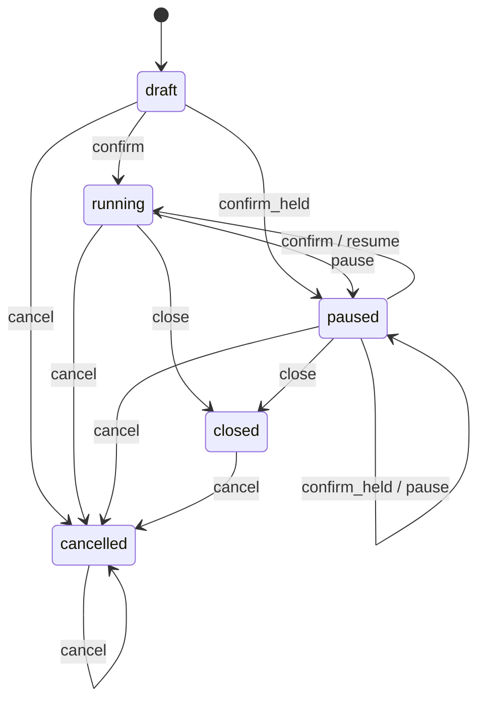

# 智能体批量任务

`agent_batches.status`。转移表：`packages/shared/src/machines/agent-batch.ts`。

```mermaid
stateDiagram-v2
  [*] --> draft
  draft --> running: confirm
  draft --> paused: confirm_held
  paused --> running: confirm / resume
  paused --> paused: confirm_held / pause
  running --> paused: pause
  running --> closed: close
  paused --> closed: close
  draft --> cancelled: cancel
  running --> cancelled: cancel
  paused --> cancelled: cancel
  closed --> cancelled: cancel
  cancelled --> cancelled: cancel
```

`confirm_held` 是确认时计划要求先停住（改价或重新确认）。若干取消写入不读当前状态，所以 closed 和 cancelled 再写成 cancelled 也在表里，与现网 SQL 一致。
