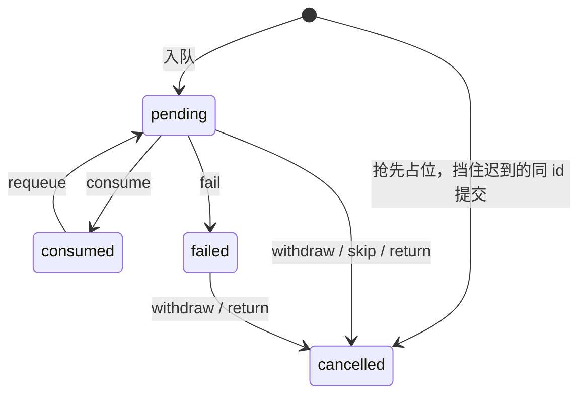

# 智能体收件箱

`agent_inbox.status`。转移表：`packages/shared/src/machines/agent-inbox.ts`。

```mermaid
stateDiagram-v2
  [*] --> pending: 入队
  [*] --> cancelled: 抢先占位，挡住迟到的同 id 提交
  pending --> consumed: consume
  pending --> failed: fail
  pending --> cancelled: withdraw / skip / return
  failed --> cancelled: withdraw / return
  consumed --> pending: requeue
```

`requeue` 只发生在插话没能进当前轮、且 `consumed_turn_id` 仍是那一轮的时候。已 consumed 不能撤回。收件箱写入已改用这张表。
