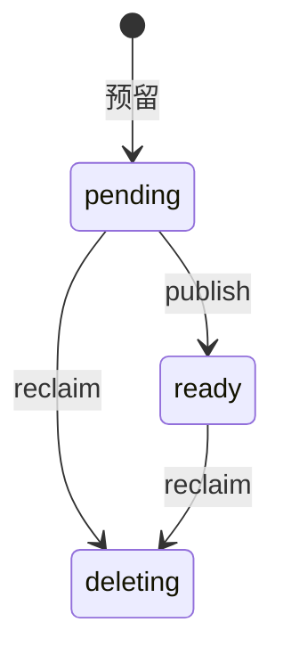

# 媒体对象

`media_objects.status`。转移表：`packages/shared/src/machines/media-object.ts`。

```mermaid
stateDiagram-v2
  [*] --> pending: 预留
  pending --> ready: publish
  pending --> deleting: reclaim
  ready --> deleting: reclaim
```

已经是 ready 的确认直接返回，不走 `publish`。已经是 deleting 的回收直接返回这一行。图片确认和视频确认、过期回收的状态字面量已改成这张表。预留插入仍写 `pending`。
